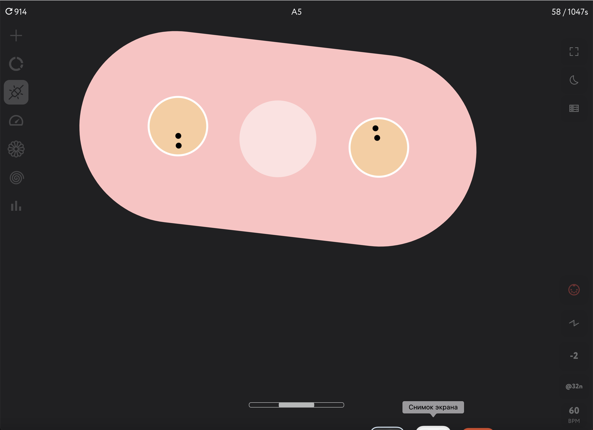
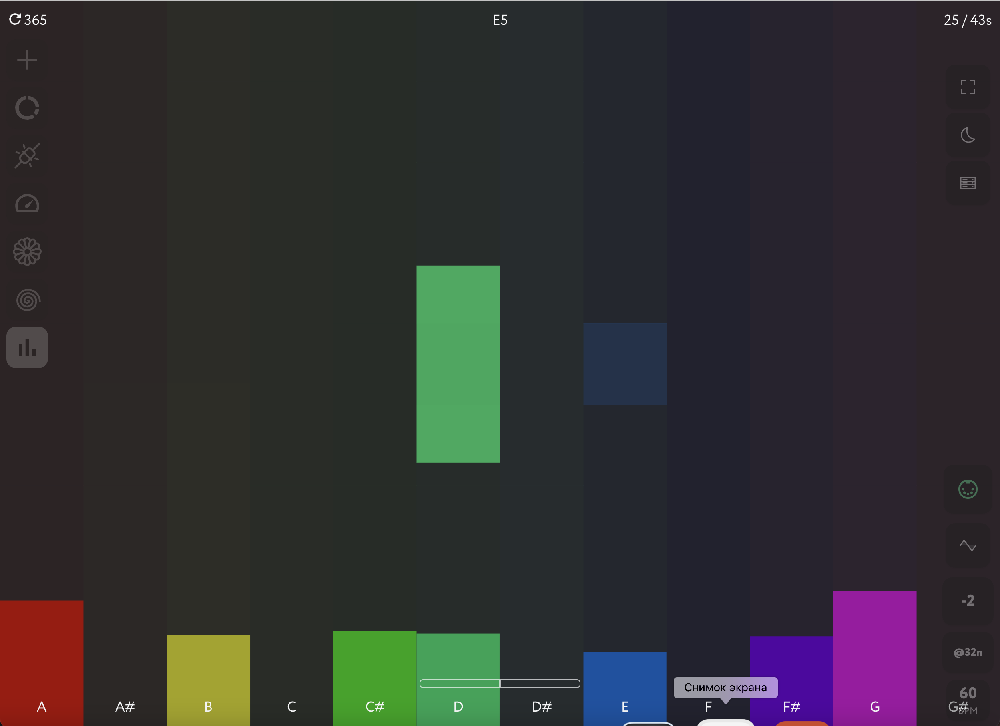
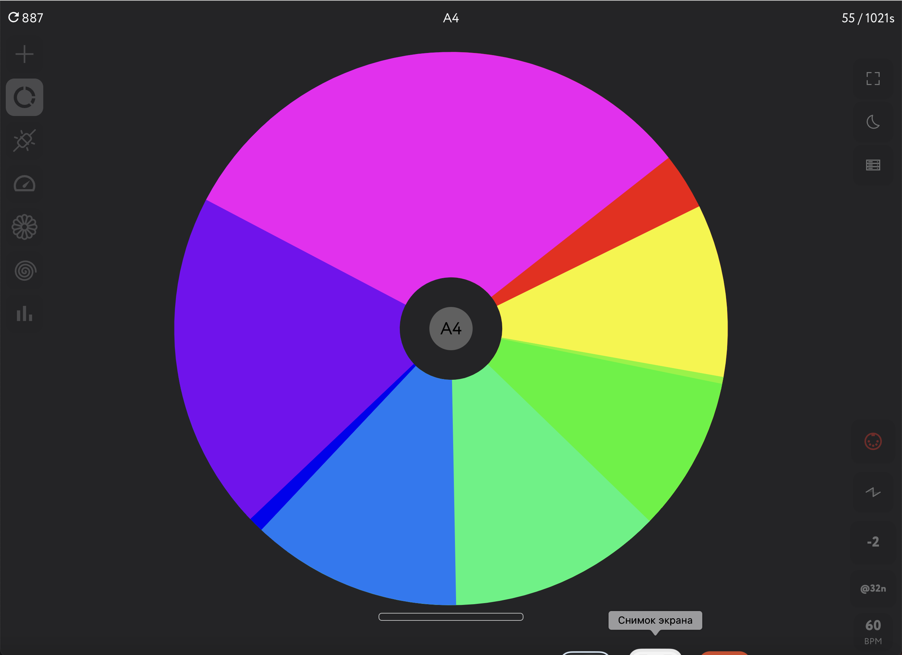
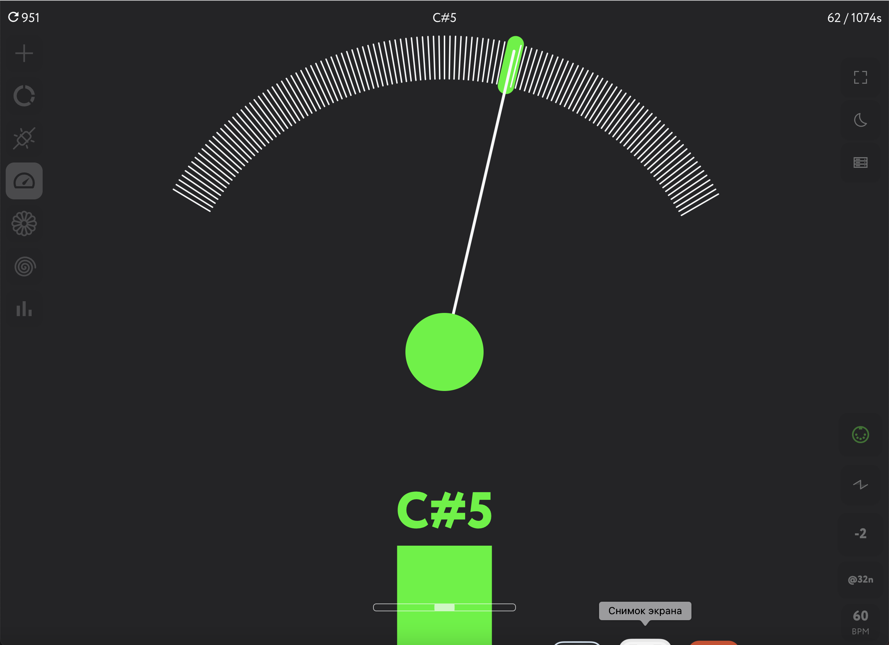
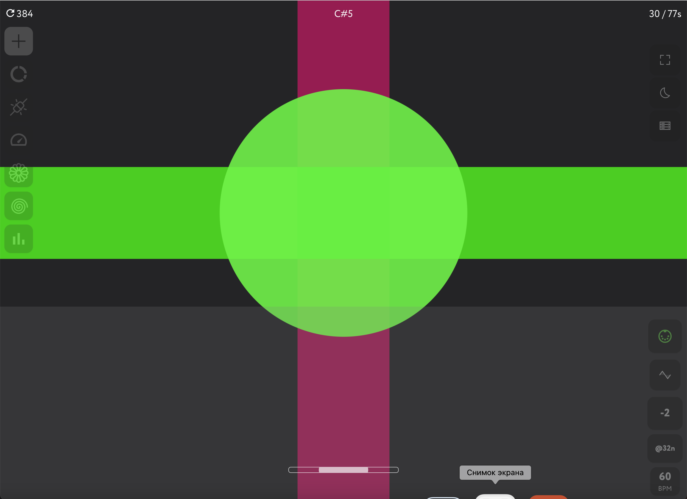

In 2022 we started our web-app collaboration with [Playtronica](https://playtronica.com). They're building MIDI controllers and we're building an interactive audio-visual playground web application together - the TouchMe Experience.

It's multi-scene SVG MIDI WebAudio visual synthesizer for [Playtronica](https://playtronica.com) TouchMe tactile MIDI controller.

## Features

- MIDI support (desktop and mobile)
- WebAudio mono synth + delay + reverb
- Synth oscillator type switch (sine, triangle, square,saw)
- Octave shift switch (-2 - +2)
- Quantize modes switch (8n, 16n, 32n, free)
- BPM switch
- 6 ready made interactive SVG scenes
- Desktop keyboard note layout
- Light/dark mode switch
- Fullscreen switch
- Basic visitor sessions statistics
- Total notes count and total duration stats displayed

