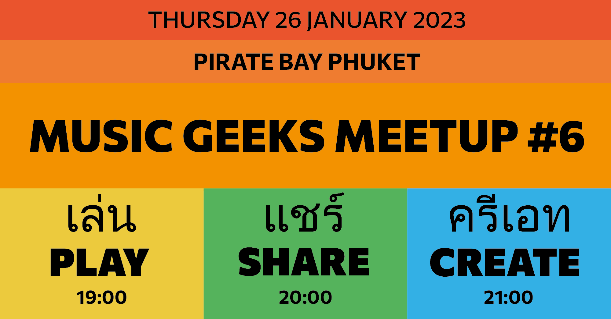

<youtube-embed video="CEcb7Ya6vFY" />

# Summary

1. We made a one string guitar out of an empty cola bottle. Learned the Bowline and Taut line hitch knots.

2. We've tuned it to A and found places to play D, E and B on it and then jammed together around A. The chord progression was Amadd9->Am->Asus4->Am and all around it. It was quite fun!

3. Learned more about building up a mobile music setup. Explored the power of the newly bought common ground noise isolator.

<youtube-embed video="S8UT1iEj_p4" />
