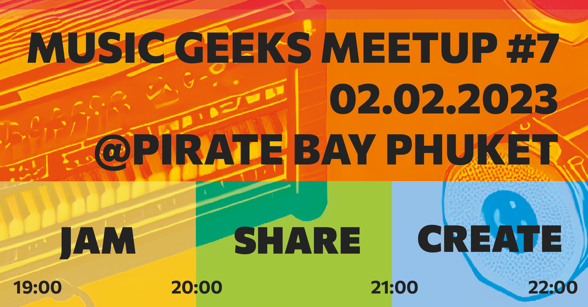

<youtube-embed video="rB7gyPbYatM" />

Our young community of passionate music explorers is gathering for the seventh weekly Music Geeks Meetup at Pirate Bay Phuket. Last time we made our first music instrument - the single string bottle guitar and then had quite a jam with it as a bass and solo. This time we are going to upgrade it with a new string and a bent neck to have even more fun with it. 

Any visitor of the meetup can have a short talk about any of their interest in music and then we explore the topic deeper together. Eventually we come up with our next build idea. Compose a song, build a synth setup, or may be build some new percussion for us to play? Let's decide together! No music skills required. Basic English is enough to start. And yeah, the event is free! So if you’re interested in any way of music - see you among us this Thursday at 7pm in Pirate Bay, Phuket town.

---

- Improved guitar with the curved neck and new string.
- Learned Sondown song
  - [Sundown video](https://www.youtube.com/watch?v=atcNf8zBB3M) song
  - [Sundown ENG video](https://www.youtube.com/watch?v=VGuLWL48o-c)
  - [Sundown chords](https://www.thechordtab.com/%E0%B8%A7%E0%B8%B5-%E0%B8%A7%E0%B8%B4%E0%B9%82%E0%B8%AD%E0%B9%80%E0%B8%A5%E0%B8%95-%E0%B8%A7%E0%B8%AD%E0%B9%80%E0%B8%97%E0%B8%B5%E0%B8%A2%E0%B8%A3%E0%B9%8C/%E0%B8%84%E0%B8%AD%E0%B8%A3%E0%B9%8C%E0%B8%94-%E0%B9%80%E0%B8%9E%E0%B8%A5%E0%B8%87-%E0%B8%A2%E0%B8%B2%E0%B8%A1%E0%B9%80%E0%B8%A2%E0%B9%87%E0%B8%99)