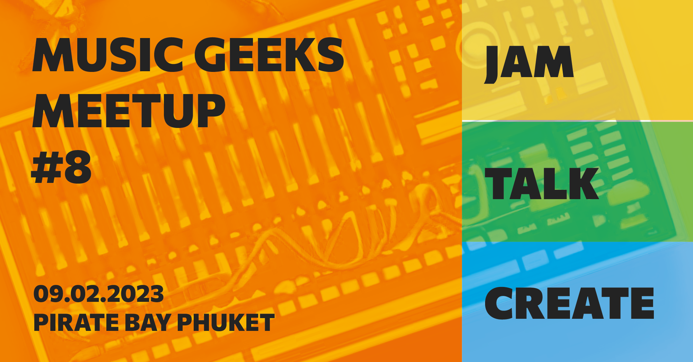

The weekly meetups of Phuket music geeks continue. This Thursday we will continue jamming, talking and creating together! We've already built one bottle guitar and upgraded it's string. This time we will amplify it with a piezo mic and have it playing rich and fuzzy bass. 

We start around 7 PM with a free jam, expressing and communicating with music. Jam lasts for an hour and then we have a break to talk about our interests in music and all around it. Any member can have a short talk about any topic for us to discuss and experiment upon. 

And it all concludes in an hour of actual creative process. We can choose to build a new music instrument or a full setup of them, we may compose songs and record tracks or create almost anything musical together. No music skills required. Basic English is enough. And yeah, the event is free! See you!

