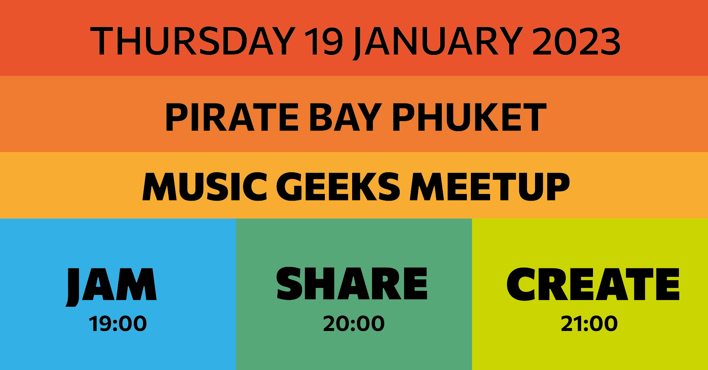
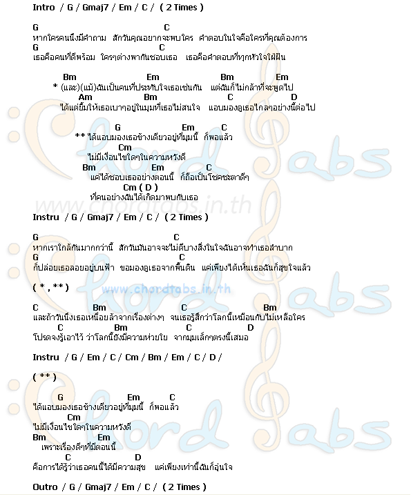
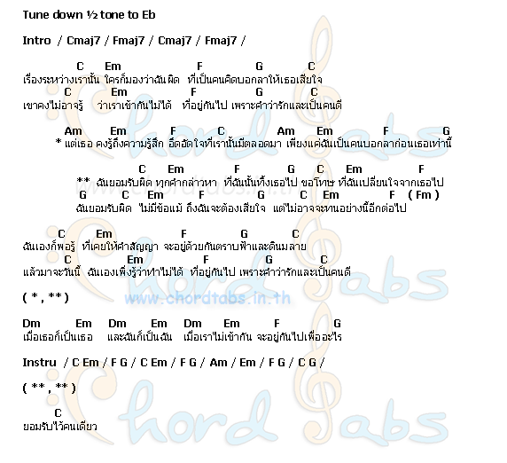

<youtube-embed video="_IZqq4rHKJE" />

## JAM - SHARE - CREATE

- Structure: JAM - SHARE - CREATE
- JAM:
  - Instruments
    - new guitar strings
    - amplified ukulele
    - microphone!
  - Apps at chromatone center
    - circular metronome
    - improved midi clock sync with the site
    - layers of midi tracks looped on op-z
- SHARE: => EXPLORE
  - Short break
  - Discussion
  - Instruments
    - visual tools as a way to get deep into music fast
    - explored basic vocal audio effects
  - how to think musically
  - discussed that every member will try prepare a short talk about their music passion for the next meetup
- CREATE:
  - Tried to recreate some rather simple Thai songs
  - found out the vertical loop approach as the way of composing music on the op-z
  - Tried recording some of our experiments with the zoom recorder. Worked fine!
  - decided to use this time to create music and music instruments. Will build the plastic bottle guitar project together.

[คอร์ด เพลง ยอมรับ - อัลบั้ม Basic - ศิลปิน Black Head | ยอมรับคอร์ด](https://chordtabs.in.th/336/)

[คอร์ด เพลง มุม - อัลบั้ม Box - ศิลปิน Playground | มุมคอร์ด](https://chordtabs.in.th/79/)
