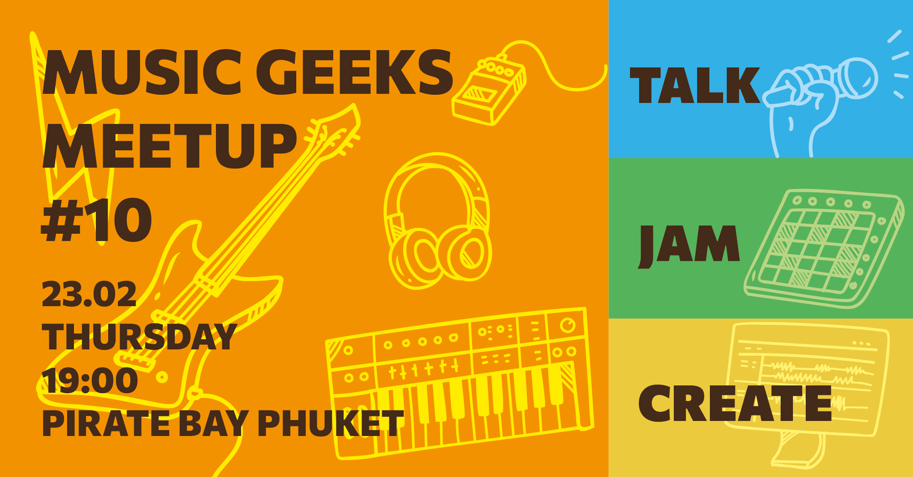

<youtube-embed video="blgN4Rn_0o4"></youtube-embed>

Dear Music Geeks!

We're happy to invite you to the 10th weekly Music Geeks Meetup event on Thursday, February 23rd, at Pirate Bay Phuket. Our community of passionate music lovers from around the world will come together to explore our collective love of music, connect with one another, and create something special.

Our event will start at 7:00 PM with an hour of interactive talks about our music passions, where everyone is welcome to share their favourite artists, genres, and personal experiences with music. We'll then move on to the music jams from 8:00 PM to 9:00 PM, where you can bring your electronic or acoustic instruments and join in the fun as we create spontaneous music together.

From 9:00 PM to the end at 10:00 PM, we'll come together to create something special as a group. Whether it's a performance, a song, or a musical instrument, we'll work as a team to produce something unique and exciting.

If you're new to our community, please know that no prior music knowledge is required, and basic English is enough to take part in our free event. We welcome everyone who shares our passion for music, regardless of their background or experience.

We can't wait to see you at Pirate Bay Phuket on Thursday, February 23rd, for a night of music, connection, and creativity.

Best regards,
Denis Starov.