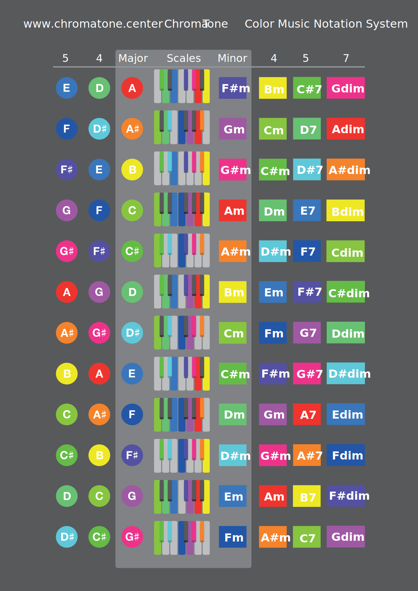
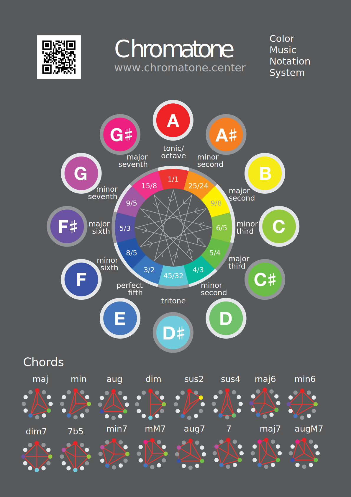

## WORK IN PROGRESS

The A4 cheat-sheet is currently in a design process.

## Diatonic scales and modes

<chroma-keys chroma="111111111111" :letters="true" />

<draw-scales />
<svg-save svg="diatonic"/>

