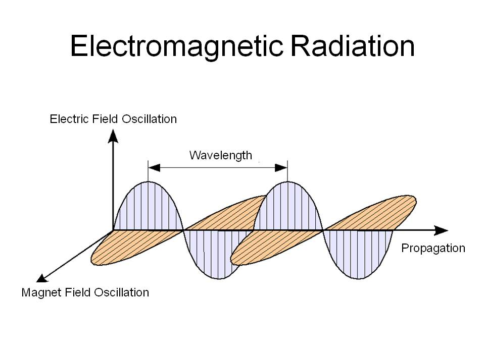
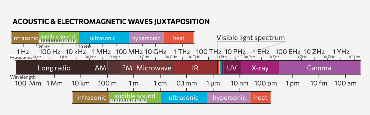
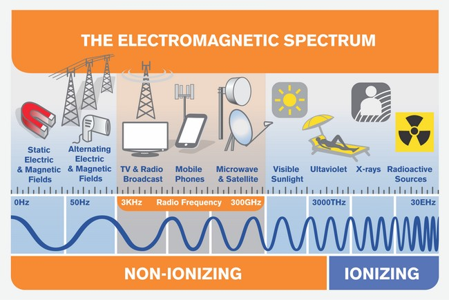
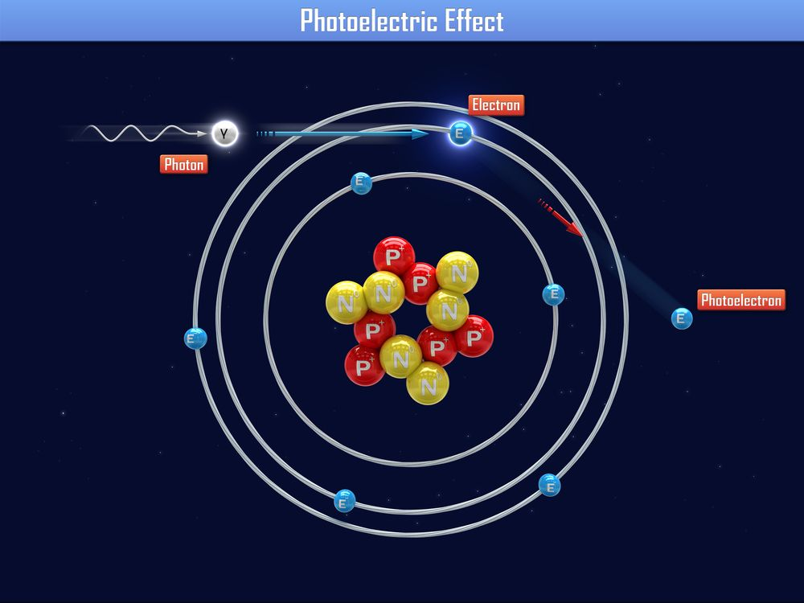

<youtube-embed video="FWCN_uI5ygY" />

Synchronised oscillations (or their quanta, photons) of the electric and magnetic fields, propagating through space at the speed of ~300,000 km/s.

Visible light is a certain portion of electromagnetic spectrum between infrared (too weak to excite electrons in molecules) and ultraviolet (powerful enough to cause irreversible chemical reactions in organic matter).

<youtube-embed video="V_jYXQFjCmA" />

# Electromagnetic Radiation: The Complete Guide to Light and Beyond

## What is Electromagnetic Radiation?

**Electromagnetic radiation (EMR)** is a form of energy that is propagated through space as synchronized oscillations of electric and magnetic fields, or equivalently, as streams of photons—quantum packets of electromagnetic energy. These waves travel through space at the speed of light (~300,000 km/s or ~186,000 miles per second) in a vacuum, carrying energy and momentum from one location to another.

<figure style="text-align: center;">
  
  <figcaption style="font-style: italic; color: #666; margin-top: 8px;">
    An electromagnetic wave showing perpendicular oscillating electric (E) and magnetic (B) fields propagating through space. The fields are in phase and perpendicular to each other and to the direction of propagation.
  </figcaption>
</figure>

Unlike mechanical waves (such as sound or water waves), electromagnetic waves do not require a medium for propagation—they can travel through perfect vacuum. This fundamental property was demonstrated experimentally and explained theoretically by James Clerk Maxwell in the 1860s, who unified electricity, magnetism, and optics into a single theoretical framework.

### The Dual Nature: Waves and Particles

Electromagnetic radiation exhibits **wave-particle duality**, one of the cornerstones of quantum mechanics:

**As a wave:** EM radiation is characterized by:
- **Wavelength (λ)**: The distance between consecutive peaks of the wave
- **Frequency (f)**: The number of oscillations per second, measured in Hertz (Hz)
- **Amplitude**: The maximum strength of the electric and magnetic fields
- **Speed (c)**: Approximately 3 × 10⁸ m/s in vacuum

These quantities are related by the fundamental equation: **c = λf**

**As particles (photons):** EM radiation consists of discrete packets of energy called photons, where each photon carries energy:

**E = hf = hc/λ**

where h is Planck's constant (6.626 × 10⁻³⁴ J·s). Higher frequency (shorter wavelength) radiation carries more energetic photons.

---

## The Electromagnetic Spectrum

The **electromagnetic spectrum** encompasses all possible frequencies of electromagnetic radiation, from extremely low-frequency radio waves to ultra-high-energy gamma rays. While all forms of EM radiation are fundamentally the same phenomenon—propagating oscillations of electric and magnetic fields—they differ dramatically in how they interact with matter, their applications, and their effects on biological systems.

The spectrum is conventionally divided into regions based on how the radiation is generated and detected:

---

## Radio Waves (λ > 1 mm, f < 300 GHz)

**Radio waves** are the lowest-frequency, longest-wavelength electromagnetic radiation. They are produced by accelerating charges in antennas and electronic circuits.

### Characteristics:
- Wavelengths: From millimeters to hundreds of meters (or even kilometers for very low frequency waves)
- Frequencies: Up to 300 GHz
- Photon energies: Nano-electronvolts to micro-electronvolts (extremely low)

### Generation & Detection:
Radio waves are generated by **oscillating electric currents** in conductors (antennas). When electrons accelerate back and forth in an antenna, they emit electromagnetic radiation at the same frequency as the oscillation. Detection works in reverse: incoming radio waves induce oscillating currents in receiving antennas.

### Applications:
1. **Communications**: AM/FM radio, television broadcasting, mobile phones (4G/5G), Wi-Fi, Bluetooth, satellite communications
2. **Navigation**: GPS, radar systems, aircraft navigation beacons
3. **Radio Astronomy**: Studying celestial objects that emit radio frequencies (pulsars, quasars, cosmic microwave background)
4. **Medical**: MRI (Magnetic Resonance Imaging) uses radio frequency pulses (though it's nuclear magnetic resonance, not absorption of radio waves)
5. **Industrial**: RF heating, induction welding, plasma generation

### Health Considerations:
Radio-frequency radiation is **non-ionizing**, meaning individual photons lack sufficient energy to break chemical bonds or ionize atoms. At high intensities, the primary effect is tissue heating (the principle behind microwave ovens). Current scientific consensus indicates no established health risks at exposure levels below international safety guidelines for typical consumer devices.

---

## Microwaves (1 mm < λ < 30 cm, 1 GHz < f < 300 GHz)

**Microwaves** occupy the region between radio waves and infrared. The name refers to the relatively short wavelengths compared to radio waves.

### Characteristics:
- Wavelengths: 1 millimeter to 30 centimeters
- Frequencies: 1 GHz to 300 GHz
- Photon energies: Micro-electronvolts to milli-electronvolts

### Unique Properties:
Microwaves exhibit properties intermediate between radio waves and infrared:
- They can penetrate clouds, smoke, and light rain (unlike infrared and visible light)
- They are absorbed by water molecules (resonant with molecular rotations)
- They can be focused by dish antennas (like visible light can be focused by lenses)

### Applications:
1. **Microwave Ovens**: Operating at 2.45 GHz, microwaves excite water molecules, generating heat through dielectric heating
2. **Radar**: Weather radar, air traffic control, speed detection, automotive collision avoidance
3. **Satellite Communications**: C-band, Ku-band, Ka-band satellite links
4. **Wireless Networks**: Point-to-point microwave links, 5G millimeter-wave bands
5. **Radio Astronomy**: Cosmic microwave background radiation (remnant from Big Bang at 160 GHz)
6. **Spectroscopy**: Rotational spectroscopy of molecules

---

## Infrared Radiation (700 nm < λ < 1 mm, 300 GHz < f < 430 THz)

**Infrared (IR)** radiation lies between microwaves and visible light. The name means "below red"—it's adjacent to the red end of the visible spectrum.

### Subdivisions:
- **Far-infrared** (15 μm – 1 mm): Closer to microwaves, associated with thermal radiation
- **Mid-infrared** (3 – 15 μm): "Fingerprint region" for molecular identification
- **Near-infrared** (700 nm – 3 μm): Closest to visible, used in fiber optics and remote controls

### Characteristics:
- All objects with temperature above absolute zero emit infrared radiation
- The peak wavelength of thermal emission depends on temperature (Wien's displacement law)
- Human body temperature objects emit primarily around 10 μm (far-infrared)

### Applications:
1. **Thermal Imaging**: Night vision cameras, building insulation inspection, medical thermography, fire fighting
2. **Heating**: Infrared heaters, heat lamps for food service and therapy
3. **Communications**: Fiber-optic telecommunications (near-infrared at 1310 nm and 1550 nm)
4. **Remote Controls**: TV remotes, air conditioners (typically 940 nm)
5. **Spectroscopy**: IR spectroscopy identifies molecular bonds and functional groups
6. **Astronomy**: Observing cool stars, dust clouds, and planets hidden in visible light

---

## Visible Light (400 nm < λ < 700 nm, 430 THz < f < 750 THz)

**Visible light** is the portion of the electromagnetic spectrum that human eyes can detect. It represents an extraordinarily narrow band—less than 0.01% of the full spectrum—yet it's the region where our Sun emits most intensely.

### The Visible Spectrum:

| Color | Wavelength Range | Frequency | Photon Energy |
|-------|------------------|-----------|---------------|
| **Red** | 620–750 nm | 400–484 THZ | 1.65–2.0 eV |
| **Orange** | 590–620 nm | 484–508 THZ | 2.0–2.1 eV |
| **Yellow** | 570–590 nm | 508–526 THZ | 2.1–2.17 eV |
| **Green** | 495–570 nm | 526–606 THZ | 2.17–2.5 eV |
| **Blue** | 450–495 nm | 606–667 THZ | 2.5–2.75 eV |
| **Violet** | 380–450 nm | 667–789 THZ | 2.75–3.26 eV |

### Why We See This Range:

Visible light is **a certain portion of electromagnetic spectrum between infrared (too weak to excite electrons in molecules) and ultraviolet (powerful enough to cause irreversible chemical reactions in organic matter)**. Evolution optimized our eyes for this "sweet spot":

- **Below red (infrared)**: Photons lack sufficient energy to trigger photochemical reactions in retinal molecules efficiently
- **Above violet (ultraviolet)**: Photons have enough energy to damage organic molecules (DNA, proteins); the cornea and lens absorb UV to protect the retina
- **In between**: Perfect balance—enough energy for detection, not so much as to cause damage under normal exposure

### Properties of Light:

1. **Refraction**: Bending when passing between media of different densities (lenses, prisms, rainbows)
2. **Reflection**: Bouncing off surfaces (mirrors, seeing objects)
3. **Diffraction**: Spreading after passing through apertures or around obstacles
4. **Interference**: Constructive and destructive superposition of waves
5. **Polarization**: Orientation of the electric field oscillation
6. **Dispersion**: Separation into colors due to wavelength-dependent refraction

### Biological Importance:

Visible light from the Sun powers virtually all life on Earth through **photosynthesis**—the process by which plants, algae, and some bacteria convert light energy into chemical energy. Chlorophyll pigments absorb primarily blue and red light (reflecting green, which is why most plants appear green).

Human vision relies on **rhodopsin** in rod cells (for low-light vision) and three types of **cone cells** (for color vision sensitive to short/blue, medium/green, and long/red wavelengths).

---

## Ultraviolet Radiation (10 nm < λ < 400 nm, 750 THz < f < 30 PHz)

**Ultraviolet (UV)** radiation has higher frequencies and shorter wavelengths than visible light. The name means "beyond violet."

### UV Classifications:
- **UV-A** (315–400 nm): Longest UV wavelengths, least energetic, penetrates deeply into skin (aging effects)
- **UV-B** (280–315 nm): Partially absorbed by ozone layer, causes sunburn, stimulates vitamin D production
- **UV-C** (100–280 nm): Almost completely absorbed by atmosphere, highly germicidal, dangerous to living tissue
- **Extreme UV** (10–121 nm): Overlaps with soft X-rays, strongly absorbed by all materials

### Sources:
- **Sun**: Primary natural source; only UV-A and small amount of UV-B reach Earth's surface
- **Mercury vapor lamps**: Used in tanning beds, sterilization, lithography
- **Black lights**: Fluorescent lamps with phosphors that emit primarily UVA
- **Electric arcs**: Welding, lightning
- **Specialized lasers**: Excimer lasers (ArF at 193 nm for eye surgery)

### Applications:
1. **Sterilization**: UV-C kills bacteria and viruses by damaging DNA/RNA (water treatment, operating rooms, laboratory equipment)
2. **Curing**: UV-hardening of inks, coatings, adhesives, dental fillings
3. **Forensics**: Revealing bodily fluids, counterfeit detection, document examination
4. **Astronomy**: Studying hot young stars, active galactic nuclei, interstellar medium
5. **Photolithography**: Manufacturing integrated circuits (using extreme UV at 13.5 nm for cutting-edge chips)
6. **Medical Therapy**: Psoriasis treatment, vitamin D synthesis, some skin conditions

### Health Effects:

<figure style="text-align: center;">
  
  <figcaption style="font-style: italic; color: #666; margin-top: 8px;">
    The photoelectric effect: ultraviolet photons ejecting electrons from a metal surface. This phenomenon, which cannot be explained by classical wave theory, was crucial in establishing quantum mechanics.
  </figcaption>
</figure>

UV radiation is **powerful enough to cause irreversible chemical reactions in organic matter**:

- **Beneficial effects**: Vitamin D synthesis in skin, treatment of certain skin conditions (psoriasis, eczema), mood regulation (possibly via serotonin)
- **Harmful effects**: 
  - Sunburn (erythema) from UV-B
  - Premature skin aging, wrinkles, loss of elasticity from UV-A
  - Skin cancer (melanoma, basal cell carcinoma, squamous cell carcinoma)
  - Cataracts and other eye damage (photokeratitis—"snow blindness")
  - Suppression of immune system

**Protection**: Sunscreen (absorbs/reflects UV), protective clothing, sunglasses with UV protection, limiting exposure during peak hours (10 AM – 4 PM).

---

## X-Rays (0.01 nm < λ < 10 nm, 30 PHz < f < 30 EHz)

**X-rays** are high-energy electromagnetic radiation capable of penetrating many materials opaque to visible light.

### Discovery:
Discovered in 1895 by Wilhelm Röntgen, who named them "X" to indicate their unknown nature. This discovery earned him the first Nobel Prize in Physics in 1901.

### Characteristics:
- High penetration power (depends on material density and X-ray energy)
- Ionizing radiation (can eject electrons from atoms)
- Produced by decelerating fast electrons (bremsstrahlung) or electron transitions in atoms
- Absorption depends on atomic number (heavier elements absorb more strongly)

### Types:
- **Soft X-rays** (0.1–10 nm): Lower energy, less penetrating, used in microscopy and lithography
- **Hard X-rays** (0.01–0.1 nm): Higher energy, more penetrating, used in medical imaging and crystallography

### Applications:
1. **Medical Imaging**: 
   - Radiography (standard X-ray images of bones, teeth, chest)
   - Computed Tomography (CT scans)—3D cross-sectional imaging
   - Mammography (low-dose X-rays for breast cancer screening)
   - Fluoroscopy (real-time moving X-ray images)
   
2. **Security**: Airport baggage screening, cargo inspection, detecting contraband

3. **Materials Science**: 
   - X-ray crystallography—determining atomic/molecular structures (discovered DNA double helix!)
   - X-ray fluorescence (XRF)—elemental analysis
   - Non-destructive testing—finding cracks, voids in welds and structures
   
4. **Astronomy**: X-ray telescopes (Chandra, XMM-Newton) studying black holes, neutron stars, supernova remnants, hot gas in galaxy clusters

5. **Cancer Treatment**: Radiation therapy using high-energy X-rays to destroy tumor cells

### Safety Concerns:
X-rays are **ionizing radiation** that can damage living tissue and DNA, potentially causing cancer. Medical exposures are carefully controlled using the **ALARA principle** (As Low As Reasonably Achievable):
- Minimizing dose
- Using shielding (lead aprons)
- Limiting exposure time
- Collimating the beam to expose only the area of interest

---

## Gamma Rays (λ < 0.01 nm, f > 30 EHz)

**Gamma rays** represent the highest-energy, shortest-wavelength electromagnetic radiation. They are produced by the most energetic processes in the universe.

### Sources:
- **Nuclear decay**: Alpha, beta, and gamma decay of radioactive isotopes
- **Nuclear reactions**: Fission, fusion, particle accelerators
- **Cosmic phenomena**: Supernovae, pulsars, black holes, active galactic nuclei, gamma-ray bursts (most energetic events known)
- **Antimatter annihilation**: Matter-antimatter collisions convert mass entirely to energy (including gamma rays)

### Characteristics:
- Extreme penetration power (can pass through thick concrete or lead)
- Highly ionizing
- Require dense shielding (lead, concrete, depleted uranium) for protection
- Often accompanied by particle emission (alpha/beta particles in radioactive decay)

### Applications:
1. **Medicine**:
   - **Gamma knife surgery**: Focused gamma beams destroying brain tumors without incision
   - **PET scans**: Positron Emission Tomography detects gamma rays from positron-electron annihilation
   - **Radiation therapy**: Cobalt-60 sources for cancer treatment
   - **Sterilization**: Medical equipment, surgical supplies
   
2. **Industry**:
   - **Thickness gauges**: Measuring material thickness in manufacturing
   - **Level indicators**: Monitoring fill levels in containers
   - **Food irradiation**: Preserving food by killing bacteria and parasites
   - **Polymer modification**: Cross-linking plastics, improving material properties
   
3. **Science**:
   - **Nuclear physics**: Studying nuclear structure and reactions
   - **Astrophysics**: Gamma-ray observatories (Fermi Telescope) studying extreme universe
   - **Geology**: Dating rocks and artifacts (radiometric dating)
   
4. **National Security**:
   - Detecting nuclear weapons and materials
   - Nuclear treaty verification

### Health Hazards:
Gamma radiation is extremely hazardous:
- **Acute radiation syndrome**: Nausea, vomiting, hair loss, organ failure, death at high doses
- **Long-term cancer risk**: Even low doses increase lifetime cancer probability
- **Genetic damage**: Can cause mutations in reproductive cells affecting future generations

**Protection**: Time (minimize exposure), Distance (intensity decreases with distance squared), Shielding (dense materials like lead or thick concrete).

---

## How EM Radiation Interacts With Matter

The interaction of electromagnetic radiation with matter depends critically on the photon energy relative to the energy scales of atomic and molecular processes:

### 1. Low-Energy Interactions (Radio to IR):

**Induced molecular motions:**
- **Radio waves/Microwaves**: Cause rotation of polar molecules, acceleration of free electrons in conductors
- **Far-infrared**: Excites molecular vibrations (bond stretching, bending)
- **Near-infrared**: Excites overtone vibrations and combinations

These interactions typically cause **heating** without permanent chemical change (unless temperatures become extreme).

### 2. Electronic Transitions (Visible to UV):

**Promoting electrons to higher energy states:**
- **Visible light**: Can excite valence electrons in atoms, molecules, and solids (causes colors we see)
- **Ultraviolet**: Can promote electrons to excited states, break weaker chemical bonds, ionize some molecules

This is the regime of **photochemistry**—light-induced chemical reactions including photosynthesis, vision, photography, and UV damage to biomolecules.

### 3. Ionization and Nuclear Effects (X-rays to Gamma):

**Removing electrons entirely or affecting nuclei:**
- **Soft X-rays**: Ionizes lighter elements, ejects inner-shell electrons
- **Hard X-rays/Gamma rays**: Ionizes all elements, can cause nuclear excitations, photodisintegration at very high energies

These interactions cause **ionization damage**—breaking chemical bonds randomly, creating reactive free radicals, damaging DNA and cellular machinery.

---

## Propagation of Electromagnetic Radiation

### In Vacuum:

All electromagnetic radiation travels at exactly the same speed in vacuum—the **speed of light (c)** = 299,792,458 m/s (exactly, by definition). This is one of the fundamental constants of nature and represents the cosmic speed limit according to special relativity.

### In Materials:

When passing through transparent materials (glass, water, air), EM radiation slows down due to interaction with atoms:

**v = c/n**

where n is the **refractive index** of the material (n > 1 for ordinary materials). For example:
- Water: n ≈ 1.33 (light travels 25% slower)
- Glass: n ≈ 1.5 (light travels 33% slower)
- Diamond: n ≈ 2.42 (light travels 59% slower)

The frequency remains constant, but wavelength decreases proportionally.

### Attenuation and Absorption:

Not all materials are transparent to all wavelengths:
- **Glass**: Transparent to visible, opaque to most UV and IR
- **Water**: Transparent to visible (blue-green), absorbs IR strongly, attenuates UV
- **Metal**: Reflects radio to UV, transparent to X-rays and gamma rays
- **Lead/Opaque materials**: Absorb X-rays and gamma rays effectively
- **Atmosphere**: 
  - Transparent: Visible light, radio waves, some IR windows
  - Absorbs: Most UV (< 300 nm), most IR, X-rays, gamma rays
  
This selective transparency creates **atmospheric windows** that allow ground-based astronomy only in certain wavelength ranges.

---

## Blackbody Radiation and Thermal Emission

All matter with temperature above absolute zero (0 K or -273.15°C) emits electromagnetic radiation due to the thermal motion of charged particles (mainly electrons). This **thermal radiation** has a characteristic spectrum determined solely by temperature:

### Wien's Displacement Law:

The peak wavelength of emission is inversely proportional to temperature:

**λ_max = b/T**

where b ≈ 2.898 × 10⁻³ m·K (Wien's displacement constant)

Examples:
- **Sun** (5778 K surface): Peak at ~500 nm (green visible light)
- **Human body** (310 K): Peak at ~9.3 μm (far-infrared)
- **Hot stove element** (800 K): Peak at ~3.6 μm (mid-infrared, glowing dull red)
- **Cosmic Microwave Background** (2.7 K): Peak at ~1.06 mm (microwave)

### Stefan-Boltzmann Law:

Total power radiated per unit area:

**P = σT⁴**

where σ ≈ 5.67 × 10⁻⁸ W/(m²·K⁴)

This shows radiated power increases rapidly with temperature—doubling temperature increases radiation 16-fold!

---

## The Photoelectric Effect and Quantum Nature

<youtube-embed video="V_jYXQFjCmA" />

The **photoelectric effect**—the emission of electrons when light shines on a metal surface—provided crucial evidence for the quantum nature of electromagnetic radiation.

### Experimental Observations (Late 19th Century):

1. **Threshold frequency exists**: Below a certain frequency (material-dependent), NO electrons are emitted regardless of intensity
2. **Instantaneous emission**: Electrons appear immediately (within 10⁻⁹ seconds), even at very low intensity
3. **Kinetic energy depends on frequency, NOT intensity**: Higher frequency → faster electrons; brighter light → MORE electrons but same maximum speed
4. **Intensity affects quantity, not quality**: Brighter light releases more electrons, but each electron's energy depends only on light frequency

### Classical Theory Failure:

Classical wave theory predicted:
- Sufficiently intense light of any frequency should eventually eject electrons (energy accumulates over time)
- Higher intensity should produce faster electrons
- There should be time delay at low intensity while energy builds up

**None of these predictions matched experiments!**

### Einstein's Quantum Explanation (1905):

Einstein proposed that light consists of **quanta (photons)**, each with energy E = hf:

- One photon interacts with ONE electron
- If photon energy > work function (binding energy of electron), electron is ejected instantly
- Excess energy becomes kinetic energy: **KE_max = hf - φ**
- Below threshold frequency (hf < φ), no emission regardless of how many photons arrive

This explanation earned Einstein the **1921 Nobel Prize in Physics** (ironically, not for relativity!).

### Modern Applications:
- **Solar panels** (photovoltaic cells): Convert light directly to electricity
- **Photomultiplier tubes**: Extremely sensitive light detectors for research
- **Image sensors**: CCD and CMOS sensors in digital cameras
- **Light meters**: Photography exposure measurement
- **Night vision devices**: Amplify weak visible/NIR signals

---

## Electromagnetic Radiation in Astronomy

Astronomy has been revolutionized by observing the universe across the entire electromagnetic spectrum, not just visible light:

### Multi-Wavelength Astronomy:

Different wavelengths reveal different physical processes:

| Wavelength Regime | Reveals | Examples |
|-------------------|---------|----------|
| **Radio** | Cold gas, magnetic fields, energetic particles | Pulsars, quasars, cosmic microwave background |
| **Microwave** | Cosmic background, dust, molecules | CMB radiation, star-forming regions |
| **Infrared** | Cool objects, dust, redshifted galaxies | Brown dwarfs, protostars, planet formation |
| **Visible** | Stars, ionized gas, galaxies | Sun, nebulae, normal galaxies |
| **Ultraviolet** | Hot stars, active galaxies, interstellar medium | White dwarfs, AGNs, ISM absorption |
| **X-ray** | Very hot gas, black holes, neutron stars | Accretion disks, supernova remnants, galaxy clusters |
| **Gamma ray** | Most extreme processes, antimatter, nuclear decay | Gamma-ray bursts, blazars, radioactive isotopes |

### Atmospheric Windows:

Earth's atmosphere blocks most wavelengths except:
- **Radio** (≈1 mm to ≈30 m)
- **Visible** (≈400-700 nm)
- **Some near-infrared** (several windows between 1-10 μm)

For other wavelengths, **space-based observatories** are essential:
- Hubble Space Telescope (visible, UV, near-IR)
- Chandra X-ray Observatory
- Spitzer Space Telescope (infrared)
- Fermi Gamma-ray Space Telescope
- James Webb Space Telescope (infrared)

---

## Practical Applications Across the Spectrum

### Communications Technology:

Modern society depends utterly on exploiting different EM bands:
- **AM radio** (535–1705 kHz): Long-distance skywave propagation
- **FM radio** (88–108 MHz): High-fidelity music, local coverage
- **TV broadcast** (54–890 MHz): Digital television channels
- **Cell phones** (700 MHz – 39 GHz): Mobile voice/data (4G LTE, 5G)
- **Wi-Fi** (2.4 GHz, 5 GHz, 6 GHz): Local wireless networking
- **Bluetooth** (2.4 GHz): Short-range device connectivity
- **Fiber optics** (1310 nm, 1550 nm): Internet backbone, long-distance data transmission

### Medical Applications:

EM radiation is indispensable in medicine:
- **Diagnosis**: X-ray imaging, CT scans, MRI (radiofrequency + strong magnets), PET scans (gamma detection), endoscopy (visible light)
- **Treatment**: Radiation therapy (X-rays/gamma rays), laser surgery (visible/IR), photodynamic therapy (red light), UV therapy (skin conditions)
- **Monitoring**: Pulse oximetry (red/infrared light transmission), infrared thermometry, fluorescence imaging

### Industrial and Scientific Uses:

- **Spectroscopy**: Identifying materials by their absorption/emission signatures across UV-visible-IR
- **Non-destructive testing**: X-ray/gamma radiography finding defects without damaging samples
- **Laser technology**: Cutting, welding, engraving, 3D printing, barcode scanners, optical storage (CD/DVD/Blu-ray)
- **Semiconductor manufacturing**: Extreme UV lithography for cutting-edge microchips
- **Remote sensing**: Satellite imagery monitoring agriculture, forestry, urban development, climate change

---

## Health and Safety Considerations

The biological effects of electromagnetic radiation vary enormously across the spectrum:

### Non-Ionizing Radiation (Radio to Visible):

**Generally considered safe at normal exposure levels:**
- **Radio frequency**: Main effect is heating (tissue absorbs energy); regulated by SAR (Specific Absorption Rate) limits for phones
- **Microwaves**: Same heating mechanism; oven leakage standards protect users
- **Infrared**: Thermal burns possible at high intensity (industrial heaters, furnaces); eye damage (cataracts) from chronic intense exposure
- **Visible light**: Retinal damage from staring at bright sources (especially blue light); photochemical damage from intense sources (welding arc, eclipse viewing)

**Controversial areas:**
- Power line ELF (extremely low frequency) fields: Some epidemiological studies suggested childhood leukemia associations, but mechanistic understanding is lacking and consensus on causation remains elusive
- RF from cell towers/Wi-Fi: Extensive research finds no consistent evidence of harm below guideline levels, though public concern persists

### Ionizing Radiation (Upper UV, X-rays, Gamma):

**Established health risks requiring strict regulation:**
- **Deterministic effects**: Tissue damage above threshold doses (radiation sickness, burns, cataracts, sterility)
- **Stochastic effects**: Cancer risk proportional to cumulative dose (no safe threshold assumed for protection purposes)
- **Genetic effects**: Heritable mutations (observed in animal studies, not clearly documented in humans)

**Protection Principles (ICRP - International Commission on Radiological Protection):**

1. **Justification**: Any exposure must produce net benefit
2. **Optimization (ALARA)**: Keep doses As Low As Reasonably Achievable
3. **Dose limits**: Regulatory limits for workers and public

### Typical Exposure Comparison:

| Source | Approximate Dose | Context |
|--------|------------------|---------|
| Background radiation (annual) | 2-3 mSv | Natural environment (radon, cosmic rays, terrestrial) |
| Chest X-ray | 0.1 mSv | Single diagnostic exam |
| CT scan (abdomen) | 10 mSv | Comprehensive diagnostic imaging |
| Annual occupational limit | 50 mSv | Radiation workers |
| Acute radiation syndrome threshold | ~1000 mSv (1 Sv) | Symptoms appear within hours/days |
| LD50/60 (lethal dose for 50%) | ~4000-5000 mSv | Death within 60 days without treatment |

*(Sv = Sievert, unit accounting for radiation type and tissue sensitivity)*

---

## Historical Development

### Key Discoveries and Theories:

**Pre-1800:**
- Ancient awareness of light (visible) and heat (infrared, though not understood)
- Newton's Opticks (1704): Light as particles ("corpuscles")
- Huygens' wave theory of light (1678)

**19th Century - Classical Electromagnetism:**
- **1800**: William Herschel discovers infrared radiation
- **1801**: Johann Ritter discovers ultraviolet radiation
- **1820**: Hans Christian Ørsted discovers electromagnetism
- **1831**: Michael Faraday discovers electromagnetic induction
- **1861-1865**: **James Clerk Maxwell publishes "A Dynamical Theory of the Electromagnetic Field"**—predicts electromagnetic waves traveling at speed of light, unifying electricity, magnetism, and optics
- **1886-1888**: Heinrich Hertz experimentally produces and detects radio waves, confirming Maxwell's predictions
- **1895**: Wilhelm Röntgen discovers X-rays

**20th Century - Quantum Revolution:**
- **1900**: Max Planck introduces quantized energy to explain blackbody radiation
- **1905**: Albert Einstein explains photoelectric effect using light quanta (photons)
- **1913**: Niels Bohr's atomic model explains spectral lines
- **1920s**: Quantum mechanics fully developed (Heisenberg, Schrödinger, Dirac)
- **1932**: James Chadwick discovers the neutron
- **1960**: Theodore Maiman demonstrates first working laser
- **1965**: Arno Penzias and Robert Wilson discover cosmic microwave background radiation

**Late 20th - 21st Century:**
- Development of fiber-optic communications (1960s-1980s)
- Medical imaging advances (CT 1970s, MRI 1980s, PET)
- Space-based multi-wavelength astronomy
- Laser technology proliferation (CDs, bar code scanners, surgery, industry)
- Wireless communications revolution (cell phones, Wi-Fi, Bluetooth)
- Advanced semiconductor manufacturing using EUV lithography

---

## Future Directions and Emerging Technologies

### Terahertz Gap (0.1–10 THz):

The region between microwaves and infrared (wavelengths 30 μm – 3 mm) historically difficult to generate and detect, now opening up with new technologies:
- **Security imaging**: Terahertz waves penetrate clothing but reflect off metals and plastics (airport body scanners)
- **Medical imaging**: Potential for detecting skin cancer, tooth decay, pharmaceutical analysis
- **Communications**: Ultra-high-bandwidth wireless links (beyond 5G/6G)
- **Spectroscopy**: Identifying molecules by rotational transitions

### Extreme Ultraviolet Lithography (EUV):

Using 13.5 nm light to pattern semiconductor circuits with features smaller than 7 nm, enabling continued Moore's Law scaling. Requires revolutionary reflective optics (normal mirrors absorb EUV; specialized multilayer Bragg reflectors needed) and operation in vacuum.

### Quantum Technologies:

Exploiting quantum properties of light:
- **Quantum cryptography**: Unbreakable encoding using quantum key distribution (QKD)
- **Quantum computing**: Photonic quantum computers using single photons as qubits
- **Quantum sensing**: Ultra-precise measurements using entangled photons
- **Quantum imaging**: Beating classical resolution limits (quantum lithography, ghost imaging)

### Advanced Astrophysical Observatories:

Next-generation space and ground-based telescopes covering the full spectrum:
- **Nancy Grace Roman Space Telescope** (infrared, visible)
- **Vera C. Rubin Observatory** (visible, time-domain astronomy)
- **Square Kilometre Array (SKA)** (radio, unprecedented sensitivity)
- **Lynx X-ray Observatory** (proposed successor to Chandra)
- **Advanced Gamma-ray arrays** (CTA - Cherenkov Telescope Array)

### Metamaterials and Transformation Optics:

Engineered materials with exotic electromagnetic properties not found in nature:
- Negative refractive index materials ("superlenses" beating diffraction limit)
- Invisibility cloaks (bending light around objects)
- Perfect absorbers
- Flat lenses and aberration-free optical components

---

## Summary

Electromagnetic radiation is the fundamental mechanism by which energy propagates through the universe—from the faint whisper of cosmic microwave background radiation left over from the Big Bang, to the blinding flash of a gamma-ray burst marking the death of a massive star, to the gentle warmth of sunlight enabling life on Earth.

Key points to remember:

1. **Unified phenomenon**: Despite different names (radio, light, X-rays, etc.), all EM radiation is the same thing—oscillating electric and magnetic fields or streams of photons—distinguished only by frequency/wavelength

2. **Universal speed limit**: All EM radiation travels at c in vacuum; nothing with mass can reach this speed

3. **Wave-particle duality**: Exhibits both wave-like (interference, diffraction) and particle-like (photoelectric effect, Compton scattering) behavior

4. **Spectrum breadth**: 20+ orders of magnitude in wavelength/frequency, from kilometer-long radio waves to sub-nuclear gamma rays

5. **Interaction diversity**: Different wavelengths interact with matter in vastly different ways, enabling countless applications

6. **Critical importance to science and technology**: Understanding EM radiation underlies modern physics, chemistry, biology, medicine, communications, and virtually every advanced technology

7. **Health spectrum**: Ranges from harmless (radio, visible at normal intensities) to lethal (intense gamma radiation), with appropriate safety measures essential for ionizing portions

From Maxwell's brilliant unification in the 1860s to today's quantum technologies manipulating single photons, electromagnetic radiation continues to be at the forefront of human knowledge and capability—a testament to both nature's elegance and human ingenuity in comprehending it.
