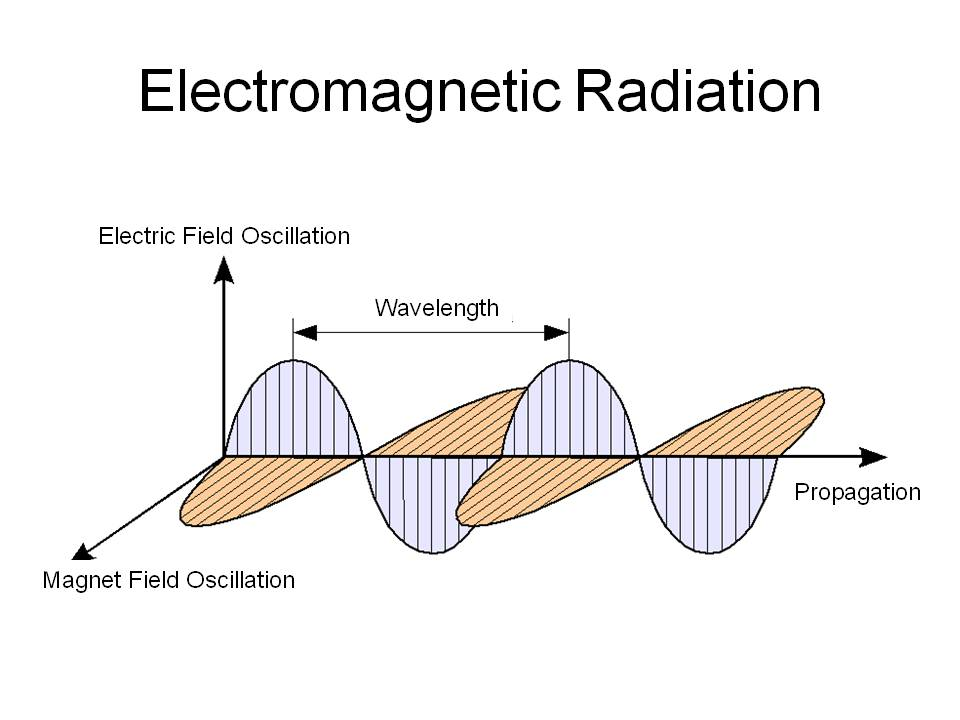
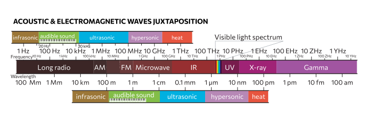

Synchronised oscillations (or their quanta, photons) of the electric and magnetic fields, propagating through space at the speed of ~300,000 km/s.

Visible light is a certain portion of electromagnetic spectrum between infrared (too weak to excite electrons in molecules) and ultraviolet (powerful enough to cause irreversible chemical reactions in organic matter).

