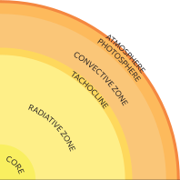
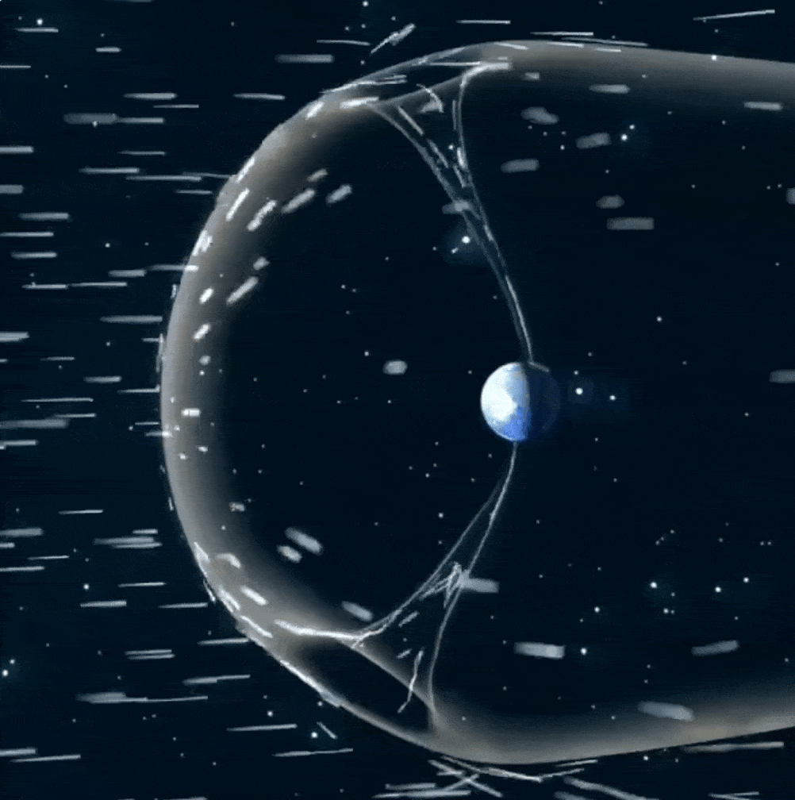
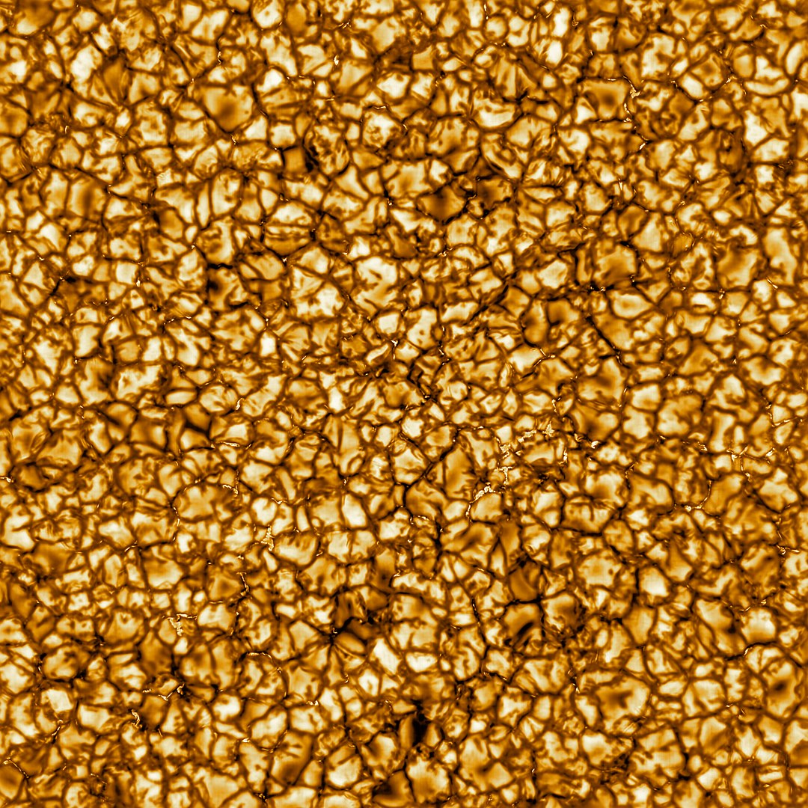
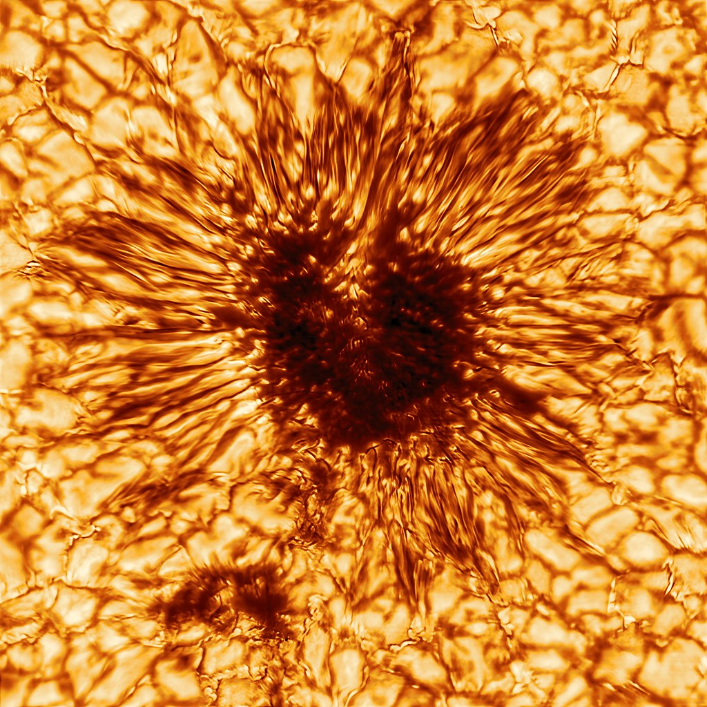
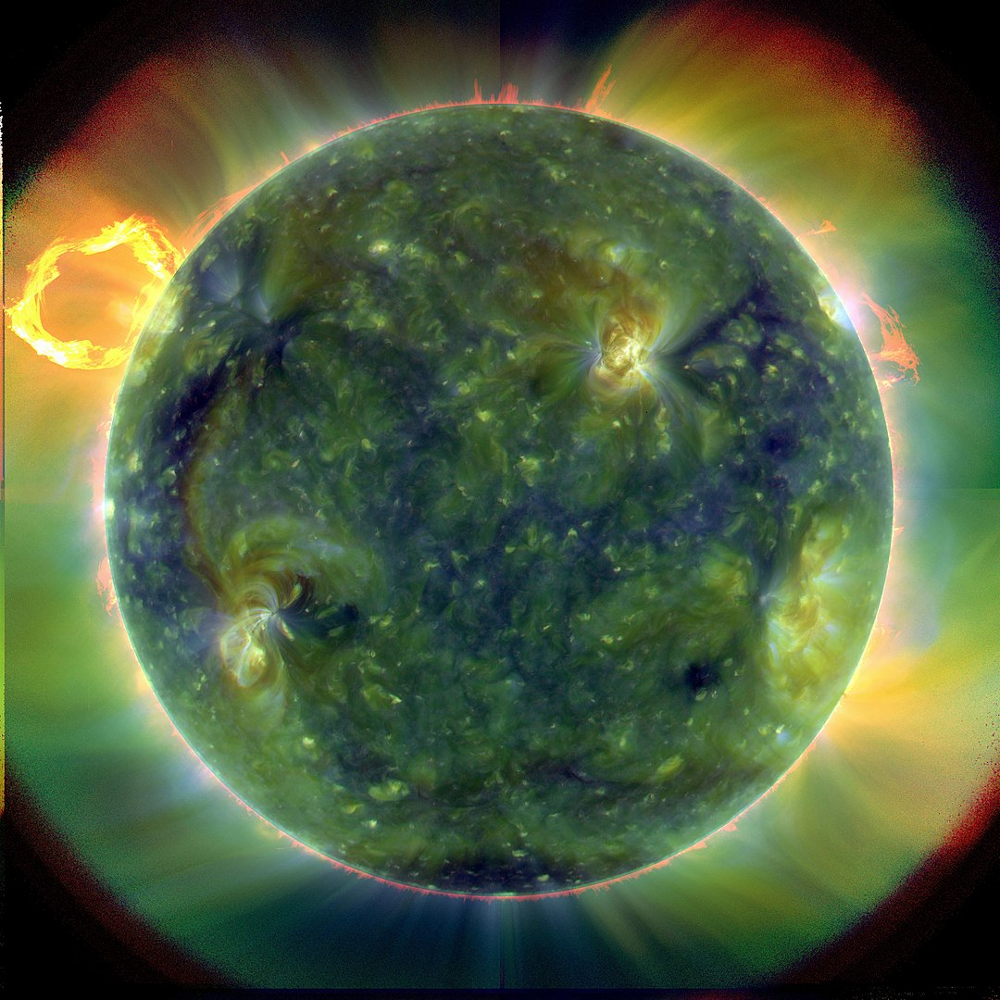

The Sun, a 4.5 billion-year-old yellow dwarf star, is the center of our Solar system and is the main source of light on Earth.

The Sun has an absolute magnitude of +4.83, estimated to be brighter than about 85% of the stars in the Milky Way, most of which are red dwarfs.

The Sun is a G-type main-sequence star that comprises about 99.86% of the mass of the Solar System. Its mass is estimated at 2 octillion tons, while it's losing 5 million tons of material each second in form of radiation and ionized corona flares that cool down in space and propagate as solar wind.

The Sun is by far the brightest object in the Earth's sky, with an apparent magnitude of −26.74. This is about 13 billion times brighter than the next brightest star, Sirius, which has an apparent magnitude of −1.46.

The Sun is about 149.6 million kilometers away from Earth. Light travels at a speed of about 299,792 kilometers per second. So, it takes about 8 minutes and 20 seconds for light to travel from the Sun to Earth.

Thermonuclear reactions at temperatures about 14 million Kelvin in its core produce high energy gamma-rays that are absorbed and converted into lower energy radiation by ionized atoms in its relatively thin and much cooler (4000 - 6000 K) photosphere and chromosphere layers.

## UV radiation of the Sun

