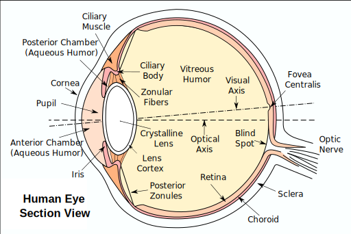
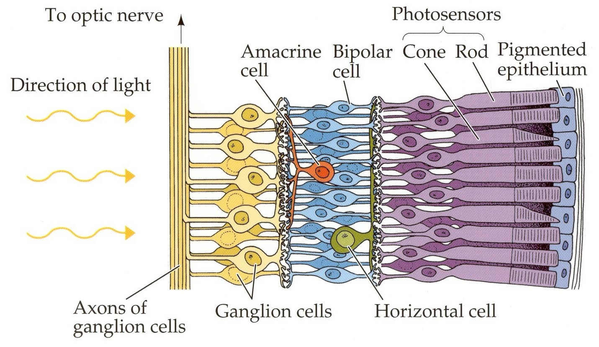
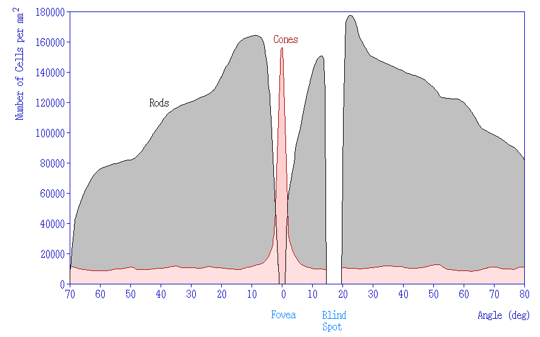
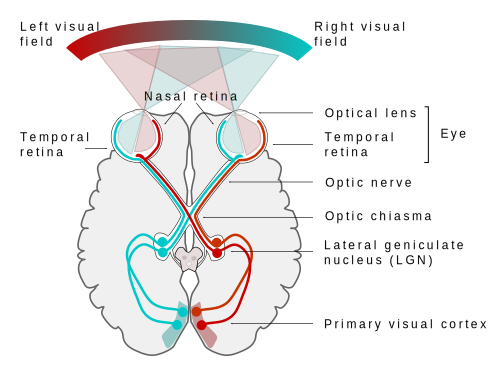
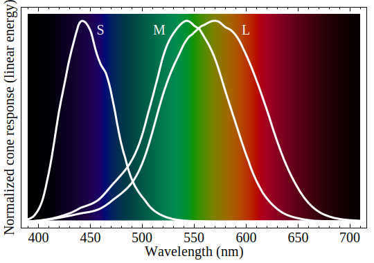
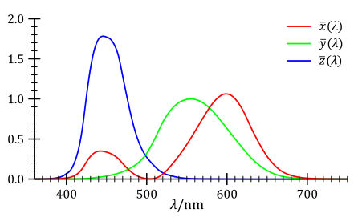
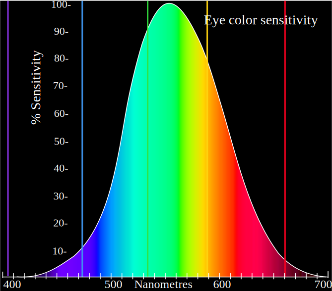
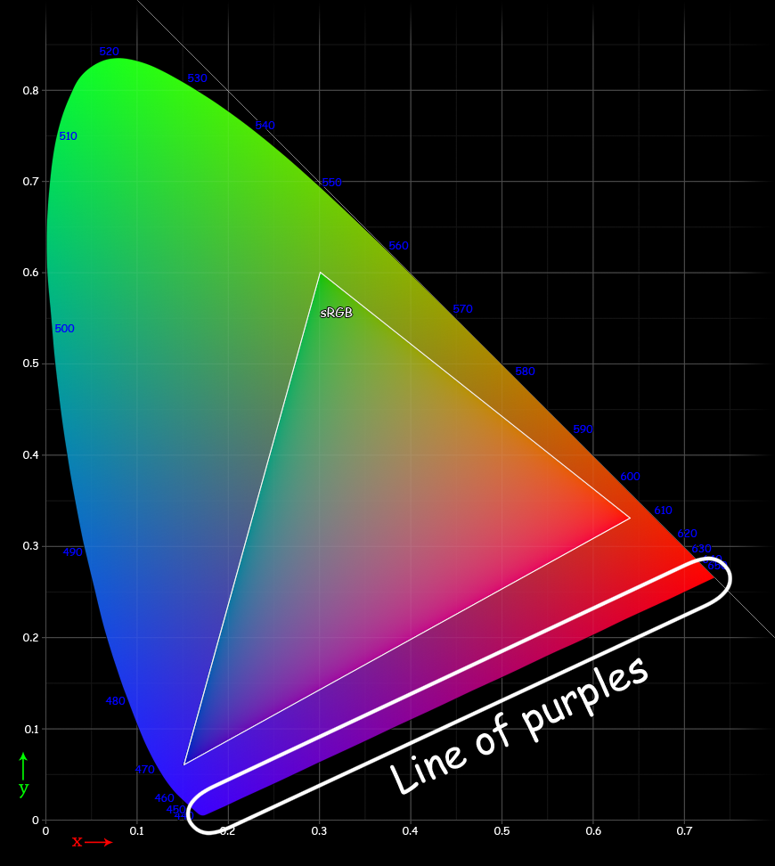
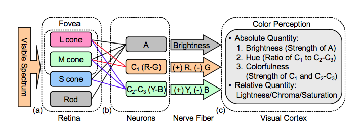
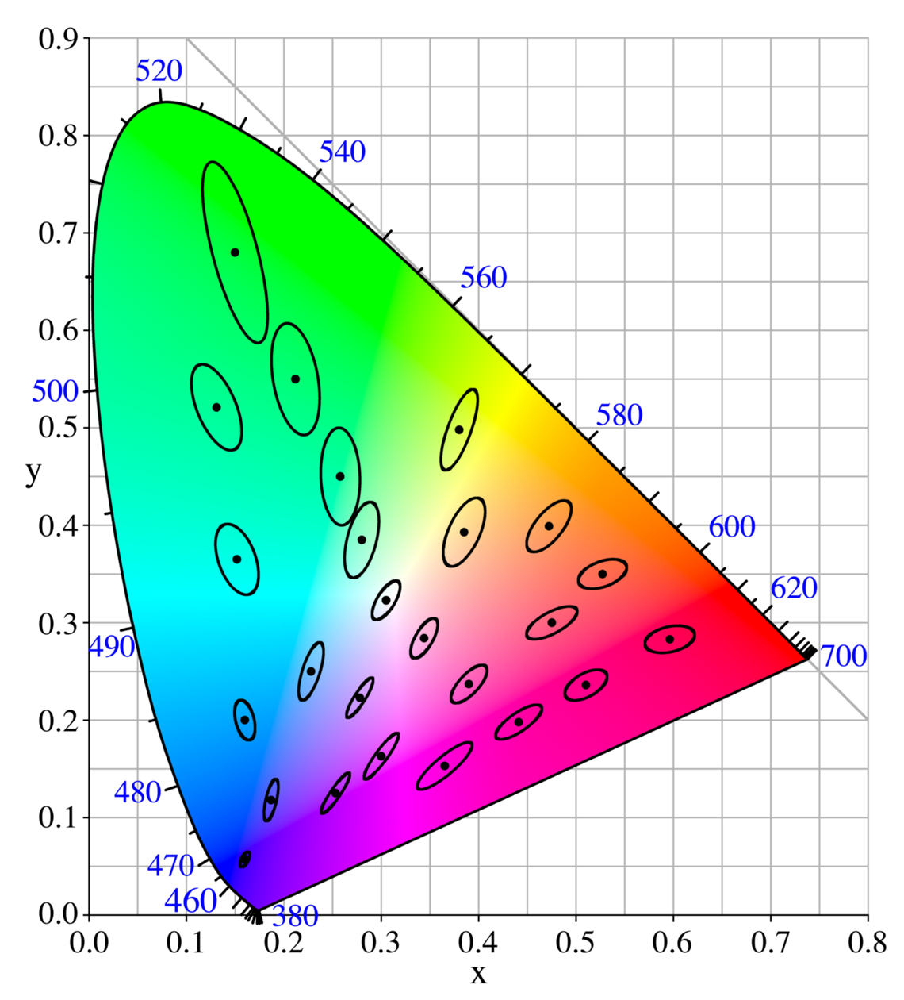

## Human eye

<youtube-embed video="eySkNWTI03Q" />

Perception of color derives from the stimulation of cone cells in the human eye by visible light. Light, containing all spectral colors is perceived white. Color of an object depends on the range of wavelengths of light that are absorbed or reflected by its surface. The sense of a particular color is produced in nervous system by combining signal from three types of cones, sensitive to red, green and blue ranges of the spectrum.

## Retina cells

- Cones
- Rods

<youtube-embed video="_xKbjYBnHhc" />

## Visual pathway

<youtube-embed video="ai7QnHS7C7g" />

Human eye with normal vision has three kinds of cone cells that sense light, having peaks of spectral sensitivity in short ("S", 420 nm – 440 nm), middle ("M", 530 nm – 540 nm), and long ("L", 560 nm – 580 nm) wavelengths. These cone cells underlie human color perception in conditions of medium and high brightness; in very dim light color vision diminishes, and the low-brightness, monochromatic "night vision" receptors, denominated "rod cells", become effective. Thus, three parameters corresponding to levels of stimulus of the three kinds of cone cells, in principle describe any human color sensation. Weighting a total light power spectrum by the individual spectral sensitivities of the three kinds of cone cells renders three effective values of stimulus; these three values compose a tristimulus specification of the objective color of the light spectrum. The three parameters, denoted "S", "M", and "L", are indicated using a 3-dimensional space denominated the "LMS color space", which is one of many color spaces devised to quantify human color vision.

> 
>
> The CIE XYZ standard observer color matching functions

## Opposite color vision theory

<youtube-embed video="l8_fZPHasdo" />

## Just noticable difference

<youtube-embed video="IZsAD_nm-q4" />

Tolerancing concerns the question "What is a set of colors that are imperceptibly/acceptably close to a given reference?" If the distance measure is perceptually uniform, then the answer is simply "the set of points whose distance to the reference is less than the just-noticeable-difference (JND) threshold." This requires a perceptually uniform metric in order for the threshold to be constant throughout the gamut (range of colors). Otherwise, the threshold will be a function of the reference color—cumbersome as a practical guide.

In the CIE 1931 color space, for example, the tolerance contours are defined by the MacAdam ellipse, which holds L\* (lightness) fixed. As can be observed on the adjacent diagram, the ellipses denoting the tolerance contours vary in size. It is partly this non-uniformity that led to the creation of CIELUV and CIELAB.

> 
>
> A MacAdam diagram in the CIE 1931 color space. The ellipses are shown ten times their actual size.
>

