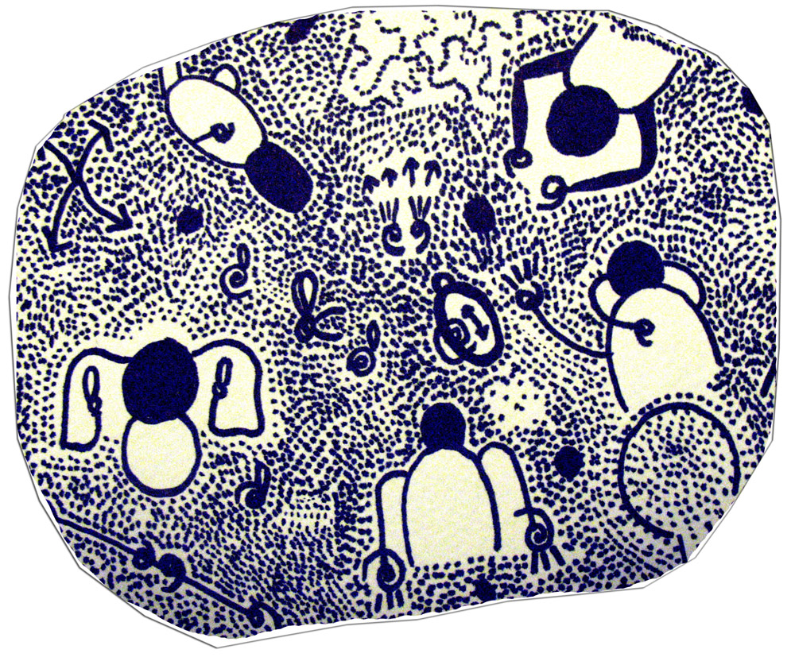
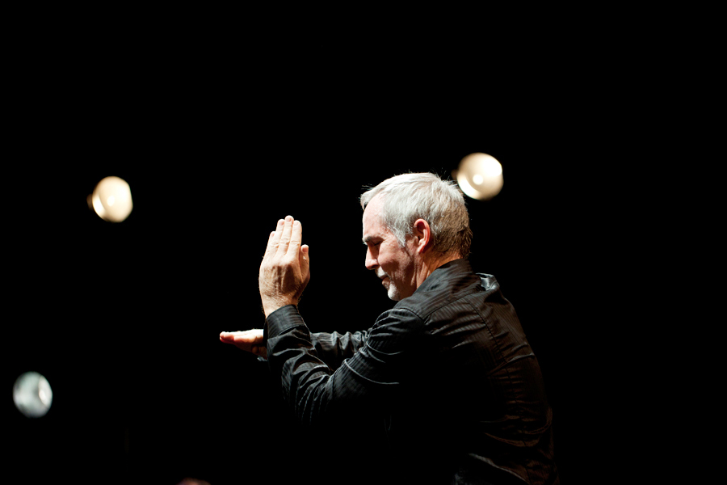
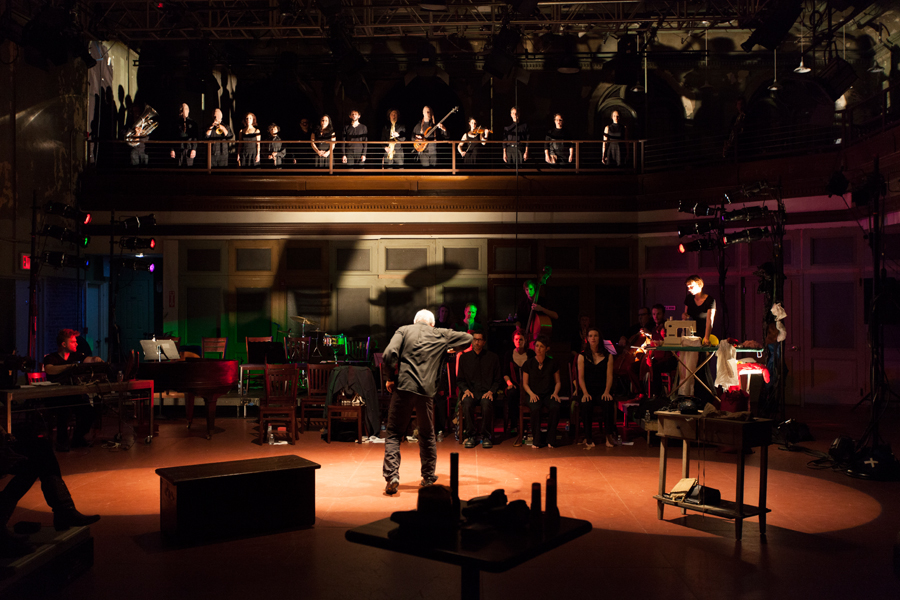

<youtube-embed video="YJQf0MDsNaA" />

## Introduction

[Soundpainting](http://www.soundpainting.com) is the universal multidisciplinary live composing sign language for musicians, actors, dancers, and visual Artists. Presently (2023) the language comprises more than 1500 gestures that are signed by the Soundpainter (composer) to indicate the type of material desired of the performers. The creation of the composition is realized, by the Soundpainter, through the parameters of each set of signed gestures. The Soundpainting language was created by Walter Thompson in Woodstock, New York in 1974.

## Developing the creative mind

Soundpainting is an essential method for engaging students of all ages, ability levels, and art forms in the creative process. Unlike learning to create within a single style, Soundpainting develops the creative voices of students through an array of structural parameters allowing individual choice and stylistic parameters. Using the composer, or “Soundpainter,” as teacher, the innate creativity of students is drawn out and developed constructively by way of the gestural choices of the Soundpainter, enabling each individual, each group, to express their own character in an experiential learning format.

<youtube-embed video="hp_AxCgtD1M" />

## Analysis

The Soundpainter (the composer) standing in front (usually) of the group communicates a series of signs using hand and body gestures indicating specific and/or aleatoric material to be performed by the group. The Soundpainter develops the responses of the performers, molding and shaping them into the composition then signs another series of gestures, a phrase, and continues in this process of composing the piece.

The Soundpainter composes in real time utilizing the gestures to create the composition in any way they desire. The Soundpainter sometimes knows what he/she will receive from the performers and sometimes does not know what he/she will receive – the elements of specificity and chance. The Soundpainter composes with what happens in the moment, whether expected or not. The ability to compose with what happens in the moment, in real time, is what is required in order to attain a high level of fluency with the Soundpainting language.

The gestures of the Soundpainting language are signed using the syntax of Who, What, How and When. There are many types of gestures, some indicating specific material to be performed as well as others indicating specific styles, genres, aleatoric concepts, improvisation, disciplines, stage positions, costumes, props, and many others.

## The Structure of Soundpainting

The Soundpainting gestures are grouped in two basic categories: Sculpting gestures and Function signals.

Sculpting gestures indicate What type of material and How it is to be performed and Function signals indicate Who performs and When to begin performing. Who, What, How, and When comprise the Soundpainting syntax. Note: The How gestures are not always employed. The Soundpainter often signs a phrase leaving out a How gesture. For example: Whole Group, Long Tone, Play. If you sign your phrase without a How gesture, then it is the performers choice in deciding the dynamics and quality of the material.

The Soundpainting syntax Who, What, How, When and the two basic categories Sculpting Gestures and Function Signals are further broken down into six subcategories: Identifiers, Content, Modifiers, Go gestures, Modes, and Palettes.

1. **Identifiers** are in the Function category and are Who gestures such as Whole Group, Woodwinds, Brass, Group 1, Rest of the Group, etc.

2. **Content gestures** are in the Sculpting category and identify What type of material is to be performed such as Pointillism, Minimalism, Long Tone, Play Can’t Play etc.

3. **Modifiers** are in the Sculpting category and are How gestures such as Volume Fader and Tempo Fader.

4. **Go gestures** are in the Function category and indicate When to enter or exit the composition and in some cases when to exit Content such as Snapshot or Launch Mode.

5. **Modes** are in the Sculpting category and are Content gestures embodying specific performance parameters. Scanning, Point to Point, and Launch Mode are several examples of Modes.

6. **Palettes** are in the Sculpting category and are primarily Content gestures identifying composed and/or rehearsed material

## Three Rates of Development

Certain gestures such as Point to Point, Scanning, Play Can’t Play, Relate To and Improvise are a few of the Content gestures that include parameters requiring specific rates of material development.

**Rate 1:** The performer develops their material in such a way that one minute later there would still be a relationship to their original idea.

**Rate 2:** The rate of development of material is about twice as fast as that of Rate 1. A minute later there would only be a vague relationship to the original idea.

**Rate 3:** Open rate of development. The performer may develop their material at any rate of their choosing.

## Imaginary Regions

There are four Imaginary Regions the Soundpainter utilizes when signing gestures.

1. **The Neutral position:** The Neutral position is the place on stage where the Soundpainter’s body indicates silence and/or stillness. It is where the Soundpainter prepares the phrase for initiation.

2. **The Box:** An imaginary space just in front of the Soundpainters Neutral position where phrases are initiated – the place of action. The Box is approximately 2 meters (6 feet) long and one meter wide. Important: Who, What, and How (sometimes) gestures are prepared out of the Box and then the Soundpainter steps into the Box initiating the phrase with a Go gesture. For example: Whole Group (out of the Box), Long Tone (out of the Box), Volume Fader (medium) (out of the Box), Play (in the Box). Important Note: Modifying Gestures such as Volume Fader and Tempo Fader can either be prepared out of the Box, then initiated with a Go gesture or, may be used in real time by stepping into the Box and signing the gesture for an immediate response from the performers.

3. **The Imaginary Staff:** An imaginary vertical field 1 and ½ meters (3 ½ feet) just in front of the Soundpainter that indicates low to high pitch range with sound and slow to fast movement with certain gestures such as a Long Tone. Note: The name Imaginary Staff is derived from music language. It is related to the music staff, which is a set of five parallel lines with spaces between them, on which notes are written to indicate their pitch.

4. **The Imaginary Stage:** A horizontal field (like a small square table top) approximately ¾ of a meter for each side (3/4 of a yard squared) at waist height positioned just in front of the Soundpainter. The Imaginary Stage is the region in which the Soundpainter indicates movement directions on the stage – where the movement will travel to and from. Such gestures as Directions and Space Fader are both signed on the Imaginary Stage.

<youtube-embed video="tKFjZEUbYdU" />

## Walter Thompson

### Soundpainter, Composer, Woodwinds, Piano, Percussion, Educator

Walter Thompson has achieved international recognition as a composer and for the creation of Soundpainting, the universal multidisciplinary live composing sign language. Thompson has composed Soundpaintings with contemporary orchestras, dance companies, theatre ensembles and multidisciplinary groups in United States, Europe and South America.

In 1974, after attending Berklee School of Music, Walter Thompson moved to Woodstock and began an association with the Creative Music Studio. While there, he studied composition and woodwinds with Anthony Braxton and began to develop his interest in using hand and body gestures as a way to create real-time compositions. Beginning as a tool to help shape the direction of a performance, it has evolved to become a universal composing language for composers and artists off all disciplines and abilities.

The language continues to be developed through Thompson’s performances, international think tanks, and the contributions of a wide range of artists and educators. Soundpainting is now being used both professionally and in education in more than 35 countries around the world including; the United States, France, Canada, Australia, Czech Republic, China, Germany, Spain, Norway, Denmark, Sweden, Finland, Italy, Japan, South Africa, Brazil, Uruguay, Montenegro, Guadeloupe, Argentina, Kazakhstan, Mexico, Nigeria, Switzerland, Turkey, and the Netherlands.

Thompson has composed Soundpaintings with contemporary orchestras, dance companies, theatre ensembles and multidisciplinary groups in many cities, including Barcelona, Paris, New York, Chicago, Los Angeles, Boston, Oslo, Berlin, Bergen, Lucerne, Copenhagen, and Reykjavik, among others, and has taught Soundpainting at the Paris Conservatoire; Grieg Academy, Bergen, Norway; Iceland Academy of the Arts; Eastman School of Music; University of California San Diego; University of Michigan; University of Iowa; Oberlin College-Conservatory of Music; and New York University, among many others. Thompson is founder of and Soundpainter for The Walter Thompson Orchestra founded in 1984 and based in New York City.

In 2002, Premis FAD Sebastià Gasch d’Arts Parateatrals awarded Thompson the prestigious “Aplaudiment” for his work with Soundpainting in Barcelona, Spain. He has also received awards from the National Endowment for the Arts, Meet the Composer, the Mary Flagler Cary Charitable Trust, ASCAP, Rockefeller Foundation, Mid Atlantic Arts Foundation, New York State Council on the Arts, and the Jerome Foundation.

## A New Approach In Music Education Improving Creativity: Soundpainting

Common characteristics of Orff, Kodaly and Dalcrose music education approaches are not only that they are the education methods improving the creativity but it is also that they gain aimed behaviours in dramatization, improve musical skills and ensure adaption into social environment thanks to music, acquire mental skills such as motivation, attention and self-confidence. Soundpainting is the universal live composing language created for musicians, dancers, actors, poets and visual artists working in their improvised environment. Soundpainting, a performance art based on improvisation, has started to be used in education in recent years. Just like other music education methods, education of Soundpainting is quite an important music education approach in terms of development in the creativity of individuals, their musical and mental skills. With this study, it has been tried to emphasize the Soundpainting's common points with other music education approaches by providing information about Soundpainting. Within this study, it is aimed at contributing to music education and teaching as a new approach. This research is one of the very few studies, which carried out in the fields of Soundpainting. Therefore, it is important in terms of its contribution to the both education and Soundpainting fields. This research is descriptive research and data were obtained by literature review. At the end of the research, it was emerged that Soundpainting has common ground with the other music education approaches and it could be used in music education.
[Read more](https://www.academia.edu/30315900/A_New_Approach_In_Music_Education_Improving_Creativity_Soundpainting)

- A New Approach In Music Education Improving Creativity: Soundpainting [Download PDF](/books/A_New_Approach_In_Music_Education_Improv-1.pdf)
