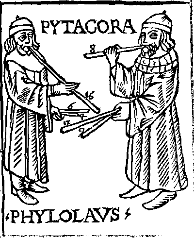

## Ancient Greece

In Greek mythology, Harmonia (/hɑːrˈmoʊniə/; Ancient Greek: Ἁρμονία) is the immortal goddess of harmony and concord. Her Roman counterpart is Concordia. Her Greek opposite is Eris, whose Roman counterpart is Discordia.

According to one account, she is the daughter of Ares and Aphrodite. By another account, Harmonia was from Samothrace and was the daughter of Zeus and Electra, her brother Iasion being the founder of the mystic rites celebrated on the island.

Almost always, Harmonia is the wife of Cadmus. With Cadmus, she was the mother of Ino, Polydorus, Autonoë, Agave, and Semele. Their youngest son was Illyrius.

He was the first Greek hero and, alongside Perseus and Bellerophon, the greatest hero and slayer of monsters before the days of Heracles.

Cadmus was credited by the ancient Greeks (such as Herodotus c. 484 – c. 425 BC, one of the first Greek historians, but one who also wove standard myths and legends through his work) with introducing the original Phoenician alphabet to the Greeks, who adapted it to form their Greek alphabet. Herodotus estimates that Cadmus lived sixteen hundred years before his time, which would be around 2000 BC.

### Pythagoreans

Pythagoras pioneered the mathematical and experimental study of music. He objectively measured physical quantities, such as the length of a string, and discovered quantitative mathematical relationships of music through arithmetic ratios. Pythagoras attempted to explain subjective psychological and aesthetic feelings, such as the enjoyment of musical harmony. Pythagoras and his students experimented systematically with strings of varying length and tension, with wind instruments, with brass discs of the same diameter but different thickness, and with identical vases filled with different levels of water. Early Pythagoreans established quantitative ratios between the length of a string or pipe and the pitch of notes and the frequency of string vibration.

Pythagoras is credited with discovering that the most harmonious musical intervals are created by the simple numerical ratio of the first four natural numbers which derive respectively from the relations of string length: the octave (1/2), the fifth (2/3) and the fourth (3/4). The sum of those numbers 1 + 2 + 3 + 4 = 10 was for Pythagoreans the perfect number, because it contained in itself "the whole essential nature of numbers". Werner Heisenberg has called this formulation of musical arithmetic as "among the most powerful advances of human science" because it enables the measurement of sound in space.

Pythagorean tuning is a system of musical tuning in which the frequency ratios of all intervals are based on the ratio 3:2. This ratio, also known as the "pure" perfect fifth, is chosen because it is one of the most consonant and easiest to tune by ear and because of importance attributed to the integer 3. As Novalis put it, "The musical proportions seem to me to be particularly correct natural proportions."

The fact that mathematics could explain the human sentimental world had a profound impact on the Pythagorean philosophy. Pythagoreanism became the quest for establishing the fundamental essences of reality. Pythagorean philosophers advanced the unshakable belief that the essence of all thing are numbers and that the universe was sustained by harmony. According to ancient sources music was central to the lives of those practicing Pythagoreanism. They used medicines for the purification (katharsis) of the body and, according to Aristoxenus, music for the purification of the soul. Pythagoreans used different types of music to arouse or calm their souls.

> 
>
> Medieval woodcut by Franchino Gaffurio, depicting Pythagoras and Philolaus conducting musical investigations.

For Pythagoreans, harmony signified the "unification of a multifarious composition and the agreement of unlike spirits". In Pythagoreanism, numeric harmony was applied in mathematical, medical, psychological, aesthetic, metaphysical and cosmological problems. For Pythagorean philosophers, the basic property of numbers was expressed in the harmonious interplay of opposite pairs. Harmony assured the balance of opposite forces. Pythagoras had in his teachings named numbers and the symmetries of them as the first principle, and called these numeric symmetries harmony. This numeric harmony could be discovered in rules throughout nature. Numbers governed the properties and conditions of all beings and were regarded the causes of being in everything else. Pythagorean philosophers believed that numbers were the elements of all beings and the universe as a whole was composed of harmony and numbers.

## Ancient Rome

### Concordia discors

> Cum tu inter scabiem tantam et contagia lucri
> Nil parvum sapias et adhuc sublimia cures:
> Quae mare conpescant causae, quid temperet annum,
> Stellae sponte sua iussaene vagentur et errent,
> Quid premat obscurum lunae, quid proferat orbem,
> Quid velit et possit rerum concordia discors,
> Empedocles an Stertinium deliret acumen.
> — Horat. Epist. I,12 (23-20 BCE)

> Temporis angusti mansit concordia discors
> Paxque fuit non sponte ducum  …
> — Lucan. Bell. civ. I, vers.98-99 (48-65 AD)

## Discordia concors

> …faciuntque deum per quattuor artus
> Et mundi struxere globum prohibentque requiri
> Ultra se quicquam, cum per se cuncta crearint:
> Frigida nec calidis desint aut umida siccis,
> Spiritus aut solidis, sitque haec discordia concors
> Quae nexus habilis et opus generabile fingit
> Atque omnis partus elementa capacia reddit:
> Semper erit pugna ingeniis, dubiumque manebit
> Quod latet et tantum supra est hominemque deumque.
> — Manilius. Astronomica, I.137-146

## Renaissance

> 
> Adriano Banchieri (1628)

<youtube-embed video="eRkgK4jfi6M" />

## Balkan Vocal Harmony

<youtube-embed video="AFgzzWT3zX4" />

## Greece

<youtube-embed video="dm1MWr0ZNdI" />

## Georgia

<youtube-embed video="9HtdXXOTWlQ"/> 

Georgian polyphonic singing encompasses several distinct regional styles, each with its own unique characteristics. The most prominent styles include Eastern Georgian and Western Georgian polyphony. Eastern Georgian polyphony, found in regions like Kartli and Kakheti, typically employs pedal drone polyphony. This style features two highly embellished melodic lines developing rhythmically free against a background of sustained pitches. In contrast, Western Georgian polyphony, prevalent in areas such as Achara, Imereti, Samegrelo, and Guria, utilizes contrapuntal techniques, often resulting in three and four-part harmonies with highly individualized melodic lines in each part.

A key characteristic of Georgian polyphonic singing is its extensive use of sharp dissonant harmonies, including seconds, fourths, sevenths, and ninths. The so-called "Georgian Triad" (C-F-G), consisting of a fourth and a second above the bass note, is particularly common. Additionally, Georgian music is known for colorful modulations and unusual key changes. The vocal technique often involves male falsetto singers, known as "krimanchuli," performing high-pitched melodies above the main melody. This creates a unique and ethereal quality to the music.

Georgian polyphonic singing typically involves three main vocal parts: mtkmeli (second tenor), modzakhili (first tenor), and bani (baritone). Other specialized parts include krini (falsetto), dvrini (bass), gamqivani, shemkhmobari, and krimanchuli. While most songs are sung a cappella, some may feature instrumental accompaniment on traditional instruments like the chonguri or panduri. The polyphonic structure allows for partial improvisation, with singers often creating their own melodies and harmonies within the established framework, resulting in a dynamic and engaging musical dialogue between voices.

## Pygmy music

<youtube-embed video="fHNkSYXbVMI"/> 

Pygmy music refers to the sub-Saharan African music traditions of the Central African foragers (or "Pygmies"), predominantly in the Congo, the Central African Republic and Cameroon.

Pygmy groups include the Bayaka, the Mbuti, and the Batwa.

Music is an important part of Pygmy life, and casual performances take place during many of the day's events. Music comes in many forms, including the spiritual likanos stories, vocable singing and music played from a variety of instruments including the bow harp (ieta), ngombi (harp zither) and limbindi (a string bow).

Researchers who have studied Pygmy music include Simha Arom, Louis Sarno, Colin Turnbull and Jean-Pierre Hallet.

### Polyphonic song

The Mbenga (Aka/Benzele) and Baka peoples in the west and the Mbuti (Efé) in the east are particularly known for their dense contrapuntal communal improvisation. Simha Arom says that the level of polyphonic complexity of Mbenga–Mbuti music was reached in Europe only in the 14th century. The polyphonic singing of the Aka Pygmies was relisted on the Representative List of the Intangible Cultural Heritage of Humanity in 2008.

Mbenga–Mbuti Pygmy music consists of up to four parts and can be described as an "ostinato with variations" similar to a passacaglia in that it is cyclical. It is based on repetition of periods of equal length that each singer divides using different rhythmic figures specific to different repertoires and songs. This creates a detailed surface and endless variations not only of the same period repeated but of various performances of the same piece of music. As in some Balinese gamelan music, these patterns are based on a super-pattern which is never heard. The Pygmies themselves do not learn or think of their music in this theoretical framework, but learn the music growing up.

Polyphonic music is only characteristic of the Mbenga and Mbuti. The Gyele/Kola, Great Lakes Twa and Southern Twa have very different musical styles.

> <youtube-embed video="zb0z0yOdY5E"/> 
> Most of the literature on Baka music concentrates on their “spirit dances”. What is actually meant by “spirit” is rarely, if ever, mentioned in the literature. In English the language for such things as “spirit” and “enchantment” have been heavily influenced by 1000 years of Christianity and given negative connotations, so the true meanings of words get lost in translation.There seems to be an underlying inference that belief in “spirits” is a primitive animistic practice, rather than a rational interpretation of a real phenomenon that is indirectly revered in Western society in art, performance and sport, but which is never spoken about. The Baka call this mé.
> With their combination of polyphonic singing, polyrhythmic percussion and masked dancers, the Baka are experts at manifesting mé. Each “Spirit Dance” creates its own unique emotions personified in the mé. By being present at these “spirit dances” from before they are born, aware of sounds and movements while still in their mother’s womb, Baka children grow up learning that the purpose of “musicking” is not about performing songs, but about manifesting mé for the good of all.

### Liquindi

 <youtube-embed video="ZNzX5t5S4Ls"/> 

Liquindi is water drumming, typically practiced by Pygmy women and girls. The sound is produced by persons standing in water, and hitting the surface of the water with their hands, such as to trap air in the hands and produce a percussive effect that arises by sudden change in air pressure of the trapped air. The sound cannot exist entirely in water, since it requires the air-water boundary as a surface to be struck, so the sound is not hydraulophonic. 

<youtube-embed video="8QyK0q1Kr-A"/> 

### Hindewhu

Hindewhu is a style of singing/whistle-playing of the BaBenzélé pygmies of the Central African Republic. The term hindewhu is an onomatopoeia of the sound of a performer alternately singing pitched syllables and blowing into a single-pitch papaya-stem whistle, in an interlocked rhythm similar to the gutera-kwakira structure of the Burundian akazehe. Hindewhu announces the return from a hunt and is performed solo, duo or in groups.

### Western popularization

Colin M. Turnbull, an American anthropologist, wrote a book about the Efé Pygmies, The Forest People, in 1965. This introduced Mbuti culture to Western countries. Turnbull claimed that the Mbuti viewed the forest as a parental spirit with which they could communicate via song.

Some of Turnbull's recordings of Efé music were commercially released and inspired more ethnomusicological study such as by Simha Arom, a French-Israeli who recorded hindewhu, and Luis Devin, an Italian ethnomusicologist who studied in depth the musical rituals and instruments of Baka Pygmies.

Some popular musicians have used hindewhu in their music:

- "Hunting", a song by Deep Forest from their album Made in Japan.
- "Ba-Benzélé", a song by Jon Hassell and Brian Eno from the album Fourth World, Vol. 1: Possible Musics (1980).
- "Fabulous" (1983), a tune by John Oswald and Dick Hyman from the album plunderphonics (1989).
- Percussionist Bill Summers imitates hindewhu in the track "Watermelon Man" by Herbie Hancock from the 1973 album Head Hunters (see hocket).
- "Sanctuary", a song by Madonna from the album Bedtime Stories (1994) samples the Herbie Hancock recording. 
- In 1992 the popularization of Pygmy music spread with the release of Eric Mouquet and Michel Sanchez's Deep Forest. A percentage of the proceeds from each album were donated to the Pygmy Fund set up to aid Zaire's Pygmies. The album was nevertheless subject to controversy, as the project used samples recorded by ethnomusicologist Hugo Zemp without permission; further controversy was stirred by the lack of consideration given to the original performer - a Northern Malaitian woman named Afunakwa - by either party during the resultant legal battle.
- Also in 1992 Martin Cradick and Su Hart spent three months living with and recording Baka in Cameroon. result was the creation of the band Baka Beyond and the release of their collaboration with the Baka musicians, "Spirit of the Forest" alongside the album "Heart of the Forest", and a musical relationship that has lasted over twenty years. Proceeds from both these albums have returned to the Baka musicians through the charity Global Music Exchange which continues to work with the Baka helping them in their rapidly changing environment.
- Pianist Pierre-Laurent Aimard programmed recordings of Pygmy songs (performed by the Aka Pygmies) with works of contemporary composers György Ligeti and Steve Reich on his African Rhythms (2003)

## Other African traditions

### Mbube and Isicathamiya (South Africa)

Zulu a cappella singing styles featuring complex harmonies.

<youtube-embed video="FclwRECHoWc"/> 

### Khoikhoi and San Music (Southern Africa)

Features overlapping vocal parts and complex rhythms.

<youtube-embed video="dTL_TdONVBs"/> 

### West African Griot

While primarily melodic, some griot performances include harmonized choruses.

> <youtube-embed video="Ig91Z0-rBfo"/> 
> Sona Jobarteh is the first female Kora virtuoso to come from a west African Griot family. The Kora is one of the most important instruments belonging to the Manding peoples of West Africa (Gambia, Senegal, Mali, Guinea and Guinea-Bissau). It belongs exclusively to griot families, and usually only men who are born into these families have the right to take up the instrument professionally. Sona Jobarteh combines various genres of African Music and western musical elements. 
> 
<youtube-embed video="--q1j2PExpE"/> 