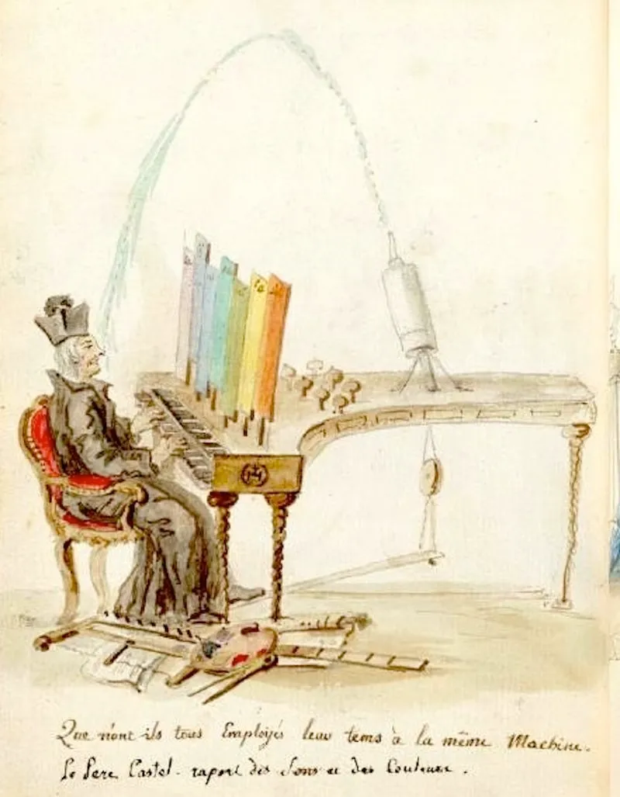
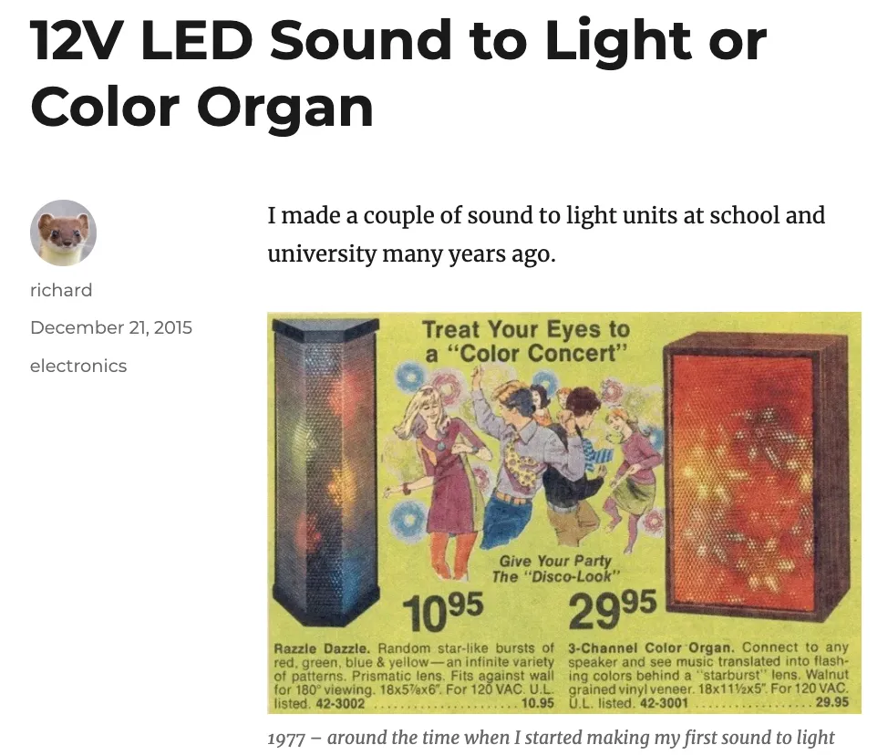
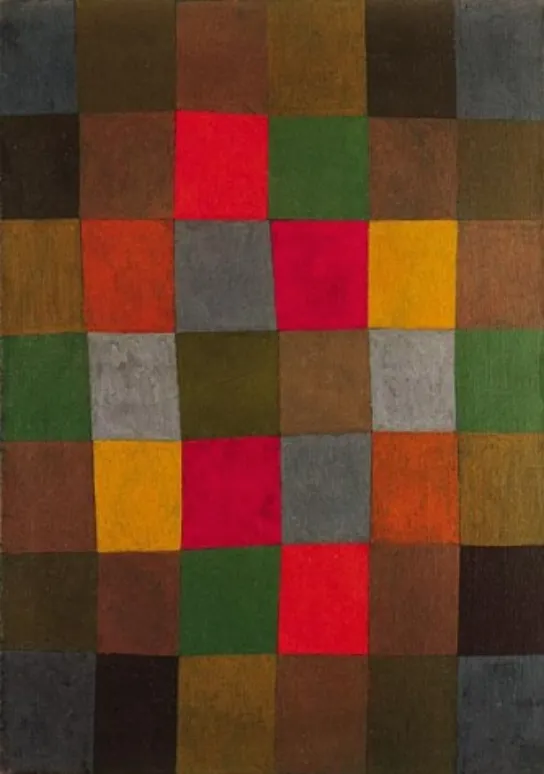
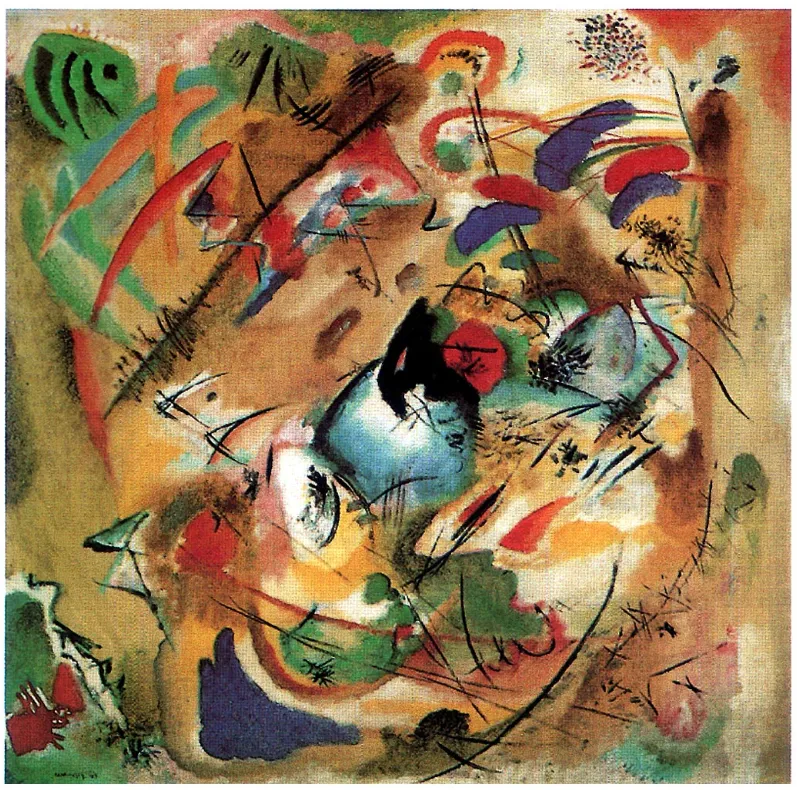
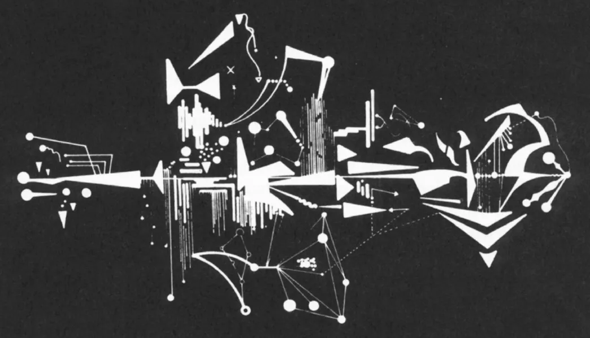
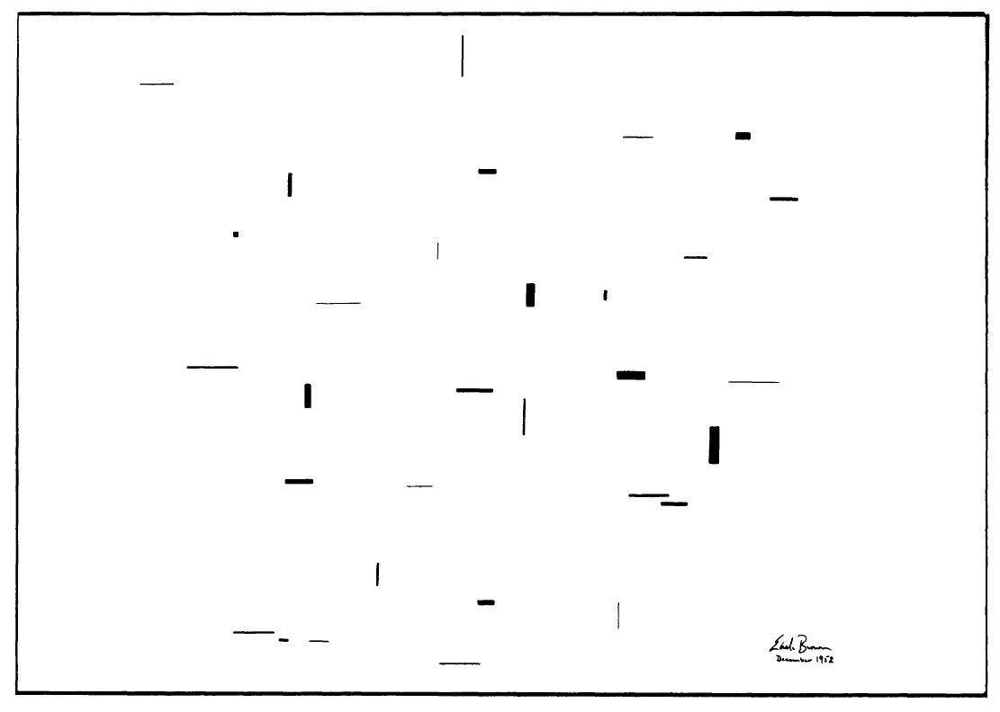
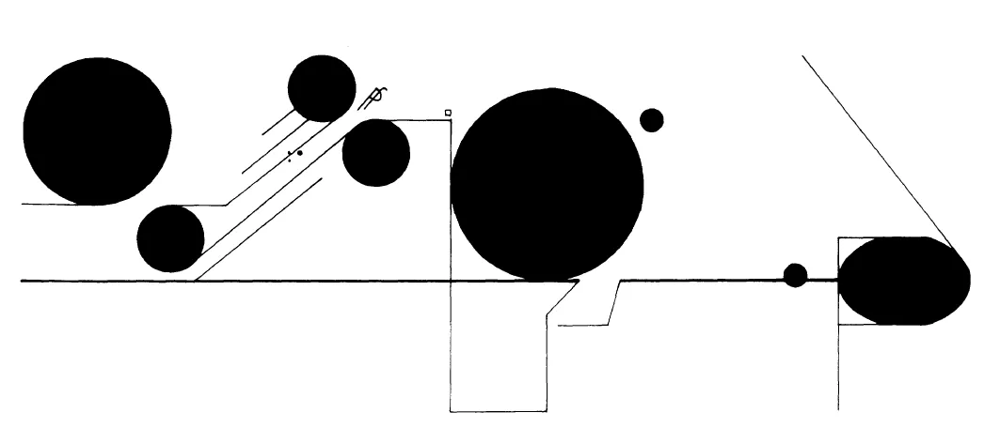
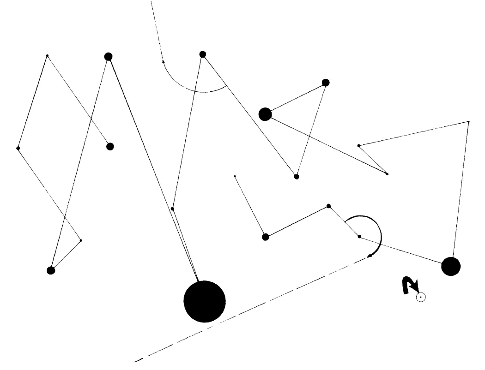
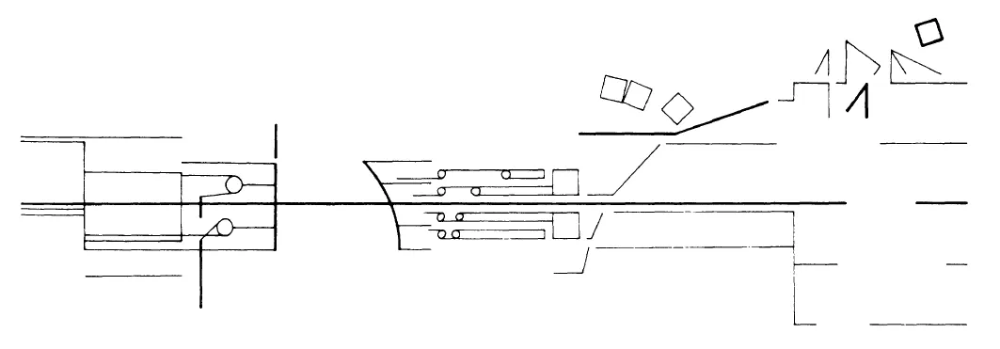
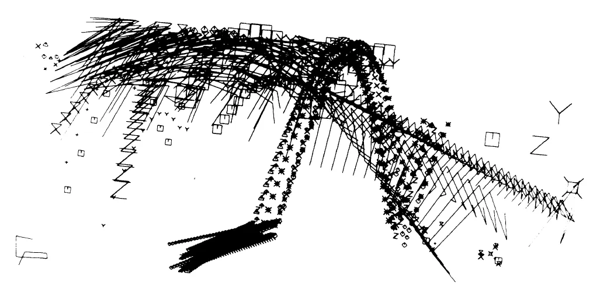

Visual Music and Audiovisual Aesthetics
=======================================

<youtube-embed video="jQCEXWjitsA" />

Visual Music & the Poetics of Synaesthesia
==========================================

**Poetics** in the context of this essay refers broadly to ‘principles of making’ and by extension, general design principles. The origins of poetics was with Aristotle’s _Poetics_ which analyzed literary-theatrical narratives, but today the scope of poetics is much wider and can cover any media- and meaning-making terrain where patterns of making can be formally analyzed.

> For most of its long history, the term **poetics** subsumed attempts to reveal the inner [logic](http://csmt.uchicago.edu/glossary2004/logic.htm) of a work of art in an examination of its formal and constituent features while inevitably raising problems of intention, meaning, and interpretation.
> 
> With the advent of new technologies and an increasing differentiation of media, the medium of [print](http://csmt.uchicago.edu/glossary2004/typeprint.htm) has lost some of its status while other technologies vie for acceptance alongside it. Accordingly, in critical [discourse](http://csmt.uchicago.edu/glossary2004/discourse.htm), new media studies have gained ascendancy over poetics. Poetics, broadly understood, takes as its subject matter a hermeneutic process productive of meaning and responsive to [communication](http://csmt.uchicago.edu/glossary2004/communication.htm), even where this process is intentionally made difficult for artistic purposes, a view that has been hotly contested as a result of the emergence of new technologies ([source](https://lucian.uchicago.edu/blogs/mediatheory/keywords/poetics/)).

Visual music predates the contemporary concept of the music video by at least half a millennia, depending on how one qualifies it. Most historical commentary on visual music finds an origin point in the Medieval color organ, which is the earliest known technological precursor to today’s iTunes Visualizer. Many commentators, however, do not go so far back, and relate visual music to early 20th Century trends in Modernism. In today’s maker culture, there is often a lack of deep historical sense and context. At the start of the first video embed below, an Arduino-tinkerer claims that the color organ originated in the 1970s (!) when there was a genre of music-light interactive consumer novelties that were also called color organs. Here is what Wikipedia has to say about color organs (all Wikipedia links will be left in place in case you want to explore more):

> The term **color organ** refers to a tradition of mechanical devices built to represent sound and accompany music in a visual medium. The earliest created color organs were manual instruments based on the harpsichord design. By the 1900s they were electromechanical. In the early 20th century, a silent color organ tradition (Lumia) developed. In the 1960s and ’70s, the term “color organ” became popularly associated with electronic devices that responded to their music inputs with [light shows](https://en.wikipedia.org/wiki/Liquid_light_show). The term “[light organ](https://en.wikipedia.org/wiki/Light_organ)” is increasingly being used for these devices; allowing “color organ” to reassume its original meaning.
> 
> The dream of creating a visual music comparable to auditory music found its fulfillment in animated abstract films by artists such as [Oskar Fischinger](https://en.wikipedia.org/wiki/Oskar_Fischinger), [Len Lye](https://en.wikipedia.org/wiki/Len_Lye) and [Norman McLaren](https://en.wikipedia.org/wiki/Norman_McLaren); but long before them, many people built instruments, usually called “color organs,” that would display modulated colored light in some kind of fluid fashion comparable to music.
> 
> — [William Moritz](https://en.wikipedia.org/wiki/William_Moritz)
> 
> In 1590, Gregorio Comanini described an invention by the [Mannerist](https://en.wikipedia.org/wiki/Mannerist) painter [Arcimboldo](https://en.wikipedia.org/wiki/Arcimboldo) of a system for creating color-music, based on apparent luminosity (light-dark contrast) instead of hue.
> 
> In 1725, French Jesuit monk [Louis Bertrand Castel](https://en.wikipedia.org/wiki/Louis_Bertrand_Castel) proposed the idea of _Clavecin pour les yeux_ (_Ocular Harpsichord_). In the 1740s, German composer [Telemann](https://en.wikipedia.org/wiki/Georg_Philipp_Telemann) went to [France](https://en.wikipedia.org/wiki/France) to see it, composed some pieces for it and wrote a book about it. It had 60 small colored glass panes, each with a curtain that opened when a key was struck. In about 1742, Castel proposed the _clavecin oculaire_ (a light organ) as an instrument to produce both sound and the ‘proper’ light colors.
>

Castel’s Ocular Organ, [Source](https://en.wikipedia.org/wiki/Color_organ#/media/File:A_caricature_of_Louis-Bertrand_Castel's_%22ocular_organ%22.jpg). A caricature of Louis-Bertrand Castel’s “ocular organ” by [Charles Germain de Saint Aubin](https://en.wikipedia.org/wiki/Charles_Germain_de_Saint_Aubin)

> In 1743, Johann Gottlob Krüger, a professor at the University of Hall, proposed his own version of the ocular harpsichord.
> 
> In 1816, [Sir David Brewster](https://en.wikipedia.org/wiki/Sir_David_Brewster) proposed the [Kaleidoscope](https://en.wikipedia.org/wiki/Kaleidoscope) as a form of visual-music that became immediately popular.
> 
> In 1877, US artist, inventor [Bainbridge Bishop](https://en.wikipedia.org/w/index.php?title=Bainbridge_Bishop&action=edit&redlink=1) gets a patent for his first Color Organ.The instruments were lighted attachments designed for pipe organs that could project colored lights onto a screen in synchronization with musical performance. Bishop built three of the instruments; each was destroyed in a fire, including one in the home of [P. T. Barnum](https://en.wikipedia.org/wiki/P._T._Barnum).
> 
> In 1893, British painter [Alexander Wallace Rimington](https://en.wikipedia.org/wiki/Alexander_Wallace_Rimington) invented the [Clavier à lumières](https://en.wikipedia.org/wiki/Clavier_%C3%A0_lumi%C3%A8res). Rimington’s _Colour Organ_ attracted much attention, including that of [Richard Wagner](https://en.wikipedia.org/wiki/Richard_Wagner) and Sir [George Grove](https://en.wikipedia.org/wiki/George_Grove). It has been incorrectly claimed that his device formed the basis of the moving lights that accompanied the [New York City](https://en.wikipedia.org/wiki/New_York_City) premiere of [Alexander Scriabin](https://en.wikipedia.org/wiki/Alexander_Scriabin)’s [synaesthetic](https://en.wikipedia.org/wiki/Synesthesia) symphony [_Prometheus: The Poem of Fire_](https://en.wikipedia.org/wiki/Prometheus:_Poem_of_Fire) in 1915. The instrument that accompanied that premiere was lighting engineer Preston S. Millar’s chromola, which was similar to Rimington’s instrument.
> 
> In a 1916 [art manifesto](https://en.wikipedia.org/wiki/Art_manifesto), the Italian Futurists [Arnaldo Ginna](https://en.wikipedia.org/wiki/Arnaldo_Ginna) and [Bruno Corra](https://en.wikipedia.org/wiki/Bruno_Corra) described their experiments with “color organ” projection in 1909. They also painted nine abstract films, now lost….
> 
> In 1918, American concert pianist [Mary Hallock-Greenewalt](https://en.wikipedia.org/wiki/Mary_Hallock-Greenewalt) created an instrument she called the [_Sarabet_](https://en.wikipedia.org/wiki/Sarabet). Also an inventor, she patented nine inventions related to her instrument, including the [rheostat](https://en.wikipedia.org/wiki/Rheostat).
> 
> In 1921, Arthur C. Vinageras proposed the _Chromopiano,_ an instrument resembling and played like a grand piano, but designed to project “chords” composed from colored lights.
> 
> In the 1920s, Danish-born [Thomas Wilfred](https://en.wikipedia.org/wiki/Thomas_Wilfred) created the _Clavilux,_ a color organ, ultimately patenting seven versions. By 1930, he had produced 16 “Home Clavilux” units. Glass disks bearing art were sold with these “Clavilux Juniors.” Wilfred coined the word [_lumia_](https://en.wikipedia.org/wiki/Lumia_(art)) to describe the art. Significantly, Wilfred’s instruments were designed to project colored imagery, not just fields of colored light as with earlier instruments.
> 
> In 1925, Hungarian composer [Alexander Laszlo](https://en.wikipedia.org/wiki/Alexander_Laszlo_(composer)) wrote a text called _Color-Light-Music_ ; Laszlo toured Europe with a color organ.
> 
> In [Hamburg](https://en.wikipedia.org/wiki/Hamburg), Germany from the late 1920s–early 1930s, several color organs were demonstrated at a series of Colour-Sound Congresses (German:_Kongreß für Farbe-Ton-Forschung_).[Ludwig Hirschfeld Mack](https://en.wikipedia.org/wiki/Ludwig_Hirschfeld_Mack) performed his Farbenlichtspiel colour organ at these congresses and at several other festivals and events in Germany. He had developed this color organ at the [Bauhaus](https://en.wikipedia.org/wiki/Bauhaus) school in Weimar, with Kurt Schwerdtfeger.
> 
> The 1939 London Daily Mail Ideal Home Exhibition featured a “72-way Light Console and Compton Organ for Colour Music”, as well as a 70 feet, 230 kW “Kaleidakon” tower.
> 
> From 1935–77, Charles Dockum built a series of Mobilcolor Projectors, his versions of silent color organs.
> 
> In the late 1940s, [Oskar Fischinger](https://en.wikipedia.org/wiki/Oskar_Fischinger) created the [Lumigraph](https://en.wikipedia.org/w/index.php?title=Lumigraph&action=edit&redlink=1) that produced imagery by pressing objects/hands into a rubberized screen that would protrude into colored light. The imagery of this device was manually generated, and was performed with various accompanying music. It required two people to operate: one to make changes to colors, the other to manipulate the screen. Fischinger performed the Lumigraph in Los Angeles and San Francisco in the late 1940s through early 1950s. The Lumigraph was licensed by the producers of the 1964 sci-fi film, [_The Time Travelers_](https://en.wikipedia.org/wiki/The_Time_Travelers_(1964_film)). The Lumigraph does not have a keyboard, and does not generate music.
> 
> In 2000, [Jack Ox](https://en.wikipedia.org/wiki/Jack_Ox) and David Britton created “The Virtual Color Organ.” The 21st Century Virtual Reality Color Organ is a computational system for translating musical compositions into visual performance. It uses supercomputing power to produce 3D visual images and sound from Musical Instrument Digital Interface (MIDI) files and can play a variety of compositions. Performances take place in interactive, immersive, virtual reality environments such as the Cave Automatic Virtual Environment (CAVE), VisionDome, or Immersadesk. Because it’s a 3D immersive world, the Color Organ is also a place — that is, a performance space._(_[_source_](https://en.wikipedia.org/wiki/Color_organ#:~:text=In%20the%20late%201940s%2C%20Oskar,performed%20with%20various%20accompanying%20music.)_)_

Contrary to the Young Maker at the start of the video below, the Color Organ did NOT originate in the 1970s. Image [Source](https://www.richardmudhar.com/blog/2015/12/12v-led-sound-to-light-or-color-organ/)

<youtube-embed video="HUw1-Kxq9_U" />

There aren’t any videos on YouTube of the Medieval color organ, but in the 20th Century many artists were inspired by the concept, and with new electronic and audiovisual technologies, what is sometimes called sound-image or music-visual ‘synaesthesia’ was often pursued in a range of creative works in different media and performance contexts. Below is an excerpt from a performance of Scriabin’s _Prometheus: Poem of Fire_ painstakingly recreated at Yale University in 2010.

<youtube-embed video="V3B7uQ5K0IU" />

Prometheus: Poem of Fire (Scriabin)

> Scriabin suffered from the natural condition of synesthesia, which made him associate musical notes and keys with colors. For example, the pitch “D” represented bright yellow, while “A” looked like dark green, and “D flat” felt like deep purple. In addition, in his late works traditional tonality is replaced by a set of unique harmonic spaces that inhabit a world of polyrhythmic uncertainty. In his quest to transfigure the word, Scriabin thought it necessary to confront the forces of evil. His Ninth Sonata is aptly nicknamed “The Black Mass,” and Scriabin tellingly regarded the performance of this work as “practicing sorcery.” Whatever the case may be, it is certainly a work of great musical concentration and extreme emotional intensity. ([source](https://interlude.hk/taste-color-musicalexander-scriabin/))

Many experimental filmmakers made use of optical representations of sound to manipulate the audio track that is played by analog projectors, reversing the usual process of transcribing optical audio by drawing sounds directly onto film to create the soundtrack.

<youtube-embed video="Q0vgZv_JWfM" />
Optical Sound

<youtube-embed video="E3-vsKwQ0Cg" />

McLaren’s Dots

Visual music approaches are particularly popular in creative practices where electroacoustic composition and animation intersect, and the synaesthetic explorations that we saw above in the realm of analog film continue today in the use of integrating the output 3D modeling and animation software with sound synthesis.

<iframe title="vimeo-player" src="https://player.vimeo.com/video/14112798?h=62e7053ce4" width="640" height="360" frameborder="0"    allowfullscreen></iframe>

Here is a very recent example of some new trends emerging in computational visual music (to use that term in a very broad sense, since ‘visual music’ can encompass quite a range of creative practices) related to an increasing interest in data and algorithms. Michele Zaccagnini is developing a process he calls Deep Mapping, which is

> an approach that allows the composer to store and render musical data into visuals by “catching” the data at its source, at a compositional stage. The advantages of this approach are: accuracy and discreteness in the representation of musical features; computational efficiency; and, more abstractly, the stimulation of a practice of audiovisual composition that encourages composers to envision their multimedia output from the early stages of their work.The drawbacks are: prerecorded sounds cannot be deep-mapped and deep mapping presupposes an algorithmic compositional approach.

<youtube-embed video="yGXZBfgmVBo" />

Deep Map #1

Visual Music in Film
--------------------

Visual Music is a concept also sometimes employed in the purely visual arts, where some painters have found inspiration in the concept of music to describe their abstractions.

Paul Klee, New Harmony, 1936

Wassily Kandinsky, Improvisation (Dreamy), 1913

In Visual Music of the moving image variety (e.g. film and video, rather than music as the “referent” or metaphor for abstractions in painting, such as those of Kandinsky or Klee), the image track is often in a fantasia mode vis-à-vis the soundtrack. While as is usually the case with sound design, the script, footage and first edits usually precede the production of sound (though there are exceptions, as with Ben Burtt’s collection of sounds for Star Wars where he often recorded interesting sounds before knowing what to do with them), with visual music there is typically a pre-existent work of music, which the moving image takes as an inspiration or motivation for free form and abstract play. Visual Music as a form can range from abstraction (e.g. a play on geometric shapes, light or color), to specific references to technologies of mediation (e.g. bright flashes of overexposed film, video footage modulated by rhythms in a techno beat, or even the generative imagery produced by iTunes Visualizer), to highly stylized and very abstract characterizations of personae with degrees of recognizable action and even plot (for instance, the struggle of an orange triangle to escape from thick lines and grids of black, which metaphorically morph into the bars of a prison or cage, as below with Synchromy No 4 Escape).

<youtube-embed video="YRmu-GcClls" />

Mary Ellen Bute’s Synchromy №4 Escape

<youtube-embed video="pzErTRNVj3Y" />

Fan video, Black Eyed Peas “I Gotta Feeling” as motion-visual geometry.

<youtube-embed video="T96K2inyQok" />

Powercord vs Philter Phreak

Photo-collage and montage editing have also been a feature of Visual Music, and highly stylized music video production (especially for electronica genres) can often blur the usual stylistic boundaries between what one might typically refer to as a ‘music video’ versus a work of Visual Music.

<youtube-embed video="JY_gQ9TNIUw" />

One Dot Zero

> The ident is based around the idea of the roots of computer technology in the pre digital world — a world of music boxes, jacquard looms, punch cards and relay switches. Music box mechanisms were the precursors to punch cards as ways of communicating binary information, the Jacquard loom used punch-cards to essentially program the loom to create complex textile patterns (looked at now they resemble 8-bit computer drawings). The first real computer circuit was created using telephone relay switches. Our contemporary digital world is linked to pre-electric era of automated crafts and musical automata. This has a resonance with the tenth anniversary of onedotzero — both in the way that it references history but also it is mirrored in a lot of the work that’s being produced now. Computers have become almost invisible, powerful tools which are being used to facilitate craft. ([source](https://www.youtube.com/watch?v=JY_gQ9TNIUw))

In its ‘classic’ mode,’ visual music is often linked to the tradition of seeking an experience of synaesthesia as a spiritually heightened fusion of the senses. Its antecedents are in Wagner’s Gesamtkunstwerk (indeed, Richard Wagner’s “Evening Star” is the music of Mary Ellen Bute’s Synchrony №2) or total artwork (a fusion of the all the arts and consequently, of the senses), but it also has roots in the Symbolist and Spiritualist movements of the 19th century — all of this has its origins in Schopenhauer’s philosophy of music, in which music was framed as the highest art due to its ability to directly represent the Will (for Schopenhauer, the Will as a category included magnetism, love, rage, and electricity — in other words, forces in general, whether internal to one’s self and unconscious, or external in the workings of the world).

> As an outgrowth of the Romantic and Symbolist movements, music was elevated to a status of supremacy over all the other forms of creative expression. The other arts, notably poetry and painting, were said to aspire to the “condition of music.” Artists came to believe that painting should be analogous to music.
> 
> Proponents of musical analogy based their aesthetic theories on an abstraction of the idea of music, rather than on a clear understanding of musicology. For them music represented a non-narrative, non-discursive mode of expression. They reasoned that music, in its direct appeal to emotions and senses, transcended language. Just as music was a universal form of expression, so should the visual arts attain universality by evoking sensual pleasure or an emotional response in the viewer.
> 
> Advocates of musical analogy and color music also depended upon the related notion of synaesthesia; that is, they believed in the subjective interaction of all sensory perceptions. This common acceptance of synaesthesia resulted from two divergent philosophical positions. According to the more romantically inclined artists and writers, the interchangeability of the senses was evidence of mystical correspondence to a higher reality. On the other hand, some artists joined forces with scientific researchers to study synaesthesia as a phenomenon of human perception. ([Source](https://www.jstor.org/stable/1483303?seq=1))

Many works in the filmic synaesthetic tradition can be read as an a counter-modernist inclination, a vestige of romantic impulse in the development of 20th century mediation.

**Sound Design**
----------------

The term Sound Design came into vogue in the 1970s to describe a new role in the creation of the sound film, analogous to a “director” or “cinematographer” of the soundtrack. In the early ’70s Dolby noise reduction, which had already established itself widely in music production and distribution during the ’60s, expanded its application to the area of film sound. The specific properties of Dolby — increased dynamic range, improved spatialization, better frequency response, and reduction of the noise floor — combined with Dolby’s strategy of providing relatively affordable licensing to theater owners so that it’s noise reduction technology could be widely adapted, provided for the first time a universal standard in cinematic sound reproduction, allowing the sound mix heard in the theaters to be closer to that heard on the mix stage than at any time previously. ([source](https://www.amazon.com/Dolby-era-contemporary-Hollywood-Popular/dp/0719070678))

The aesthetic possibilities opened up by this technological change were exploited by filmmakers, particularly those based in San Francisco’s “Hollywood North.” For instance, the two artist-technicians usually credited with being the first “sound designers” (the first to receive this designation), Ben Burtt and Walter Murch, were each given unprecedented periods of time to explore sound as a dimension of film. Burtt was given more than a year to build a sound effects library for George Lucas’s _Star Wars_ film soundtrack, famously (in widely circulated images) “wandering the desert” with field recording gear, tapping on phone wires and recording sounds that would eventually support such futuristic technologies as X-Wing Fighters and light sabers. Murch spent a year mixing and remixing Francis Ford Coppola’s _Apocalypse Now_, trying out multiple edits and approaches to what is likewise (as in the case of Star Wars) regarded as a paradigm shift in film mixing.

In entertainment industry contexts, sound‘s role is often described in the relevant literature as a form of “[subordination](https://www.amazon.com/Music-Imagination-Culture-Clarendon-Paperbacks/dp/0198163037/ref=sr_1_1?keywords=Music%2C+Imagination+and+Culture+by+Nicholas+Cook&qid=1579364384&s=books&sr=1-1)” to the film’s imagery. In other words, the work of the soundtrack is to reinforce, through its specific effects (heightened emotion, spatial depth, representing sound sources, clarity of speech, rhythmic pacing and the like) the narratological and often “realist” motivations of the image track (and reciprocally, reserving “weird sound.” often simply taken from the realm of avant-garde music — for dream sequences, aliens, monsters and the like ([source](https://www.jstor.org/stable/j.ctt2005s0z)). Such an approach is typical of more narrative, mainstream or commercial projects.

In contrast, experimental approaches to sound design tend to assert a relative autonomy for the soundtrack in relation to the moving image. But at the same time there is often an “associational intent” at work, in that there is an attempt to create poetic or connotational relationships between sound and image.

**Experimental Music**
----------------------

In her paper “Experimental Music Semiotics,” Morag Josephine Grant elaborates an intriguing [Peircean semiotic approach](https://vanseodesign.com/web-design/icon-index-symbol/) to understanding the distinction between experimental music and other forms of avant-garde, classical or “new” music. In her analysis, experimental music has a heightened interest in the indexical relationship to sound, whereas other forms may be better described as having a stronger affinity for the symbolic.

> Definitive for the icon in similarity with the object referred to, definitive for the index is contiguity with the object referred to, definitive for the symbol is its dependence on a standard rule of interpretation. ([source](https://www.jstor.org/stable/i30032123))

It is in this notion of “a standard rule of interpretation” that one can find a slew of correspondences to non-experimental (including avant-garde) music practices. For instance, an interval can be read as also referring to a moment in the score, a minor third, and all the rules of harmony with its allowances and strictures of what one is to do with a minor third (or not do with it). In the recapitulation of a theme, the work itself can be understood as the interpretant which contextualizes its significance. One can expand this to other fields of music as well. Jazz, for instance, can be understood as a metaphor or symbol for communication (call and response, dialogue). To draw her distinction sharply, she offers the striking example of the sound of a telephone:

> So why don’t telephones ring in music? They ring all over the place in literature. They appear in pictures more often than they do in music. They are the hinge of countless film plots.
> 
> The case of experimental music is immediately different because it can deal with the telephone as a telephone.

Grant cites [Winfried Nöth](https://www.springer.com/de/book/9783476012265), noting that “the index makes no assertions regarding its object, but merely shows us the object or draws our attention to it,” the index is “of fact, of reality, and of experience in time and space.”

Experimental music does not draw a distinction between the realms of “music” and that of “sound and noise.” It forces our attention to the causal dimensions of sonic experience, the productions of sonorous bodies, rather than to the systemic embeddedness of a sound in a formal logic or system (such as score, or the rules of harmony). Indeed, to further bolster her argument that non-experimental (but still scored) music has more of a symbolic character, we need only note the aspects of rhetoric that accompany such compositions: themes, argument, development, recapitulation, verse, refrain, and the like.

Grant does not assert, however, that non-experimental music is only symbolic, or that experimental music is only indexical. Indeed, her essay devotes much time to exploring devil’s advocate, borderline, and seemingly contradictory examples to her schema. She notes that “signification generally involves complex hybrids of these categories (icon, index, symbol).” But as a general description of what may make some music “experimental” and others not, it does have a subtle cogency. For instance, John Cage’s silent work _4’33”_ can be understood in relation to Peirce’s example of the indexical weather vane signifying even the absence of wind.

> Even if there is no wind at a particular moment, the weather vane still fulfills its purpose, confirming that there is no wind… It is specifically created to draw our attention to something by contiguous relationship with it. Even if there is never wind again, a weather vane will not stop being a weather vane…

The silence evoked by Cage in this work is analogous to the absence of wind — it is still significant (hence a work of experimental music) even though it does not sound.

What is interesting to note about visualized sound in a Peircean semiotic context is that the sound which results from such processes has its “origin” in an indexical (directly causal) relationship. The nature of the index-causality is different in these cases: pen or scratches on film emulsion in McLaren’s work, or digital drawing tablet in the case of Xenakis‘ [UPIC system](https://en.wikipedia.org/wiki/UPIC). However, once we as listener-viewers are experiencing the work, the synaesthetic play of visual-sonic percepts takes on an iconic dimension as well, as we start to see that the sounds high up in the visual frame also sound high-pitched, or thick bands may produce clusters, while thin bands produce purer tones, or as we notice the way in which rhythmic syncretism in sound and image reinforce each other. At times one feels that one is really ‘seeing the sound’ but simultaneously sounds and images have their own autonomy — in fact, in an iconic sense one is only seeing certain aspects of the sound — both the visual and sonic imagination have their own resonances which can’t be entirely merged.

New Visualizations in Music
---------------------------

In the context of visual music, we would be amiss if we didn’t touch on new practices of visualizing musical form that have gone far beyond traditional music notation using bass and treble clefs, note and rest values, bars, measures, time signatures, and all of the other inscription apparatus of classical music common practice. As musical form exploded in its sheer variety of approaches in the 20th Century, so too did ways of representing the new kinds of sounds and their composition. The images below are visualization of musical compositions, and are taken from Sylvia Smith’s article [Visual Music](https://www.jstor.org/stable/i238916).

Note: some text above has been excerpted from [a previous article](http://piim.newschool.edu/journal/issues/2010/02/index.php) in the _Parsons Journal for Information Mapping_.

Written by Michael Filimowicz, PhD
----------------------------------

[Original article at oundand.design](https://soundand.design/audiovisual-aesthetics-5-b29c9471020)