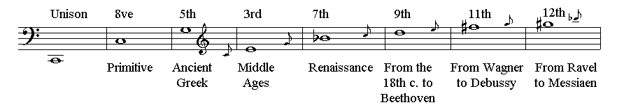
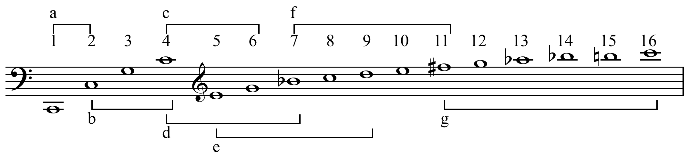

Schoenberg [believed](https://digital.library.unt.edu/ark:/67531/metadc9855/m2/1/high_res_d/dissertation.pdf) that the modern major and minor modes were artificial, produced by historical evolution rather than by or through nature. His first definition of the minor mode revolves around the notion of this mode as "synthetic" or "a product of art."

Though Schoenberg believed that the major-minor system had evolved historically, it was not present in nature but rather had undergone a transformation to last with it. The major mode, especially, had evolved to include all of the nondiatonic notes of the seven church modes that were “constructed on the seven diatonic tones of our major scale”. Here, Schoenberg defends his notion that each bass note can impose its own overtones, thus becoming the root of each chord; though they may be construed as “artificial,” they are not because they imitate a “prototype” in nature, the overtone series.

The major and minor modes are the simplification of an earlier modal system, with the addition of “nondiatonic phenomena.” In Harmonielehre, Schoenberg wrote of this central premise:

> If we sum up the characteristics of the church modes, we get major and minor plus a number of nondiatonic phenomena. And the way in which the nondiatonic events of one church mode were carried over to the other modes I conceive as the process by which our two present-day modes (major and minor) crystallized out of the church modes. Accordingly, major and minor contain all those nondiatonic possibilities inherently, by virtue of this historical synthesis

Schoenberg characterized nondiatonic phenomena in the alteration of chords as a continuation of the major-minor system, and eventually taught that there is no difference between consonance and dissonance. This argument resulted in his famous theory of the ‘emancipation of the dissonance,’ a concept Schoenberg borrowed from Rudolph Louis’s Der Widerspruch in der Musik, which addresses historical connotations not intrinsic in the original meanings of consonance and dissonance. When working out the ‘emancipation of the dissonance,’ Schoenberg was “attacking a structural-ornamental distinction that claims to be valid for all music, not distinctions appropriate to individual pieces, styles or composers.”

> There are, then, no non-harmonic tones, no tones foreign to harmony, but merely tones foreign to the harmonic system. Passing tones, changing tones, suspensions, etc., are, like sevenths and ninths, nothing else but attempts to include in the possibilities of tones sounding together – these are of course, by definition, harmonies – something that sounds similar to the more remote overtones. Whoever gives rules for their use is describing, at best, the ways in which they are most generally used. He does not have the right, though, to claim that he has then precisely separated those possibilities in which they sound good from those in which they sound bad.
>
> "Harmonielehre"

Turning points, pivot tones, neutralization, chromatic substitutes, and nondiatonic phenomena are concepts Schoenberg began teaching to address the changing context of dissonance in late nineteenth-century harmonic theory. In his chapter titled “At the Frontiers of Tonality,” Schoenberg began to illustrate what he called “vagrant harmonies,” defining the diminished triad, diminished seventh chords, and the augmented sixth chord and explaining how each of these chords functions in harmony.

Just as the harmonic series was and is used as a justification for consonance, such as by Rameau, among others, the harmonic series is often used as physical or psychoacoustic justification for the gradual emancipation of intervals and chords found further and further up the harmonic series over time, such as is argued by Henry Cowell in defense of his tone clusters. Some argue further that they are not dissonances, but consonances higher up the harmonic series and thus more complex. Chailley (1951, 12); cited in Nattiez 1990 gives the following diagram, a specific timeline he proposes:

### Cooper timeline

Cooper (1973, 6-7) proposes the following timeline:

- A. unison and octave singing (magadizing) in Greek music and Ambrosian and Greek chant,
- B. parallel fourths and fifths in organum, from c. 850
- C. triadic music; from c. 1400
- D. chordal seventh, from c. 1600
- E. chordal ninth, from c. 1750
- F. whole-tone scale, from c. 1880
- G. total chromaticism, twelve-tone technique, and microtones in the early 20th-century.
