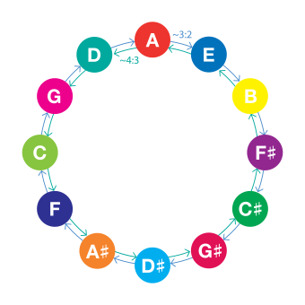

Having anchored musical space with the unison and the octave, we meet the intervals that **build structure** on top of it: the perfect fifth and the perfect fourth. These are the architects of harmony — they define keys, drive tension and resolution, and form the backbone of musical movement across cultures. Everything in this article grows from two small integers: **3:2** and **4:3**.

| At a glance | Perfect fifth (P5) | Perfect fourth (P4) |
|---|---|---|
| Just ratio | 3:2 | 4:3 |
| Just size | 701.96 cents | 498.04 cents |
| 12-TET size | 7 semitones = 700 cents | 5 semitones = 500 cents |
| In the harmonic series | 2nd → 3rd harmonic | 3rd → 4th harmonic |
| String stop (monochord) | 2⁄3 of the length | 3⁄4 of the length |
| Inversion | becomes a P4 | becomes a P5 |
| On the 16-grid | exact line (24/16, +2.0¢) | floats between lines (21/16, −29.2¢) |
| Character | grounded, open, powerful | suspended, open, resolving |

## Fifth P5

<abc-render abc="[A4e] Ae" />

<chroma-profile :chroma="'100000010000'" />

The **second most harmonic interval** (after the octave) is the fifth — **3/2** of any given frequency. If your drone is at 200 Hz, the fifth above sits at 300 Hz. Pythagoras is claimed to be the first to use this law to construct pleasant combinations of musical notes, and the principle is foundational for the modern 12-tone equal temperament.

**Why 3:2 feels "right."** The harmonics of two notes a fifth apart align constantly: the **third harmonic of the lower note (3f) coincides exactly with the second harmonic of the upper (2 × 1.5f)**, and every second harmonic of the upper keeps landing on every third of the lower. Coiniding harmonics that fall outside the ear's critical band are precisely what produces sensory consonance (Plomp & Levelt, 1965) — the acoustic root of the fifth's feeling of strength and correctness.

**The monochord and the cosmos.** Stopping a string at **2⁄3 of its length** sounds a fifth above the open string. Pythagoras read the beauty of 3:2 as evidence of a mathematical harmony underlying the universe — the idea later poetized as the **"music of the spheres."** His followers revered the **tetractys**, the triangular figure whose rows encode the intervals:

- **1** — the monad (unity)
- **2** — the dyad (octave, 2:1)
- **3** — the triad (fifth, 3:2)
- **4** — the tetrad (fourth, 4:3)

### The fifth as a scale generator

Take the lowest starting frequency and go up in two ways:

- multiplying it by **two** — stepping an octave above,
- and multiplying it by **1.5** — stepping a fifth at a time.

After **7 octaves and 12 fifths** you'll end up on the same starting tone — and you'll find you've pressed **all the other tones on the way**. Every new step of a fifth gives a new note: C → G → D → A → E → B → F♯ → C♯ → G♯ → D♯ → A♯ → E♯ → C. (Fourths run the same cycle in reverse: C → F → B♭ → E♭ → A♭ → D♭ → G♭ → B → E → A → D → G → C.) Fold every generated fifth down by octaves — divide by two until it lands in the starting octave — and there you have it: **12 notes in any given octave**. This is why fifths and fourths govern key relationships and modulation: they connect all twelve pitch classes in one systematic loop.

This equation shows the approximate equality of **12 perfect fifths and 7 octaves**: (3/2)¹² ≈ 129.74634 versus 2⁷ = 128. If we use the just interval of 3/2, the small leftover difference is the **Pythagorean comma**.

In musical tuning, the Pythagorean comma (or **ditonic comma**), named after Pythagoras, is the small interval existing in Pythagorean tuning between two enharmonically equivalent notes such as C and B♯, or D♭ and C♯. It is equal to the frequency ratio (1.5)¹⁄2⁷ = 531441⁄524288 ≈ 1.01364, or about **23.46 cents** — roughly a quarter of a semitone (in between 75:74 and 74:73).

> **Fact:** that 23.46-cent "error" puzzled mathematicians for centuries and spawned the Renaissance **meantone temperaments**, which narrow eleven fifths to ≈696.6 cents to purify the thirds — leaving one howling **wolf fifth** of ≈737.6 cents to be avoided. The comma is the reason temperament exists at all.

### 12-Tone Equal Temperament

Twelve-tone equal temperament is the musical system that divides the octave into 12 parts, all of which are equally tempered (equally spaced) on a logarithmic scale, with a ratio equal to the 12th root of 2 (¹²√2 ≈ 1.05946). That resulting smallest interval, 1⁄12 the width of an octave, is called a **semitone** or half step.

In 12-TET the fifth becomes **700 cents** (1.96 cents narrower than pure 3:2) and the fourth **500 cents** (1.96 cents wider than pure 4:3) — a compromise of about two cents each, small enough that both still sound "perfect." That tiny narrowing is audible as **slow beating**: at A4–E5 the tempered fifth beats about **1.5 times per second** (the 3rd harmonic of A at 1320 Hz against the 2nd harmonic of E at ≈1318.5 Hz). Piano tuners don't hide these beats — they **count them**, using specific beating patterns as a ruler for a well-tempered instrument.

**Emotional character.** The perfect fifth feels **stable and grounded, open and spacious** (it defines no major/minor quality), **supportive, and powerful**. Hear it at the openings of Strauss's *Also sprach Zarathustra* (the *2001* theme), the *Star Wars* main title, or *Twinkle, Twinkle, Little Star*; on stage it is the guitar **power chord** (root + fifth, usually with octave doubling) and the falling fifth of every V–I cadence.

**Innate?** Infants as young as **2–6 months** prefer consonant intervals over dissonant ones (Zentner & Kagan, 1996; Trainor & Heinmiller, 1998), and 9-month-olds process melodies built on the 3:2 fifth noticeably better than other sequences (Schellenberg & Trehub, 1996) — evidence that fifth-consonance is at least partly hardwired. Yet the Tsimane' of the Bolivian Amazon rate consonance and dissonance as equally pleasant (McDermott et al., 2016), so *preference* is tuned by culture even where the *perception* is universal.

**Chromatone view.** On the spectrogram the fifth appears as two colors at a specific, consistent spacing — and walking the circle of fifths cycles you through all 12 colors in a predictable sequence.

## Perfect fourth P4

<abc-render abc="[A4d] Ad" />

<chroma-profile :chroma="'100001000000'" />

The **perfect fourth is the inverse of the perfect fifth**: ratio **4:3**, about **498.04 cents** in just intonation, five semitones (**500 cents**) in equal temperament. It may be derived from the harmonic series as the interval between the **third and fourth harmonics**. The term *perfect* identifies it as belonging to the group of perfect intervals (unison, fourth, fifth, octave) — so called because they are neither major nor minor.

### Inversion: the mirror math

Interval inversion asks: *what interval completes the rest of the octave?* Fourths and fifths are exact complements:

- **Ratios multiply to the octave:** 4/3 × 3/2 = 2/1. In general, the inversion of a ratio R is I(R) = 2/R — so I(3/2) = 4/3 and I(4/3) = 3/2.
- **Cents add to the octave:** 498.04 + 701.96 = 1200.00.
- **On a string of length L:** stopping at 2⁄3 L sounds the fifth, at 3⁄4 L the fourth; the leftover segments (1⁄3 L, 1⁄4 L) resonate as higher harmonics.
- **The gap between them is the whole tone:** 3/2 ÷ 4/3 = **9:8**, the Pythagorean **epogdoon** (203.91 cents; exactly 200 cents in 12-TET). The ancient whole tone was discovered precisely as *the space left between a fourth and a fifth* — on the keyboard, the step from F up to G.

### The fourth's double life

The perfect fourth is a **sensory consonance** — its harmonics align as cleanly as the fifth's (the 4th harmonic of the lower note meets the 3rd of the upper). In common-practice harmony, however, it is considered a **stylistic dissonance in certain contexts**: namely in two-voice textures, and whenever it occurs **above the bass** in chords with three or more notes. If the bass note also happens to be the chord's root, the interval's upper note almost always temporarily displaces the third of the chord — in popular-music terminology, a **suspended fourth** (sus4), which the ear expects to resolve down to the third.

Medieval theorists called the fourth above the bass "imperfect" for exactly this reason: its upper note's harmonic series sits *off* the bass's grid, creating a mild mismatch that wants to settle. Its "perfection" as a classification refers to its consonance and mathematical purity, not to its behavior.

**Emotional character.** Where the fifth feels grounded, the fourth feels **suspended, open, resolving, supportive** — a gentle leaning rather than a pillar. Hear it in the opening leaps of *Amazing Grace*, Wagner's Bridal Chorus (*Here Comes the Bride*), and *O Tannenbaum*: longing and expectation, ready to move on.

> **Next up:** exactly halfway between the fourth (498¢) and the fifth (702¢) lies the octave's midpoint at 600 cents — the most notorious interval in Western history, the tritone. Its symmetry, its √2 ratio, and its legend as *diabolus in musica* get an article of their own; here we only note that P4 and P5 sit as equal-and-opposite mirrors (±101.96 cents) around it.

### The fourth on the 16-grid

Mapping Chromatone's linear 16-step fundamental grid (n/16) onto 12-TET pitch classes reveals why the two "perfect" siblings feel physically different:

| Interval | Grid ratio | Ratio | Cents | Deviation from 12-TET |
|---|---|---|---|---|
| Perfect 5th (P5) | 24/16 | 3/2 | 702.0 | +2.0 |
| Perfect 4th (P4) | 21/16 | 21:16 | 470.8 | −29.2 |

The fifth lands on an **exact integer grid line** (24/16 = 3/2) — perfect alignment with the physical frequency-division substrate. The fourth **floats microtonally between grid lines**, which matches its experienced quality: more suspended, less physically grounded.

In the layered Chromatone model this is coherent architecture, not coincidence:

- **Layer 1 — the 3-limit frame** (primes {2, 3}) builds the macro-geometry of pitch space: octave 2:1, fifth 3:2, fourth 4:3, whole tone 9:8 (epogdoon).
- **Layer 3 — the 16-grid substrate** is where the fifth aligns exactly and the fourth requires microtonal adjustment.

Fifths and fourths together form the **geometric skeleton** of pitch space; the fifth is the one member of the family that also locks onto the substrate.

## Quartal and quintal harmony

**Quartal harmony** builds harmonic structures from fourths — perfect, augmented, and diminished. A three-note quartal chord on C stacks perfect fourths: **C–F–B♭**. **Quintal harmony** prefers fifths: **C–G–D**.

Regarding chords built from perfect fourths alone, composer Vincent Persichetti writes:

> Chords by perfect fourth are ambiguous in that, like all chords built by equidistant intervals (diminished seventh chords or augmented triads), any member can function as the root. The indifference of this rootless harmony to tonality places the burden of key verification upon the voice with the most active melodic line.

That productive ambiguity made quartal stacking the sound of modal jazz: the famous **"So What" chord** Bill Evans played on Miles Davis's *Kind of Blue* is three perfect fourths plus a major third on top (E–A–D–G–B), and McCoy Tyner built whole solos from fourth stacks. The intervals are even built into our instruments: the **guitar is tuned in fourths** (with one third between G and B), while the **violin family is tuned in fifths** (G–D–A–E) — quartal and quintal geography under your fingers. Modern composers extend the idea into **polychords** (stacked fourth/fifth structures combined) and into floating, non-directional **modal harmonies** that replace fifth-based tonality with fourth-based space.

## The circle of fifths in practice

The circle was first drawn in **1679 by Nikolay Diletsky** (Ukrainian theorist and composer) in his *Idea grammatiki musikiyskoy*, and popularized in the 18th century by Johann David Heinichen (1728) — a diagram of the very cycle generated above by stacking 3:2 steps.

It is a working map, not decoration:

- **Key relationships:** neighboring keys on the circle differ by one accidental and share most notes.
- **Chord progressions:** moving around the circle (especially counter-clockwise, i.e., by fourths) creates the strongest harmonic motion — the V–I cadence is just one step of it. Note that a **falling fifth and a rising fourth are the same move**, which is why the circle unifies both intervals.
- **Transposition and modulation:** shifting around the circle shows exactly which notes change.

**Chromatone view:** on the spectrogram the circle of fifths appears as a regular pattern of color relationships — cycling through fifths walks you through all 12 colors in order, making the circle intuitive rather than abstract.

## Cultural perspectives

- **Western classical:** the fifth/fourth frame *is* the harmonic system — circle of fifths, dominant–tonic engine, cadential grammar.
- **Indian classical:** the **tanpura** drone sounds **sa and pa** (tonic and fifth) continuously; the sa–pa relationship anchors every raga, while **shrutis** color subtle microtonal variations around these pillars.
- **African traditions:** call-and-response patterns and instruments like the **mbira (kalimba)** and marimba emphasize fifths and fourths; pentatonic scales common across the continent naturally outline fifth/fourth relationships.
- **Arabic and Persian music:** maqam practice bends and shades fifths and fourths microtonally for melodic expression, keeping the 2:1 octave frame intact.
- **Just intonation and experimental music:** pure 3:2 and 4:3 beyond equal temperament, and new microtonal divisions of the fifth and fourth, continue the exploration Pythagoras began.

Same architecture, different dialects: the 3:2 / 4:3 frame is near-universal; the tuning of its edges is cultural.

## Practice: feeling the fifth and fourth

**Exercise 1 — The fifth drone.** 1) Choose a comfortable drone note. 2) Sing the perfect fifth above it. 3) Hold it and notice the feeling of stability — the "lock" of coinciding harmonics. 4) Try singing the fifth *below* the drone. 5) Notice how the quality changes while the relationship remains.

**Exercise 2 — The fourth's suspense.** 1) With your drone, sing the perfect fourth above. 2) Notice how it differs from the fifth. 3) Does it feel like it wants to go somewhere? 4) Resolve it down to a major third. 5) Notice the sense of release — the sus4 resolving in your own voice.

**Exercise 3 — The inversion mirror.** 1) Sing the fifth above your drone (e.g., drone C → sing G). 2) Now sing the fourth *below* the drone's octave (C an octave down → G is a fourth above it… equivalently, G is a fourth below the drone's upper octave). 3) Confirm it is the same pitch class: **a fifth up = a fourth down from the octave**. 4) Alternate the two voicings and feel the character flip from grounded to suspended while the color stays the same.

**In a jam:**
- **Fifths for power and stability:** bass lines moving in fifths give strong direction; power chords are fifths; vocal harmonies in fifths sound open and supportive; counterpoint in fifths keeps lines independent but related.
- **Fourths for suspension and interest:** smooth voice leading, modern open quartal voicings, melodic ornament, modal interchange.
- **Find your place:** if the bass is walking fifths, complement with thirds or sixths; if the texture is crowded, open space with fourths; if the harmony is over-complex, ground it with a fifth.

## Chromatone connection

On the Chromatone spectrogram these intervals are consistent color geometries:

- **Perfect fifth** — two colors at a specific, consistent spacing (7 steps of the 12-color wheel).
- **Perfect fourth** — the mirror spacing (5 steps), the fifth's complement within the octave cycle.

With **Chromatone stickers** on your instrument, fifths and fourths form predictable visual patterns, and the circle of fifths becomes a color cycle you can see wrapping around your fretboard or keyboard — the architecture of harmony, rendered as geometry.

## Summary

- **Perfect fifth (3:2, ≈702¢ / 700¢ in 12-TET)** — the most consonant non-octave interval; harmonics align at 3f = 2 × 1.5f; the generator of all 12 pitch classes via the circle of fifths.
- **Pythagorean comma (≈23.46¢)** — the gap between 12 fifths and 7 octaves; the birthmark of temperament (meantone, wolf fifth, and finally 12-TET's ¹²√2).
- **Perfect fourth (4:3, ≈498¢ / 500¢)** — the fifth's exact inversion (ratios multiply to 2:1, cents add to 1200); sensory consonance with a contextual, "suspended" life above the bass (sus4).
- **The epogdoon (9:8, ≈204¢)** — the whole tone, discovered as the space between fourth and fifth.
- **On the 16-grid:** P5 is an exact substrate line (24/16, +2.0¢); P4 floats between lines (21/16, −29.2¢) — physics mirroring phenomenology.
- **Quartal/quintal harmony** — fourths and fifths as building material: Persichetti's rootless ambiguity, the "So What" chord, and the tuning of guitars (fourths) vs. violins (fifths).
- **Circle of fifths** — Diletsky 1679; the map of keys, cadences, transposition, and modulation; a color cycle in Chromatone.
- **Cognition & culture** — infants prefer consonant fifths from the first months of life, while cultural exposure tunes the preference; sa–pa drones, African pentatonics, and maqam shading all live inside the same 3:2 frame.
- **Practice** — feel the fifth's lock, the fourth's lean, and their inversion mirror; in a jam, choose fifths to ground and fourths to open space.

Mastering fifths and fourths gives you the tools to understand and create harmonic structure — you are navigating the architecture of music itself. Next: the interval sitting exactly between them, the tritone.

### Sources & further reading

- Plomp & Levelt (1965), *Tonal consonance and critical bandwidth* 
-  Schellenberg & Trehub (1996), *Natural musical intervals: evidence from infant listeners* 
-  Zentner & Kagan (1996); Trainor & Heinmiller (1998), infant consonance preference 
-  Trainor (1997), ratio effects in infants and adults 
-  McDermott et al. (2016), *Indifference to dissonance in native Amazonians* 
-  Diletsky (1679), *Idea grammatiki musikiyskoy*; Heinichen (1728) 
-  Persichetti, *Twentieth Century Harmony* 
-  Chromatone course unit *vmt/intervals/fifth-fourth*.