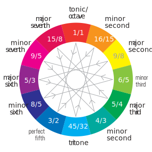

Two notes sounding simultaneously or sequentially form the basic building block for all the emotional expressiveness of music. They form some kind of relationships that bring up some distinct feeling.

The most basic is the 1:2 ratio of an [Unison and octave](./unison-octave/index.md), that are foundational for cyclic nature of pitch class space. [Perfect Fifth and Fourth](./fifth-fourth/index.md) are the foundational consonances that bring joy of the simple 2:3 and 3:4 ratios. This is the root of the 12 note system as a whole.

[Thirds and Sixth](./third-sixth/index.md) are the imperfect consonances to evoke deeper feelings while the [Seconds and Sevenths](./second-seventh/index.md) are the sharper dissonances to spice everything up. We'll explore the process of the [Emancipation of dissonance](./emancipation/index.md) to find out how did we get at this point in our pitch pairs interpretation. And how science finally got [a measure for sound consonance](./dissonance/index.md). And take a brief look at some mathematical implications of building [interval chains](./cycles/index.md).

<YoutubeEmbed video="3sUpoSTy8zw" />
