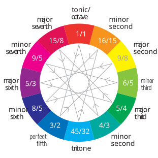

Two notes sounding simultaneously or sequentially form the basic building block for all the emotional expressiveness of music. They form some kind of relationships that bring up some distinct feeling.

The most basic is the 1:2 ratio of an [Unison and octave](./unison-octave/index.md), that are foundational for cyclic nature of pitch class space. [Perfect Fifth and Fourth](./fifth-fourth/index.md) are the foundational consonances that bring joy of the simple 2:3 and 3:4 ratios. This is the root of the 12 note system as a whole.

[Thirds and Sixth](./third-sixth/index.md) are the imperfect consonances to evoke deeper feelings while the [Seconds and Sevenths](./second-seventh/index.md) are the sharper dissonances to spice everything up. We'll explore the process of the [Emancipation of dissonance](./emancipation/index.md) to find out how did we get at this point in our pitch pairs interpretation. And take a brief look at some mathematical implications of building [interval chains](./cycles/index.md).

<youtube-embed video="3sUpoSTy8zw" />

<youtube-embed video="cyW5z-M2yzw" />

## Pitch class space

In music theory, pitch-class space is the circular space representing all the notes (pitch classes) in a musical octave. In this space, there is no distinction between tones that are separated by an integral number of octaves. For example, C4, C5, and C6, though different pitches, are represented by the same point in pitch class space.

Since pitch-class space is a circle, we return to our starting point by taking a series of steps in the same direction: beginning with C, we can move "upward" in pitch-class space, through the pitch classes C♯, D, D♯, E, F, F♯, G, G♯, A, A♯, and B, returning finally to C. By contrast, pitch space is a linear space: the more steps we take in a single direction, the further we get from our starting point.

Deutsch and Feroe (1981), and Lerdahl and Jackendoff (1983) use a "reductional format" to represent the perception of pitch-class relations in tonal contexts. These two-dimensional models resemble bar graphs, using height to represent a pitch class's degree of importance or centricity. Lerdahl's version uses five levels: the first (highest) contains only the tonic, the second contains tonic and dominant, the third contains tonic, mediant, and dominant, the fourth contains all the notes of the diatonic scale, and the fifth contains the chromatic scale. In addition to representing centricity or importance, the individual levels are also supposed to represent "alphabets" that describe the melodic possibilities in tonal music (Lerdahl 2001, 44–46). The model asserts that tonal melodies will be cognized in terms of one of the five levels a-e:

> Level a: C C
> Level b: C G C
> Level c: C E G C
> Level d: C D E F G A B C
> Level e: C D♭ D E♭ E F F♯ G A♭ A B♭ B C
>
> (Lerdahl 1992, 113)

Note that Lerdahl's model is meant to be cyclical, with its right edge identical to its left. One could therefore display Lerdahl's graph as a series of five concentric circles representing the five melodic "alphabets." In this way one could unite the circular representation depicted at the beginning of this article with Lerdahl's flat two-dimensional representation depicted above.

According to David Kopp (2002, 1), "Harmonic space, or tonal space as defined by Fred Lerdahl, is the abstract nexus of possible normative harmonic connections in a system, as opposed to the actual series of temporal connections in a realized work, linear or otherwise."