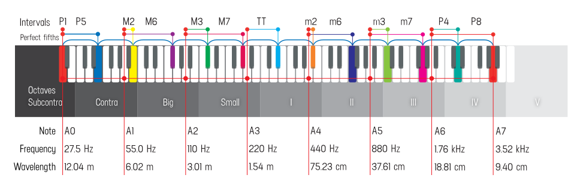
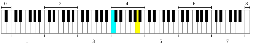

An **interval** is the relationship between two musical sounds in terms of pitch — the terrain we navigate every time we jam, harmonize, or sing in a choir. Intervals occur **simultaneously** (two notes sounding together — *harmonic*, vertical) and **sequentially** (one note following another — *melodic*, horizontal).

Two intervals anchor that entire terrain: **unison** and **octave**. They are the reference points from which all other intervals derive their meaning — and the only intervals where both notes share the same **pitch class**, the same color in Chromatone.

| At a glance | Unison (P1) | Octave (P8) |
|---|---|---|
| Frequency ratio | 1:1 | 2:1 |
| Semitones | 0 | 12 |
| Cents | 0 | 1200 |
| Pitch class / chroma | same | same |
| On the spectrogram | one reinforced band | parallel same-color lines |

## Unison P1

<abc-render abc="[A4A4] AA" />

<chroma-profile chroma="100000000000" />

**Unison** is two or more musical parts sounding either the same pitch, or pitches separated by one or more octaves, usually at the same time. **Perfect unison** (also a **prime** or **perfect prime**; German *Unisono*, *Einklang*, or *Prime*) is the (pseudo-)interval between a tone and its exact duplication — C–C, as differentiated from the second, C–D.

- **Ratio 1:1** — 0 half steps, 0 cents. Two parts, one frequency.
- **The most consonant interval** — while the **near unison** is the most *dissonant*: tones a few hertz apart produce slow loudness **beats**, and differences of a few tens of hertz fall inside one critical band of the ear as maximal roughness (Plomp & Levelt, 1965).
- **The easiest interval to tune** — precisely because those beats slow down and disappear at exactly 1:1. Ensemble players and piano tuners tune unisons by ear this way.
- **Still two sources.** Even in perfect unison we perceive separate voices: they arrive from different locations and carry different **timbres** — different waveforms with the same fundamental frequency but different amplitudes of higher harmonics.

> **Feel it:** when a choir section sings together, voices merge into a wall of unified sound; an orchestra doubling one line gains thickness and authority; a rock band doubling a riff in unison gets a fatter tone. The parts fuse into reinforcement and unity — yet the blend is richer than any single voice.

> **Fact:** most piano keys strike **two or three strings tuned in unison**; Balinese gamelan deliberately tunes paired instruments a few hertz apart so the "unison" shimmers with slow beats called **ombak** ("wave") — near-unison used as beauty, not error.

**Chromatone view.** On the spectrogram, unison appears as two perfectly aligned lines of color occupying the same frequency — a single, reinforced band. No tension, no movement: pure alignment. That is exactly why unison feels like home.

## Octave P8

<abc-render abc="[A4a] Aa" />

An **octave** (Latin *octavus*: eighth; also **perfect octave** or **diapason**, from Greek *dia pasōn*, "through all [the strings]") is the interval between one musical pitch and another with **double its frequency**: A 220 Hz → A 440 Hz → A 880 Hz, doubling by 2ⁿ in both directions without limit. This octave relationship is a natural phenomenon, referred to as the "basic miracle of music," the use of which is "common in most musical systems."

- **Nature's first interval.** The step between the 1st and 2nd harmonics of the harmonic series is an octave — as is every 2→4, 3→6, 4→8 step above it.
- **1200 cents.** Human pitch perception is **logarithmic** — we hear ratios, not hertz differences — so intervals are measured in **cents**, the unit Alexander John Ellis introduced in his 1885 English edition of Helmholtz's *On the Sensations of Tone*: one octave = 1200 cents, one equal-tempered semitone = 100.
- **Same color, new register.** Because pitch perception is periodic, the "color" (**chroma**) of all notes an octave apart seems circularly equivalent, gathering them into one **pitch class**. Psychologists picture pitch as a **helix**: height climbs forever while chroma circles every 12 semitones (Revesz, 1913; Shepard, 1982).

> **Feel it:** octaves are separation yet unity — different registers, still "together." Doubling a melody in octaves adds brilliance and power, reinforced bass lines hit harder, open spacious harmonies appear, and sudden octave jumps create drama.

To emphasize that it is one of the **perfect intervals** (together with unison, perfect fourth, and perfect fifth), the octave is designated **P8**.

**Chromatone view.** On the spectrogram, octaves appear as **parallel lines of the same color**, spaced equally apart (equally, because the frequency axis is logarithmic). The pattern repeats at each octave level — the octave is a true **cycle**, which is why we can say "C" in any octave and mean essentially the same thing.

<chroma-profile chroma="100000000000" />

*The same chroma profile lights up for both notes of an octave: different height, identical color.*

## Octave equivalence: who hears the cycle?

After the unison, the octave is the simplest interval in music. The human ear tends to hear both notes as essentially "the same," due to closely related harmonics — in fact **every harmonic of the higher note is also a harmonic of the lower one**, so notes an octave apart "ring" together. The interval is so natural that when men and women are asked to sing in unison, they typically sing in octave.

This perceived sameness of pitches one or more octaves apart is called **octave equivalence**. It is why notes an octave apart share one letter name in Western notation, and why "scales are uniquely defined by specifying the intervals within an octave."

### The evidence

- **Human infants**, before language development, already group octave-related tones by chroma (Demany & Armand, 1984).
- **Rats** generalize across octaves (Blackwell & Schlosberg, 1943; confirmed with modern methods by Wagner et al., 2024), and **rhesus monkeys** recognize melodies transposed by an octave (Wright et al., 2000) — evidence that octave perception is deep in mammalian hearing, plausibly tied to harmonic vocal structures.
- **Not everyone, though:** European starlings (Cynx, 1993), black-capped chickadees, and common marmosets (Wagner et al., 2023) fail standard octave-equivalence tests — the trait is widespread, but not universal across species.
- **The brain files octaves under one category.** fMRI adaptation shows cortical populations tuned to pitch **chroma** respond alike to octave-related tones (Moerel et al., 2014), and auditory attention automatically spreads to octave-related frequencies (Borra et al., 2013).
- **Absolute pitch reveals the split:** people with absolute pitch name chroma flawlessly yet often misjudge *which octave* a note is in — pitch class and pitch height are separate cognitive processes.
- **Culture tunes the hardware.** Among the Tsimane' of the Bolivian Amazon, sung reproductions show the universal logarithmic pitch scaling but **no detectable octave equivalence** (Jacoby & McDermott, 2019): musical experience — especially singing — appears to strengthen a cycle the ear is merely ready to hear.

A **pitch class** (p.c. or pc) is the set of all pitches a whole number of octaves apart: "The pitch class A stands for all possible As, in whatever octave position." Pitch therefore has two dimensions — **pitch height** (absolute frequency) and **pitch class** (position within the octave) — and that pair is what makes pitch circular. Thus all C♯s, or all 1s (if C = 0), in any octave belong to one pitch class.

> Although there is no formal upper or lower limit to this sequence, only a few of these pitches are audible to the human ear. Yet we can imagine seeing the 40th octave as the frequency gets to the visual spectrum.

Psychologists refer to the quality of a pitch as its **chroma** — an attribute of pitch, just like **hue** is an attribute of color. A pitch class is the sound-world's "set of all yellow things": every B, in every octave, is one class, one color.

### The Shepard tone: the cycle made audible

Stack octaves, fade the top and bottom in and out, and you can rise forever without ever getting higher: the **Shepard tone** (Shepard, 1964, *Circularity in Judgments of Relative Pitch*; the sliding version is the Shepard–Risset glissando). Its cousin, the **tritone paradox** (Deutsch, 1986), splits listeners into people who hear the same two-tone pair rise and people who hear it fall — direct proof that the brain organizes pitch along an octave circle.

<youtube-embed video="BzNzgsAE4F0" />

### Two octave quirks of the brain

- **Missing fundamental.** Hear only the upper harmonics of a note and the brain reconstructs the bass anyway (first described by Seebeck in 1841; Schouten's "residue pitch," 1940). This is why small speakers "play" bass notes they cannot physically reproduce: pitch is a construction, and the octave is its scaffolding.
- **Octave stretching.** Judged by ear, octaves at the extremes of the piano sound best slightly **wider** than 2:1 (by a few to a few tens of cents). Piano tuners bake this perceptual stretch into the **Railsback curve**, and string inharmonicity plus sensory dissonance explain much of it (e.g., *JASA*, 2019). The "perfect" octave is exactly perfect in mathematics — and nearly perfect in the ear.

## Notation: naming the octaves

Octaves are identified with various naming systems. Among the most common are the **scientific**, **Helmholtz**, **organ-pipe**, and **MIDI** systems. In scientific pitch notation a numeral follows the note name: middle C is **C4** — the fourth C on a standard 88-key piano — and the C an octave higher is C5. Helmholtz uses primes (c′, c″…); MIDI counts semitones (middle C = 60, A440 = 69); and organ **footage** names octaves by pipe length: 8′ sounds as written, 4′ an octave above, 16′ below, 32′ and 64′ into the contra and sub-contra depths.

| Octave name | Range | C frequency | Who lives here |
|---|---|---|---|
| Sub-contra | C0–B0 | 16.4–31 Hz | Lowest audible octave, mostly unused; basso profondo such as Mikhail Zlatopolsky; Tim Storms' record low G−7 (0.189 Hz, 2012) lies far below it |
| Contra | C1–B1 | 32.7–61.7 Hz | Extreme bass voices (Vladimir Miller); 32′ organ stops |
| Great | C2–B2 | 65.4–123.5 Hz | Bass country: basso profondo, bass, baritone; vocal fry dips here; rare low notes of Mariah Carey or Georgia Brown |
| Small | C3–B3 | 130.8–246.9 Hz | Foundation of most vocal music; tenor to soprano harmony roots |
| First | C4–B4 | 261.6–493.9 Hz | The "middle C" octave; most melodic action; tenors and altos at work |
| Second | C5–B5 | 523.3–987.8 Hz | Soprano territory — bright, prominent, carries well |
| Third | C6–B6 | 1046.5–1975.5 Hz | Flutes, violins, coloratura; whistle register begins (above ~1000 Hz the body has few resonators left, so timbre thins) |
| Fourth–fifth | C7–B8 | 2093–7902 Hz | Coloratura extremes and the piano's top (C8); Georgia Brown's record G7 lives here |
| Sixth and above | C9+ | 8 kHz+ | Whistle tones; past ~20 kHz the cycle leaves the human ear entirely |

> **Records:** in 2004 Georgia Brown (Brazil) documented the Guinness widest **female** vocal range — **8 octaves, G2 to G10**, its top note above human hearing; Tim Storms (USA) holds the overall record at **10 octaves**.

<youtube-embed video="MzjB8BOBms8" />

**The audible window is about ten octaves** (20 Hz – 20 kHz). A piano spans 7⅓ of them (A0–C8); a large organ with a 64′ stop reaches ~8 Hz — vibration felt in the chest more than heard as pitch.

**Practical payoff:** knowing the octave map helps you find your place in the musical texture, avoid competing for the same frequency space, build balanced arrangements, and sing where your voice naturally wants to go.

## Beyond hearing: hypothetical octaves

The 2:1 cycle does not stop at the ear's door:

- **+40 octaves ≈ light.** Double 440 Hz forty times (≈ 4.8 × 10¹⁴ Hz) and you arrive in the **visible spectrum** (~400–790 THz). Poetically, the eye's whole window is itself **just under one octave wide** — vision "hears" a single octave of light.
- **−4 to −5 octaves ≈ rhythm.** Below roughly 16–20 Hz, pitch dissolves into discrete pulses: the realm of **tempo** (~0.5–8 Hz, i.e. 30–480 BPM). Rhythm and melody turn out to be the same phenomenon at different speeds — a polyrhythm is a polyphony slowed down.
- **On Chromatone's 16-step linear grid** (n/16, n ∈ [16, 32]) mapped to 12-TET pitch classes, the octave boundaries land on exact integers:

| Interval | Grid ratio | Frequency ratio | Cents | Deviation |
|---|---|---|---|---|
| Unison (P1) | 16/16 | 1/1 | 0.0 | 0.0 |
| Octave (P8) | 32/16 | 2/1 | 1200.0 | 0.0 |

## Dividing the octave: cultural perspectives

The octave frame (2:1) is near-universal; what cultures do **inside** it varies beautifully:

- **Western classical:** 12 equal semitones; the whole pitch-organization system assumes octave equivalence.
- **India:** the **22 shruti** microtones color the octave around the tonic **sa**, the raga's anchor across octaves.
- **Arabic & Persian maqam:** quarter-tone steps within a 24-position framework — subtle emotional nuance, same cycle.
- **Indonesia:** gamelan **slendro** (≈5 near-equal steps) and **pelog** (7 unequal steps) divide — and slightly stretch — the octave their own way.
- **Thailand:** a **7-tone equidistant** system (≈171.4 cents per step).
- **East Asia:** pentatonic frameworks span the octave while emphasizing different internal relationships.

Same circle, different maps.

## Practice: feeling unison and octave

**Exercise 1 — Unison matching.** 
1) Choose a drone (sustained note). 
2) Sing the matching note. 
3) Notice how perfect tuning feels versus slightly off (the wobble of beats). 
4) Practice finding perfect alignment — zero beats.

**Exercise 2 — Octave hopping.** 
1) With your drone, sing the note an octave above. 
2) Drop back to the original. 
3) Try the octave below. 
4) Practice moving between octave positions — "same note, different floor."

**Exercise 3 — Octave harmonization.** 
1) Have a friend play a simple melody. 
2) Sing along in unison. 
3) Sing an octave above. 
4) Sing an octave below. Notice: unison fuses, octaves widen.

**In a jam:**
- **Find your octave home.** If the bass holds the low octave, take the one above; if the middle is crowded, drop or jump an octave to create space.
- **Double for impact.** Guitarists and keyboardists double solos in octaves; vocalists add an octave for emphasis, power, and clarity.
- **Jump for drama.** Octave leaps up for climaxes, down for sudden energy shifts; octave displacement for surprise.

## Chromatone connection

On the Chromatone spectrogram, intervals become color relationships:

- **Unison** = same color at the same position — one reinforced band.
- **Octave** = same color at regularly spaced positions — the cycle made visible.

With **Chromatone stickers** on your instrument, unison and octave relationships are visually obvious: octaves are quick to find, transposed melodies keep their color pattern, and chords and scales reveal their octave skeleton at a glance. These visual patterns explain why these intervals feel fundamental — they are the most basic relationships in the color/pitch spectrum.

## Summary

- **Interval** = relationship between two pitches; harmonic (together) or melodic (in sequence).
- **Unison P1** = 1:1, 0 cents — maximal consonance, easiest to tune; near-unison = maximal dissonance (beats).
- **Octave P8** = 2:1, 1200 cents — same pitch class in a new register; the harmonic series' first step.
- **Octave equivalence** appears in human infants, rats, and monkeys, is encoded in auditory cortex — and is strengthened (or not) by musical culture.
- **Pitch = height × chroma**; the pitch helix, the Shepard tone, and the tritone paradox make the circularity audible.
- **The ear's window ≈ 10 octaves**; the cycle extends hypothetically from rhythm (−4/−5) to light (+40).
- **Cultures divide the octave differently** (12, 22, 24, 5, 7 steps…) but keep the 2:1 frame.
- **Chromatone** renders both intervals as one color: aligned (unison) or stacked in a regular pattern (octave).
- **Practice:** tune by beats, hop octaves, harmonize — and in a jam, choose your octave consciously.

### Sources & further reading

- Demany & Armand (1984), *The perceptual reality of tone chroma in early infancy* 
- Blackwell & Schlosberg (1943), *Octave generalization… in the white rat* 
- Wright et al. (2000), *Music perception and octave generalization in rhesus monkeys* 
- Cynx (1993), starling octave tests 
- Wagner et al. (2023, 2024), marmoset and rat comparisons 
- Moerel et al. (2014), *Representation of pitch chroma…* 
- Borra et al. (2013), *Octave effect in auditory attention* 
- Jacoby & McDermott (2019), *Universal and non-universal features of musical pitch…* 
- Shepard (1964), *Circularity in judgments of relative pitch* 
- Deutsch (1986), tritone paradox 
- Schouten (1940), residue pitch 
- Plomp & Levelt (1965), *Tonal consonance and critical bandwidth* 
- Ellis (1885), translation of Helmholtz 
- Railsback (1938), octave stretch curve.