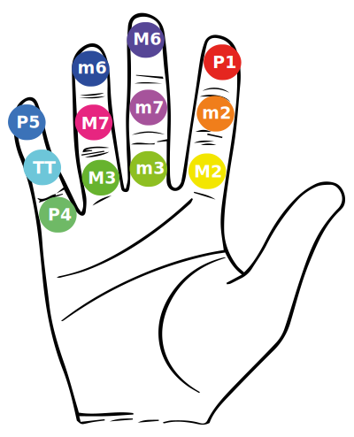

There's a plenty of possible ways to make the Chromatone system work for written music communication. This whole web site is one big experiment to find the most useful implications of the simple equations. But there's more to explore!

## Colorize the staff notation

First and the most obvious use of color in music is a simple coloring the regular staff notation. You can use 12 markers to denote any pitch on paper and we can modify existing apps and scripts to produce colored sheet music.

## Chromatic hand

The extension of the ancient method of linking finger phalanges and musical notes. We can make it consistent enough to use intuitively after a little practice.

## Interval hand

The 12 phalanges of fingers are ideal to reason not only about notes, but intervals too. Assume the tip of your index finger as a tonic note and build any interval, chord, or even scale just with your thumb. It enables you to practice melodies, progressions and more in any moment, at any place.

## Colorful piano rolls

Try the [MIDI-roll](../../../practice/midi/roll/index.md) to look at incoming MIDI visualization.

Try the [Pitch-roll](../../../practice/pitch/roll/index.md) to see the main note graph of incoming audio on an endless roll.

## Colorful spectrogram

Adding the colors to a regular spectrogram makes you see much more about the musical contents of any sound. You can easily see the fundamental pitch and the colors of all the main overtones for simple sounds.

Try the [Colorful spectrogram](../../../practice/pitch/spectrogram/index.md) online now.

