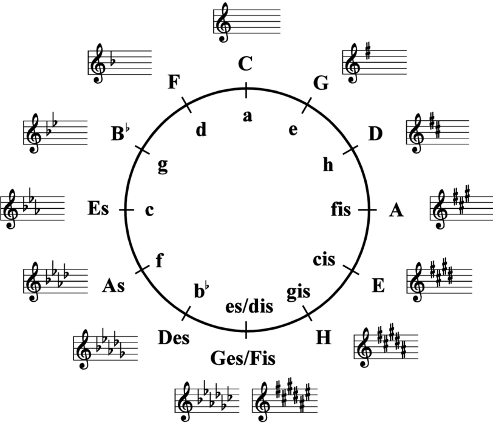
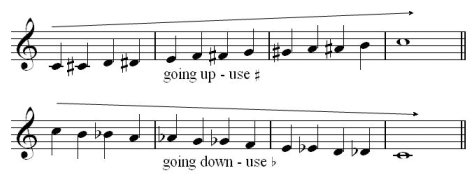
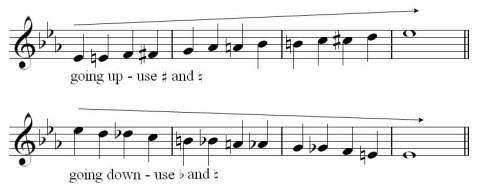
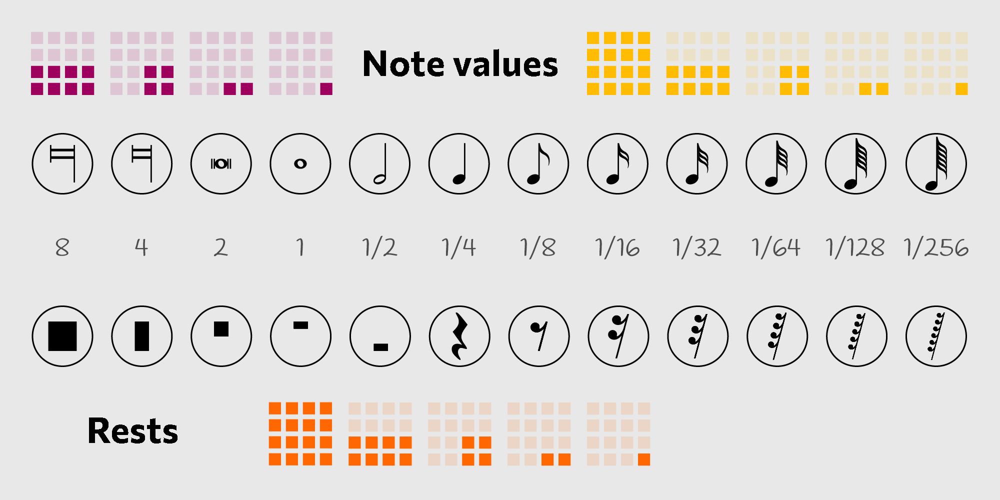
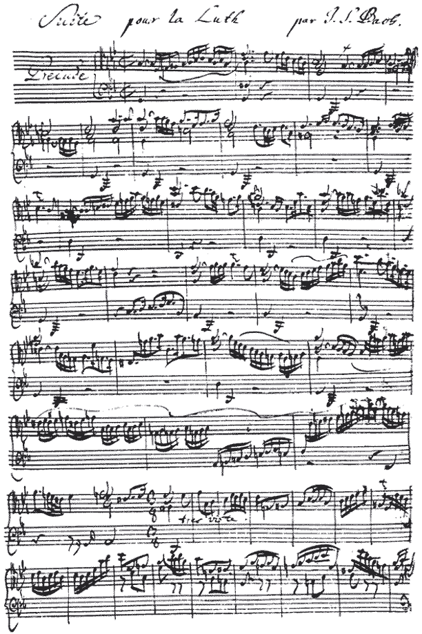

<button :style="{background: state.colorize ? 'linear-gradient(#e66465, #9198e5)': ''}" class="button fixed right-16 bottom-4 z-20000 p-2 bg-light-400 dark-bg-dark-400 rounded-xl shadow active_bg-red-100"
@click="state.colorize = !state.colorize">Colorize notes</button>

Standard notation is used to demonstrate how a piece is played. Unlike tablature, it applies to any instrument. It indicates key signatures, time signatures, rhythms, tempo, dynamics (how loud each instrument should be), and so on. A highly trained musician can sometimes take a piece of sheet music written in standard notation, look it over once or twice, and then play the song as though he or she had been playing it his or her whole life.

For instance, below is the C major scale, including a C at the end, in standard notation.

The standard notation staff has five lines and four spaces. From bottom to top the five lines are E G B D F, which is commonly memorized as an acrostic such as:

- **E**very
- **G**ood
- **B**oy
- **D**oes
- **F**ine

The four spaces between the five lines are F, A, C, and E, which should surely be easy for an English speaker to remember, because together they spell "face".

But what about the first two notes, which are below the staff? Well, the second note is just below the E, so it must be D. The first is below that, so it must be C. It also has a line through it to indicate it is placed on an "invisible" line. This line is called a ledger line. A note could be placed below this ledger line, which would be B. Or a note could be placed below that, on another ledger line, and it would be A. Notes can continue to be placed on ledger lines above and below the staff infinitely, but extending too far from the staff is impractical, because the pitches will become very hard to read.

## Clefs

1. Treble (G) <abc-render :abc="'K:treble\nG8'" />
2. Bass (F) <abc-render :abc="'K:bass\nF,8'" />
3. Baritone (F) <abc-render :abc="'K:bass3\nF,8'" />
4. Tenor (C) <abc-render :abc="'K:tenor\nc,8'" />
5. Alto (C) <abc-render :abc="'K:alto\nc,8'" />
6. Mezzosoprano (C) <abc-render :abc="'K:alto2\nc,8'" />
7. Soprano (C) <abc-render :abc="'K:alto1\nc,8'" />

## Note pitch

### Natural (G)

<abc-render :abc="'G8'" />

<abc-render :abc="'K:Gb\n=G8'" />

### Sharp (G#)

<abc-render :abc="'^G8'" />

<abc-render :abc="'K:Gb\n^^G8'" />

### Flat (Gb)

<abc-render :abc="'_G8'" />

<abc-render :abc="'K:C#\n__G8'" />

### Ascending

A A# B C C# D D# E F F# G G# A

<abc-render responsive :abc="'A,^A,B,C^CD^DEF^FG^GA'" />

### Descending

A Ab G Gb F E Eb D Db C B Bb A

<abc-render responsive :abc="`a,_a,G_GFE_ED_DCB,_B,A,`" />

## Note values (durations)

Whole note = 2 half notes = 4 quarter notes = 8 eighth notes = 16 sixteenth notes

<abc-render responsive :abc="`M:4/4\n|G8|G4A4|G2A2B2c2|GDGDGDGD|G/D/G/D/G/D/G/D/G/D/G/D/G/D/G/D/|`" />

### Dotted notes

<abc-render responsive :abc="`M:4/4\n|(G12|G4)|G5G2|G3GG3G|G3/2G/2G3/2G/2G3/2G/2G3/2G/2|`" />

### Triplets

<abc-render responsive :abc="`M:4/4\n|(3G4A4B4|(3G2A2B2 (3G2A2B2| (3GAB (3GAB (3GAB (3GAB|`" />

### Other tuplets

<abc-render responsive :abc="`M:4/4\n|(5G2A2B2c2d2|(7CDEFGAB|`" />

### Rests

<abc-render responsive :abc="`M:4/4\n|z8|z4z4|z2z2z2z2|zzzzzzzz|z/z/z/z/z/z/z/z/z/z/z/z/z/z/z/z/|`" />

> 
> J.S.Bach Prelude

### Alexander Scriabin - Piano Concerto in F sharp minor, Op. 20

<youtube-embed video="F734PyD3NAw" />

## Vector render of staff notation by ABCjs

Note colorization is very useful to build connections between classic and Chromatone music theory visualizations.
<abc-render responsive :abc="minuet" />

[Play with the ABC notations editor](../computer/abc/index.md)

[Sight reading](./sight-reading/index.md)

[European tradition](./evolution/index.md)
