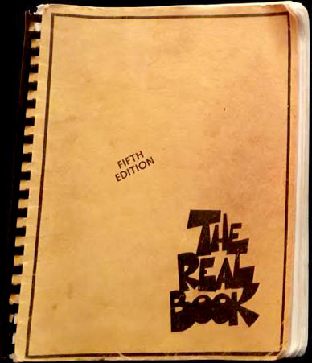
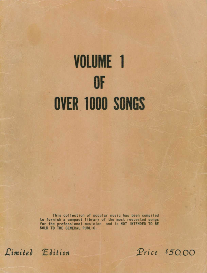
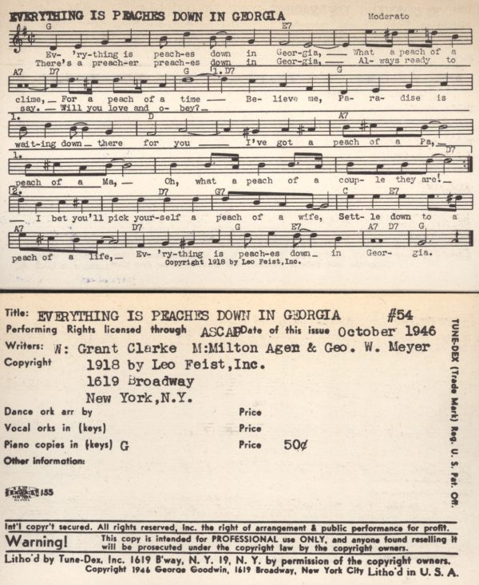
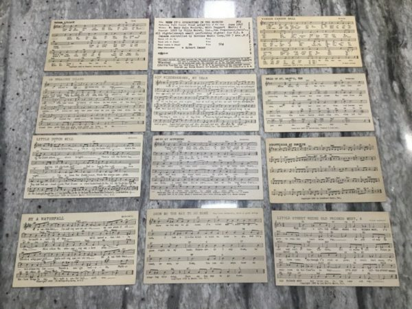
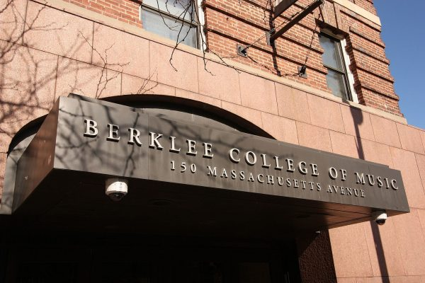
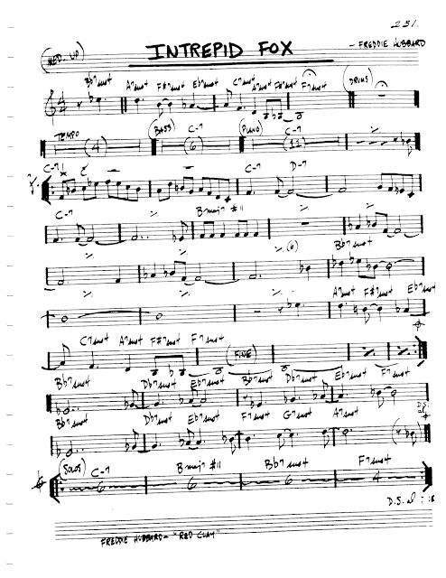
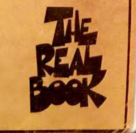
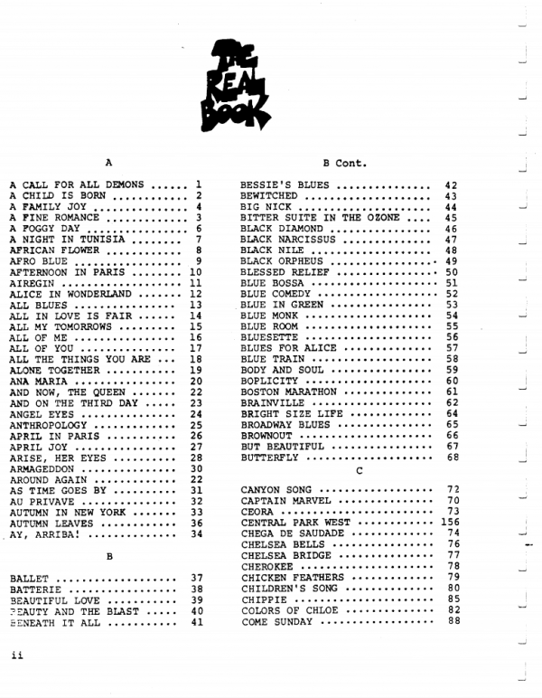
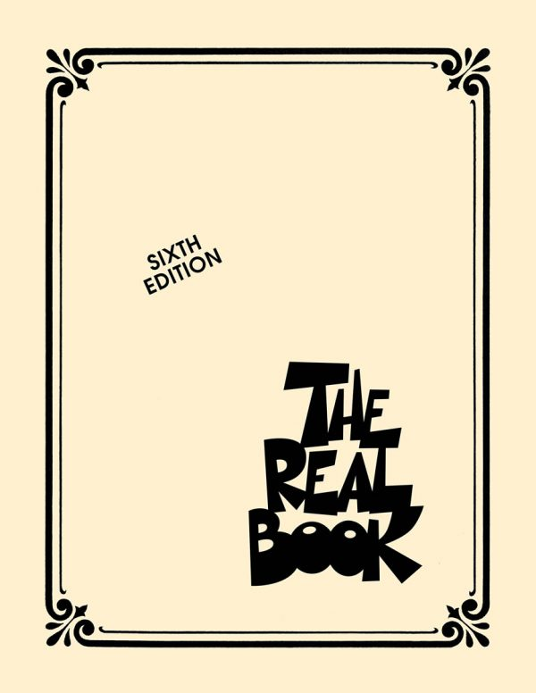

>Quotes from the deep into the topic podcast by [99% Invisible](https://99percentinvisible.org/episode/the-real-book/)

Since the mid-1970s, almost every jazz musician has owned a copy of the same book. It has a peach-colored cover, a
chunky, 1970s-style logo, and a black plastic binding. It’s delightfully homemade-looking—like it was printed by a bunch
of teenagers at a Kinkos. And inside is the sheet music for hundreds of common jazz tunes—also known as jazz
“standards”—all meticulously notated by hand. It’s called the Real Book.

But if you were going to music school in the 1970s, you couldn’t just buy a copy of the Real Book at the campus
bookstore. Because the Real Book… was _illegal_. The world’s most popular collection of jazz music was a totally
unlicensed publication. It was a self-published book created without permission from music publishers or songwriters. It
was duplicated at photocopy shops and sold on street corners, out of the trunks of cars, and under the table at music
stores where people used secret code words to make the exchange. The full story of how the Real Book came to be this
bootleg bible of jazz is a complicated one. It’s a story about what happens when an insurgent, improvisational art form
like jazz gets codified and becomes something that you can learn from a book.

The History of Fake Books
-------------------------

[Barry Kernfeld](https://www.barnesandnoble.com/w/the-story-of-fake-books-barry-kernfeld/1111519327) is a musicologist
who has written a lot about the history of jazz and music piracy. Kernfeld says that long before the Real Book ever came
out, jazz musicians were relying on collections of music they called fake books. Kernfeld says that the story of the
first fake book began in the 1940s. “A man named George Goodwin in New York City, involved in radio in the early 1940s,
was getting a little frustrated with all the intricacies of tracking licensing. And so he invented this thing that he
called the Tune-Dex,” explains Kernfeld.

TuneDex card via [Georgia State University
Library](https://blog.library.gsu.edu/2010/10/13/popular-music-tune-dex-cards/)

The Tune-Dex was an index card catalog designed for radio station employees to keep track of the songs they were playing
on air. On one side the cards had information about a particular song, such as the composer, the publisher, and anything
that one would need to know for payment rights. On the other side of the card were a few lines of bite-sized sheet
music—just the song’s melody, lyrics, and chords so that radio station employees could glance at it and quickly recall
the song. This abbreviated musical notation also made the cards useful to another group of people: working jazz
musicians.

As a Black art form, jazz had developed out of a mix of other Black music traditions including spirituals and the blues.
By the 1940s, a lot of “jazz” was popular dance music, and many jazz musicians were making their money playing live gigs
in small clubs and bars. The standard jazz repertoire was mostly well-known pop songs from Broadway, or New York’s
songwriting factory: “Tin Pan Alley.”

<YoutubeEmbed video="5WX_fKVWX2s" />

Jazz musicians would riff and freestyle over these songs. The art of improvisation has always been a key art form of
jazz music. But what made the average gigging trumpeter or sax player truly valuable was their ability to play any one
of hundreds of songs right there on the spot.

To be prepared for any request, musicians would bring stacks and stacks of sheet music to every gig. But lugging around
a giant pile of paper could be really cumbersome—this is where the Tune-Dex came in. Someone figured out that you could
gather together a bunch of Tune-Dex cards, print copies of them on sheets of paper, add a table of contents and a simple
binding, and then sell the finished product directly to musicians in the form of a book. They called them “fake books”
because they helped musicians fake their way through unfamiliar songs. These first fake books were cheaper than regular
sheet music, and a lot more organized. They became an essential tool for this entire class of working musicians.

Bootleggers
-----------

Musicians loved these new fake books, but the music publishers hated them. They wanted musicians to buy legal sheet
music, and so the publishing companies started cracking down on fake book bootleggers. That, of course, didn’t stop the
bootleggers and by the 1950s, there were countless illegal fake books in existence, which were being used in nightclubs
all across the country.

<YoutubeEmbed video="LLDELtfUsaQ" />

As helpful as fake books were, they had a lot of problems. They were notoriously illegible and confusingly laid out. The
other big problem with these fake books at this point was that the music inside felt really out of date. The fake books
hadn’t changed since the mid-40s, but jazz had. Disillusioned by commercial jazz that appealed to mainstream white
audiences, a new generation of Black musicians took jazz improvisation to a new level. They experimented with more
angular harmonies, technically demanding melodies and blindingly fast tempos. Their new style was called bebop.

<YoutubeEmbed video="09BB1pci8_o" />

Bebop was just the beginning. Over several decades, jazz exploded into this constellation of different styles.
Meanwhile, the economics of jazz shifted too. There were fewer clubs, smaller paychecks, and more university jazz
programs with steady teaching gigs. The ivory tower, not the nightclub, increasingly became a place for young musicians
to learn, and for established musicians to earn a living. And if you’re going to jazz school, you need jazz books.

Berklee College of Music. Photo by [Cryptic C62](https://commons.wikimedia.org/wiki/User:Cryptic_C62 "User:Cryptic C62")

The fake books at the time hadn’t kept up with the music. They still contained the same old-fashioned collection of
standards with the same old-fashioned collection of chord changes. If a young jazz musician wanted to try and play like
Charles Mingus or Sonny Rollins, they weren’t going to learn from a book. That is… until two college kids invented the Real Book.

The Two Guys
------------

In the mid-70s, Steve Swallow began teaching at Boston’s Berklee College of Music, an elite private music school that
boasted one of the first jazz performance programs in the country. Swallow had only been teaching at Berklee for a few
months when two students approached him about a secret project. “I keep referring them to them as ‘the two guys who
wrote the book,’ because…they swore me to secrecy. They made me agree that I would not divulge their names,” explains
Swallow. The “two guys” wanted to make a new fake book, one that actually catered to the needs of contemporary jazz
musicians and reflected the current state of jazz. And they needed Swallow’s help.

From the very beginning, the students envisioned the Real Book as a cooler and more contemporary fake book than the
stodgy, outdated ones they’d grown up with. They wanted it to include new songs from jazz fusion artists like Herbie
Hancock, and free jazz pioneers like Ornette Coleman who were pushing the boundaries of the genre. They also wanted to
include the old jazz standards from Broadway and Tin Pan Alley, but they wanted to update those classics with alternate
chord changes that reflected the way modern musicians, like Miles Davis, were actually playing them.

<YoutubeEmbed video="jy1ICphDYTQ" />

Modern jazz musicians had altered a lot of classic standards over the years, with new harmonies and more complex chord
changes. And to capture these new sounds, the students spent hours listening to recordings and transcribing what they
heard, as best they could. It was a huge undertaking because most of these chord changes had never actually been written
down. They weren’t necessarily thinking about it like this at the time, but the students were effectively establishing a
new set of standardized harmonies for a handful of classic songs.

The music wasn’t the only part of their new fake book that the students wanted to improve. They also wanted to fix the aesthetic problems with the old fake books, and make something that was nice to look at and easy to read. One of “the two guys” notated all of the music by hand in this very distinctive and expressive script. He also designed and silk-screened the logo on the front cover: “The Real Book,” written in chunky, SchoolHouse Rock-style block letters.

By the summer of 1975, the book was done, and the students took it to local photocopying shops where they cranked out hundreds of copies to sell directly to other students and a few local businesses near Berklee. Overnight, almost everyone had to have one. As the Real Book’s notoriety grew, so did the demand. The two students hadn’t printed enough copies to keep up, but it turns out, they didn’t need to. Not long after they created a few hundred copies of the book, bootleg versions began popping up all over the world. The Real Book had taken on a life of its own, and the students
ironically found themselves in the same position as the music publishers and songwriters they’d originally cut out of the process, as they watched unlicensed copies of their work get duplicated and sold. After they released the first edition of the Real Book, the students put out two more editions to correct mistakes, and then their work was done. But the Real Book lived on, copied over and over again by new generations of bootleggers. And as the number of students in elite conservatory jazz programs continued to swell over the next few decades, the Real Book, with its modern repertoire, reharmonized standards, and beautiful handwriting, became the de-facto textbook for this new legion of jazz students. The unofficial official handbook of jazz.

The Real Real Book
------------------

Just like with old fake books, the success of the Real Book was a major problem for music publishers. Some companies
released their own fake books, but they never managed to compete with the Real Book. The popularity of the Real Book
meant that lots of people weren’t getting paid for their work. But in the mid-2000s, music executive Jeff Schroedl and
the publisher Hal Leonard decided, if you can’t beat ’em, join ’em. They went through the Real Book page by page,
secured the rights to almost every song, and published a completely legal version. You don’t need to buy the Real Book
out of the back of someone’s car anymore. It’s available at your local music shop. They even wanted the same
handwriting. Hal Leonard actually hired a copyist to mimic the old Real Book’s iconic script and turn it into a digital
font, which means a digital copy of a physical copy of one anonymous Berklee student’s handwriting from the mid-70s will
continue to live on for as long as new editions of the book are published.

The Hal Leonard version of the Real Book

When Hal Leonard finally published the legal version of the Real Book in 2004, it was great news if you were a composer
with a song in there. You’d finally be getting royalties from the sale of the most popular jazz fake book of all time.
But that didn’t totally solve the intellectual property problems with the Real Book. While the legalization of the Real
Book did resolve most of its flagrant copyright violations, it didn’t clear up authorship disputes that go back to the
early days of jazz. Many jazz songs arise out of collective tinkering and improvising in jam sessions. It’s sometimes
quite hard to say who exactly wrote a given song, and power dynamics often impacted whose name actually got listed as an
official songwriter. And so there are likely many musicians whose names will never appear on the songs they helped
write, even if those songs appear in the legal Real Book.

Useful Tool, or Reductive Cheat Sheet?
----------------------------------

Even if we put the intellectual property questions aside for a second, fake books like the Real Book still have plenty
of critics. Nicholas Payton is a musician and record label owner, and he compares the Real Book to a study guide or a
cheat sheet—a way to distill this complicated art form into a manageable packet of digestible information. To Payton,
jazz isn’t just information to be learned. It’s a way of thinking and a form of expression. And it’s fundamentally a
Black cultural phenomenon that can’t be taken out of its historical context. Payton says that reading books like the
Real Book, even going to music school, can really only get you so far. If you want to learn to play, at some point
you’re going to have to immerse yourself in the culture of the music. For Payton (and many musicians) learning directly
from elders, in person, is a crucial part of what it means to really know the art form.

There’s also the question of codification, and whether it’s useful to have one songbook filled with definitive versions
of all these jazz tunes. Carolyn Wilkins has taught ensembles at Berklee College of Music, and she says that the chords
that are written down in the Real Book sometimes get treated like the _right_ way to play a particular song. But even
though jazz has all of these “standards,” they’re not supposed to be played in one standard way. As you listen to
different recordings of the same song by different jazz artists, it becomes obvious that there’s no one right way to
play it. Wilkins says that the Real Book does have its place in jazz education. Over her years at Berklee, she’s seen
how it can be a useful starting place as a tool to bring young jazz musicians together. The key, she says, is to treat
the Real Book as a starting place. From there you need to go out and explore all the other ways people have played a
particular song. “And then ultimately you must find your own way.”

<YoutubeEmbed video="1eRNRzyX3ac" />

-------

- Listen to the podcast at [99percentinvisible.org](https://99percentinvisible.org/episode/the-real-book/)
- [Download The Real Book (5th edition) [PDF]](http://biblio3.url.edu.gt/Libros/Real-Book/The_Real_Vol_1.pdf)

We see the Chromatone web-site as The Real Book for 21st century. As the old one enabled a whole class of professional jazz musicians, the new one enables the whole majority of casual visual musicians. It's a toolbox for everyone to study, explore and compose music themselves and with friends, at any place. And the more open and accessive it is - the more fun it will be for the world to start seeing music.
