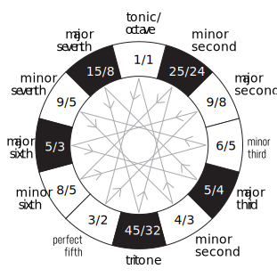

**Just intonation** or pure intonation is the tuning of musical intervals as whole number ratios (such as 3:2 or 4:3) of frequencies. An interval tuned in this way is said to be pure, and is called a just interval. Just intervals (and chords created by combining them) consist of tones from a single harmonic series of an implied fundamental. For example, if the notes G3 and C4 are tuned as members of the harmonic series of the lowest C, their frequencies will be 3 and 4 times the fundamental frequency. The interval ratio between C4 and G3 is therefore 4:3, a just fourth.

In Western musical practice, instruments are rarely tuned using only pure intervals — the desire for different keys to have identical intervals in Western music makes this impractical. Some instruments of fixed pitch, such as electric pianos, are commonly tuned using equal temperament, in which all intervals other than octaves consist of irrational-number frequency ratios. Acoustic pianos are usually tuned with the octaves slightly widened, and thus with no pure intervals at all. 

### Terminology

[Pythagorean tuning](../pythagorean/index.md), or 3-limit tuning, allows ratios including the numbers 2 and 3 and their powers, such as 3:2, a perfect fifth, and 9:4, a major ninth. Although the interval from C to G is called a perfect fifth for purposes of music analysis regardless of its tuning method, for purposes of discussing tuning systems musicologists may distinguish between a perfect fifth created using the 3:2 ratio and a tempered fifth using some other system, such as meantone or equal temperament.

**5-limit tuning** encompasses ratios additionally using the number 5 and its powers, such as 5:4, a major third, and 15:8, a major seventh. The specialized term perfect third is occasionally used to distinguish the 5:4 ratio from major thirds created using other tuning methods. **7-limit** and higher systems use higher partials in the overtone series.

**Commas** are very small intervals that result from minute differences between pairs of just intervals. For example, the 5:4 ratio is different from the Pythagorean (3-limit) major third (81:64) by a difference of 81:80, called the syntonic comma.

A twelve-tone scale can also be created by compounding harmonics up to the fifth: namely, by multiplying the frequency of a given reference note (the base note) by powers of 2, 3, or 5, or a combination of them. This method is called five-limit tuning.

5-limit tuning encompasses ratios additionally using the number 5 and its powers, such as 5:4, a major third, and 15:8, a major seventh. 7-limit and higher systems use higher partials in the overtone series.
