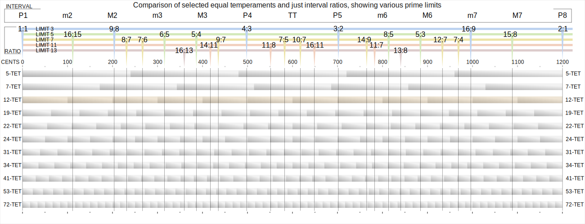

## Circle of tunings

See and hear the slight differences between Pythagorean tunings, Just intonation and 12-TET. Click on the circle to start the note. Click again to stop it. You can hear the beatings between the same notes in various tunings and also hear the quality of the intervals in each of them.

<TuningCircle/>