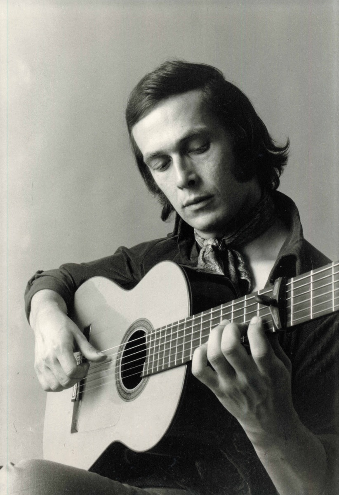

<beat-bars v-bind="flamenco" />

Flamenco (Spanish pronunciation: [flaˈmeŋko]), in its strictest sense, is an art form based on the various folkloric music traditions of southern Spain, developed within the gitano subculture of the region of Andalusia, but also having a historical presence in Extremadura and Murcia. In a wider sense, it is a portmanteau term used to refer to a variety of both contemporary and traditional musical styles typical of southern Spain. Flamenco is closely associated to the gitanos of the Romani ethnicity who have contributed significantly to its origination and professionalization. However, its style is uniquely Andalusian and flamenco artists have historically included Spaniards of both gitano and non-gitano heritage.

<youtube-embed video="z0dtTRhAGVE" />

The oldest record of flamenco music dates to 1774 in the book Las Cartas Marruecas by José Cadalso. The development of flamenco over the past two centuries is well documented: "the theatre movement of sainetes (one-act plays) and tonadillas, popular song books and song sheets, customs, studies of dances, and toques, perfection, newspapers, graphic documents in paintings and engravings. ... in continuous evolution together with rhythm, the poetic stanzas, and the ambiance.”

<youtube-embed video="sCpjPWWQB3s" />

Flamenco is rooted in various Andalusian popular musical styles, although its origins and influences are the subject of many hypotheses which may or may not have ideological implications and none of which are necessarily mutually exclusive. The most widespread is that flamenco was developed through the cross-cultural interchange among the various groups which coexisted in close proximity in Andalusia's lower classes, combining southern Spain's indigenous, Byzantine, Moorish and Romani musical traditions.

On 16 November 2010, UNESCO declared flamenco one of the Masterpieces of the Oral and Intangible Heritage of Humanity.

<youtube-embed video="zZ1456V7WlQ" />

List of Important Flamenco Forms for Guitar and their Compás:
=============================================================

Learning the difference between flamenco forms can be challenging. However, once you become familiar with the forms you’ll have a much deeper appreciation for the music and culture of flamenco!

**Here’s a list of most Important flamenco guitar Toques (Palos) and their Compás:**

[**Soleares**](#soleares)  
[Alegrías](#alegrias)  
[Bulerías](#bulerias)  
[Soleá](#solea)

[**Fandangos**](#fandangos)  
[Fandango de Huelva](#fandango-de-huelva)  
[Granaína/Granadinas](#granaina-granadinas)  
[Malagueña](#malaguena)

[**Siguiriyas**](#siguiriyas)  
[Serranas](#serranas)

[**Tangos**](#tangos)  
[Farruca](#farruca)  
[Garrotín](#garrotin)  
[Tarantas/Tarantos](#tarrantas-tarrantos)  
[Tientos](#tientos)

[**Ida y Vuelta**](#ida-y-vuelta)  
[Colombianas](#colombianas)  
[Guajiras](#guajiras)  
[Rumba](#rumba)

[**Other Toques**](#other-toques)  
[Sevillanas](#sevillanas)  
[Zambra](#zambra)  
[Zapateado](#zapateado)

Learning Flamenco guitar is a riveting adventure, full of historical intrigue and technical challenges. For those of us who haven’t lived extensively in Spain or other places where flamenco music is an integral part of life, it can be difficult to know where to begin.

**Perhaps the best introductory approach is to become familiar with the most common flamenco styles, known as _palo_s or _toques_** (from the guitarist perspective).

> _El Jaleo,_ painting by John Singer Sargent

### What does flamenco Toque or Palo mean?

You can consider a flamenco _toque_ or _palo_ as a musical form (compositional structure).

Each form signifies the following:

*   Rhythmic structure (compás)
*   Tempo
*   Key or Mode
*   Harmonic patterns (such as chord progressions)
*   Melodic phrasing elements that have been established, developed, and transmitted for hundreds of years

So how is this helpful? Simply put, saying the name of a form conveys a lot of meaning that otherwise takes a long time to describe.

For instance, without the name of a form, I would have to say “play this piece Andante in 3/4 time, E phrygian mode. You should place accents on beat 12, 3, 6, 8, and 10. The chord progression is…” blah blah blah.

Instead, one can simply say this is a “Soleá” _toque_, and know generally what to expect!

While flamenco guitar is usually improvisational based on the norms of a given toque, there are well-known compositions, familiar ‘licks’, and standard phrases that players will incorporate on a regular basis.¹

### What’s the difference between Palo and Toque?

First of all, **what’s the difference between a _palo_ and _toque_** in flamenco? The short answer is there is no practical difference other than _palo_ is a more general term to describe the classification system whereas **_toque_ is guitar-specific**.

The word _palo_ in Spanish has several definitions, but in this context a “branch” or “suit of cards” is the best translation as it refers to a categorization or classification system.

The word _toque_, meaning “to touch”, refers to the same exact system but from the guitarist perspective. Secondly, the term ‘_tocoar_‘ refers to a particular guitarist, and their particular repertoire and style of playing.

> Paco de Lucía, flamenco guitarist and composer

The Flamenco _palos_ system is extremely robust. In fact, there’s dozens of regional, historical, and of course musical distinctions to consider. Each of these forms has special nuances that inform a guitarist as to which form is which.

### What are the three top-level flamenco form categories?

The codified Flamenco _palo_ system has been classified in many different ways.² However, the forms generally fall into three main categories:

*   _**Cante**_ (singing)
*   _**Toque**_ (guitar playing)
*   _**Baile**_ (dance)

Since our focus is on flamenco guitar (_toque_), the remainder of this article will refer to the Flamenco style as _toque_.

To get a better sense of what a _toque_ is, it’s worth referring to an excerpt by Juan Martín’s _El Arte Flamenco de la Guitarra_:

> _“There is no exact English equivalent for ‘toque’…. but as you become more familiar with Flamenco you will soon find that the different toques are easily distinguished. Each has a characteristic and recurring pattern of beats and accents (i.e. its compás) and it also has its own kinds of key and harmonic structure. As a result, it has not only a particular rhythmic form but also a characteristic sound and range of expression.”_
> 
> – Juan Martín, _El Arte Flamenco de la Guitarra_: Volume 1

As Martín so eloquently describes, once you become familiar with the various _toques_, their rhythmic structures (_compás_), harmonic and even melodic nuances, you’ll be able to quickly identify which style is being played–ultimately allowing you to understand and enjoy flamenco music in a more intimate and purposeful way!

List of Common & Popular Toques
-------------------------------

Here’s the list and basic description of the most common popular flamenco guitar toques and subcategories, classified by origin and _compás_:

Soleares
--------

Many people consider the Soleares (plural of [Soleá](https://richterguitar.com/flamenco-guitar/flamenco-guitar-toques-and-palos/solea/)) the most important and fundamental toque in flamenco guitar pedagogy.

As Juan Martín states, “_the rhythm of Soleares takes you deep into the heart of Flamenco, for it is a toque which embodies many of Flamenco’s most vital elements of rhythm and harmony and from which many other toques are derived. In Andalucía, every student of the flamenco guitar will start with it_.”

Like many aspects of Flamenco, historical origins of the Soleares are uncertain and highly controversial. However, the Soleares became most well-known in the regions of Seville and Cadíz.

**The basic compás for Soleares ([Soleá](https://richterguitar.com/flamenco-guitar/flamenco-guitar-toques-and-palos/solea/)), the most widely used in all Flamenco music is:**

> Basic Soleares Compás, accents on beats 3, 6, 8, 10, and 12

### Alegrías

[Alegrías](https://richterguitar.com/flamenco-guitar/flamenco-guitar-toques-and-palos/alegrias/) (meaning joy) are a lively branch of Soleares (usually 100-180 BPM) that originated in Cadíz. [Alegrías](https://richterguitar.com/flamenco-guitar/flamenco-guitar-toques-and-palos/alegrias/) are in a major key (typically E major or A major), and are popular to perform with a dancer or as a solo.

The [Alegría](https://richterguitar.com/flamenco-guitar/flamenco-guitar-toques-and-palos/alegrias/) includes two sections for the dancer: the _silencio_, a minor key section; and the _escobilla_, which includes a virtuosic guitar solo and gradual increase in rhythm.

### Bulerías

[Bulerías](https://richterguitar.com/flamenco-guitar/flamenco-guitar-toques-and-palos/bulerias/) is the fastest branch of Soleares, with a lively, intense dissonance that compliments the advanced rhythmic structure of the _compás_. [Bulerías](https://richterguitar.com/flamenco-guitar/flamenco-guitar-toques-and-palos/bulerias/) are possibly the most popular, yet also the most virtuosic and demanding for flamenco guitarists. There are many variations of the [Bulería](https://richterguitar.com/flamenco-guitar/flamenco-guitar-toques-and-palos/bulerias/) _compás_ and accent patterns, which you can learn about [here](https://richterguitar.com/flamenco-guitar/flamenco-guitar-toques-and-palos/bulerias/).

Soleá
--------

Synonymous with the name Soleares, [Soleá](https://richterguitar.com/flamenco-guitar/flamenco-guitar-toques-and-palos/solea/) is a slow, solemn, and majestic form that likely comes from the Spanish word _soledad_, meaning solitude or loneliness. [Soleá](https://richterguitar.com/flamenco-guitar/flamenco-guitar-toques-and-palos/solea/) is known as the “Mother of Flamenco”.

Tragedy, death, and desperation are the common subject matter for the [Soleá](https://richterguitar.com/flamenco-guitar/flamenco-guitar-toques-and-palos/solea/) _cante_ (singers)– passion that you can also hear in the guitar playing. After a long night of dancing and singing lively toques, a guitarist may play a [Soleá](https://richterguitar.com/flamenco-guitar/flamenco-guitar-toques-and-palos/solea/) as a melancholy conclusion. When the shot glasses are dry and there’s a stillness in the air when sun is on the verge of rising, play the [Soleá](https://richterguitar.com/flamenco-guitar/flamenco-guitar-toques-and-palos/solea/).

Fandangos
------------------

Compared to other toques, [Fandangos](https://richterguitar.com/flamenco-guitar/flamenco-guitar-toques-and-palos/fandangos/) have a shorter rhythmic cycle that may feel more familiar to musicians trained in classical or other Western music styles. [Fandangos](https://richterguitar.com/flamenco-guitar/flamenco-guitar-toques-and-palos/fandangos/) were influenced from Arab-Moorish music, and Portuguese music.

Flamenco [Fandangos](https://richterguitar.com/flamenco-guitar/flamenco-guitar-toques-and-palos/fandangos/) have a 3/4 rhythm (previously 6/8, now 3/4 or 3/8), with an accent on the first beat. Some [Fandangos](https://richterguitar.com/flamenco-guitar/flamenco-guitar-toques-and-palos/fandangos/) are very metric and appropriate for dance, whereas others have more of a free-form atmosphere (known as _en toque libre_ or “very freely”).

Fandango de Huelva
-----------

Within the [Fandango](https://richterguitar.com/flamenco-guitar/flamenco-guitar-toques-and-palos/fandangos/) _toque_ are regional styles known as ‘_fandangos locales’_. Fandangos de Huelva is one such example.

Unlike the _toque libre_ fandango styles, Fandangos de Huelva follows a strict _compás_ structure that can be danced to.

You can count the 12 beat _compás_ of Fandango de Huelva into beats of 3 as seen here:

> Fandangos de Huelva Compás, silent beats indicated with quarter rests

### Granaína/Granadinas

[Granadinas](https://richterguitar.com/flamenco-guitar/flamenco-guitar-toques-and-palos/granadinas/) or Granaína is a variant of the Granada fandangos. [Granaína](https://richterguitar.com/flamenco-guitar/flamenco-guitar-toques-and-palos/granadinas/) is relatively slow, with a freeing rhythm (_toque libre_) and rich embellishments that convey both a dreamlike and flowing quality. The [Granaína](https://richterguitar.com/flamenco-guitar/flamenco-guitar-toques-and-palos/granadinas/) is unique in that it’s in Phrygian mode based on the B note.

### • Malagueña

[Malagueñas](https://richterguitar.com/flamenco-guitar/flamenco-guitar-toques-and-palos/malaguenas/) are another _toque libre_ fandango from the area of Málaga. The [Malagueña](https://richterguitar.com/flamenco-guitar/flamenco-guitar-toques-and-palos/malaguenas/) began as a relatively fast metric form in 6/8 time to accompany dance, then slowed the tempo down and added more embellishments in the 19th century.

Later, guitarists like [Ramón Montoya (1879-1949)](https://en.wikipedia.org/wiki/Ram%C3%B3n_Montoya) began playing [Malagueñas](https://richterguitar.com/flamenco-guitar/flamenco-guitar-toques-and-palos/malaguenas/) freely, while still incorporating the distinctive melodic phrases that gave rise to the form’s popularity.

Siguiriyas
--------------------------

[Siguiriyas](https://richterguitar.com/flamenco-guitar/flamenco-guitar-toques-and-palos/seguiriyas/), also spelled _seguiriyas_, _siguerillas_, or _siguirillas_, is a deep, expressive style evoking a tragic feeling similar to the Soleá. Slow, somber, and sentimental, the [Siguiriyas](https://richterguitar.com/flamenco-guitar/flamenco-guitar-toques-and-palos/seguiriyas/) _compás_ follows the 12 beat cycle but with a different accent pattern than the Soleares as seen here:

> Siguiriya Compás with accent marks and simpler counting system

### Serranas

[Serranas](https://richterguitar.com/flamenco-guitar/flamenco-guitar-toques-and-palos/serranas/) originated as a melodious [Siguiriya](https://richterguitar.com/flamenco-guitar/flamenco-guitar-toques-and-palos/seguiriyas/) style in the rural Ronda (Málaga) area. The guitarist [Silverio Franconetti (1831-1889)](https://en.wikipedia.org/wiki/Silverio_Franconetti) developed the [Serrana](https://richterguitar.com/flamenco-guitar/flamenco-guitar-toques-and-palos/serranas/) form in his performance interpretations.

[Serranas](https://richterguitar.com/flamenco-guitar/flamenco-guitar-toques-and-palos/serranas/) have a characteristic emphasis on melodic “third” intervals, whereas most flamenco melodies are only minor second or major second apart.

Tangos
------

First, it’s important to note that Flamenco Tangos are unrelated to the Latin-American form by the same name found in Argentina. Tangos are joyous, upbeat, and follow a relatively straightforward four-beat rhythm structure displayed in 4/4/ time.

Tangos came from the regions of Cadíz (most prominent), Jerez, Málaga, and Seville.

### Farruca

People believe that the [Farruca](https://richterguitar.com/flamenco-guitar/flamenco-guitar-toques-and-palos/farruca/) originated in Galicia, Spain. Men traditionally dance to this form with no singing component. The [Farruca](https://richterguitar.com/flamenco-guitar/flamenco-guitar-toques-and-palos/farruca/) is played in A minor, with a _compás_ of two measures of 4/4 time signature with accents on beats 1, 3, 5, and 7. You can see the accent pattern example below:

> Farruca Compás and accented beats

### Garrotín

The [Garrotín](https://richterguitar.com/flamenco-guitar/flamenco-guitar-toques-and-palos/garrotin/) is a festive and cheerful style in major mode, 2/4 time. The [Garrotín](https://richterguitar.com/flamenco-guitar/flamenco-guitar-toques-and-palos/garrotin/) originated in northern Spain near Asturias, and can include singing or dancing as well as guitar accompaniment. The renowned flamenco singer [La Niña de los Peines](https://en.wikipedia.org/wiki/La_Ni%C3%B1a_de_los_Peines) helped popularize the [Garrotín](https://richterguitar.com/flamenco-guitar/flamenco-guitar-toques-and-palos/garrotin/).

### Tarantas/Tarantos

[Tarantas](https://richterguitar.com/flamenco-guitar/flamenco-guitar-toques-and-palos/tarantas/) is a quintessential _toque libre_, with very lofty, repetitive _ligado_ phrases (hammer ons/pull offs). [Tarrantas](https://richterguitar.com/flamenco-guitar/flamenco-guitar-toques-and-palos/tarantas/) have a characteristic technique called _arrastre_, in which the right hand ring finger (a) drags from the high to the low strings in a quick successive manner (similar to an upstroke but a bit slower and disconnected). [Tarantas](https://richterguitar.com/flamenco-guitar/flamenco-guitar-toques-and-palos/tarantas/) are commonly notated with no measure bar lines to indicate the free manner in which you should play it.

The [**Tarantos**](https://richterguitar.com/flamenco-guitar/flamenco-guitar-toques-and-palos/tarantos/) contrasts to the _toque libre_ [Tarantas](https://richterguitar.com/flamenco-guitar/flamenco-guitar-toques-and-palos/tarantas/), with a strong rhythmic feel structured in a _compás_ of 4s (2/4 or 4/4 time). The key signature and basic chord structure of [Tarantos](https://richterguitar.com/flamenco-guitar/flamenco-guitar-toques-and-palos/tarantos/) is the same as [Tarantas](https://richterguitar.com/flamenco-guitar/flamenco-guitar-toques-and-palos/tarantas/) (two sharps), so their harmonic relationship is clear and distinct.

### Tientos

The Tientos is often danced, and is a bit slower than other tangos. However every [Tientos](https://richterguitar.com/flamenco-guitar/flamenco-guitar-toques-and-palos/tientos/) does speed up and become a tango by the end following the dance _escobilla_ sections. You can count the [Tientos](https://richterguitar.com/flamenco-guitar/flamenco-guitar-toques-and-palos/tientos/) four beat _compás_ with accents on beats 2 and 4.

There is a distinctive syncopation in the rhythm of the Tientos. You can see one of the simplest variations below:

> Basic Tientos Compás

Ida y Vuelta
------------

The Spanish expression Ida y Vuelta (“departure and return” or “round trip”) refers to _palos_ that were exported from Spain to the New World, particularly Cuba, where they evolved with African and Native American music influences. Immigrants later imported these forms back to Spain with a new flair.

### Colombianas

People credit the famous flamenco singer [Pepe Marchena](https://en.wikipedia.org/wiki/Pepe_Marchena) for creating the [Colombiana](https://richterguitar.com/flamenco-guitar/flamenco-guitar-toques-and-palos/colombianas/) (or _Colombina_) in 1931. The guitarist Ramon Montoya accompanied Marchena in recordings of the [Colombiana](https://richterguitar.com/flamenco-guitar/flamenco-guitar-toques-and-palos/colombianas/) the following year. [Colombianas](https://richterguitar.com/flamenco-guitar/flamenco-guitar-toques-and-palos/colombianas/) are in a major mode and follow a 4-beat _compás_ similar to the Rumba:

> Basic Colombiana Compás

### Guajiras

[Guajiras](https://richterguitar.com/flamenco-guitar/flamenco-guitar-toques-and-palos/guajiras/) is a _toque_ based on a Cuban rural genre known as Punto Guajira Cubana. The [Guajira](https://richterguitar.com/flamenco-guitar/flamenco-guitar-toques-and-palos/guajiras/) is in a major mode, and follows a 12 beat _compás_ similar to the [Solea](https://richterguitar.com/flamenco-guitar/flamenco-guitar-toques-and-palos/solea/), with accents on beats 3, 6, 8, 10, and 12. [Guajiras](https://richterguitar.com/flamenco-guitar/flamenco-guitar-toques-and-palos/guajiras/) is in a major mode, with a characteristic descending melodic phrase in the bass from F# to F to E. For more info on the [Guajiras](https://richterguitar.com/flamenco-guitar/flamenco-guitar-toques-and-palos/guajiras/) _compás_ and examples, check out [this page](https://richterguitar.com/flamenco-guitar/flamenco-guitar-toques-and-palos/guajiras/).

### Rumba

The [Rumba](https://richterguitar.com/flamenco-guitar/flamenco-guitar-toques-and-palos/rumba/), meaning “party”, originated in Havana, Cuba. The flamenco [Rumba](https://richterguitar.com/flamenco-guitar/flamenco-guitar-toques-and-palos/rumba/) became popular in the late 20th century by artists such as [Paco de Lucia](https://richterguitar.com/flamenco-guitar/flamenco-guitarists-and-albums/), and Rodrigo Y Gabriella and Gipsy Kings, among others. The [Rumba](https://richterguitar.com/flamenco-guitar/flamenco-guitar-toques-and-palos/rumba/) is in a minor mode, and notated in 4/4 time.

However, you can also count the [Rumba’s](https://richterguitar.com/flamenco-guitar/flamenco-guitar-toques-and-palos/rumba/) rhythm as 8 beats (3+3+2) in a single measure. The [Rumba’s](https://richterguitar.com/flamenco-guitar/flamenco-guitar-toques-and-palos/rumba/) characteristic accents on beats 1, 4, and 7, give the [Rumba](https://richterguitar.com/flamenco-guitar/flamenco-guitar-toques-and-palos/rumba/) an exciting drive:
> 

> Basic Rumba Rhythmic Cycle

Other Toques
------------

### • Sevillanas

Sevillanas are a lively, popular toque with dance accompaniment, usually notated in 3/4 time similar to the _[Fandango](https://richterguitar.com/flamenco-guitar/flamenco-guitar-toques-and-palos/fandangos/)_ rhythm.

People usually play the Sevillianas in a set of four short sequential pieces. In other words, a “Sevillianas performance” will have four or more short Sevillianas that immediately follow one another. Each one is in a different key or mode.

Sevillanas begin with a series of rhythmic _rasgueado_, followed by a brief melodic sequence (_salida_), followed by more _reasgueado_, then the full melody (_copla_). The third _copla_ is usually a slight variation from the previous two.

### Zambra

[Zambra](https://richterguitar.com/flamenco-guitar/flamenco-guitar-toques-and-palos/zambra/) is a flamenco style that originated in Granada and Almeira. People believe that the [Zambra](https://richterguitar.com/flamenco-guitar/flamenco-guitar-toques-and-palos/zambra/) is from earlier Moorish dance styles, and thus the melodies usually have an arabesque quality.

[Zambras](https://richterguitar.com/flamenco-guitar/flamenco-guitar-toques-and-palos/zambra/) are very metric, typically have a bouncy, alternating bass on strong beats. To play a [Zambra](https://richterguitar.com/flamenco-guitar/flamenco-guitar-toques-and-palos/zambra/), guitarists will usually tune their guitar bass string down to drop D.

### Zapateado

[Zapateado](https://richterguitar.com/flamenco-guitar/flamenco-guitar-toques-and-palos/zapateado/) is a lively style in 6/8 time and popular dance form (in Spanish, _zapato_ means shoe). The form originally appeared in Cadíz. However, one can find similar forms in Mexico (the _Zapateo_). Guitarists usually play the [Zapateado](https://richterguitar.com/flamenco-guitar/flamenco-guitar-toques-and-palos/zapateado/) in C major, although [Sabicas](https://richterguitar.com/flamenco-guitar/flamenco-guitarists-and-albums/) has a unique well-known composition “[Zapateado in Re](https://www.youtube.com/watch?v=DyNwpxPjfYg)” (D major).

##### Footnotes

¹ Parallels can be drawn to jazz guitarists learning licks and solos of famous jazz predecessors. Contemporary players will often incorporate and/or elaborate on these phrases on the spot during a performance as an homage.

² Another way to classify these styles is by mood: _cante jondo_ (serious and solemn), _cante chico_ (lighter and festive), and _cante intermedio_ (a style that doesn’t fit into either category).

Sources
====

- https://richterguitar.com/flamenco-guitar/flamenco-guitar-toques-and-palos/