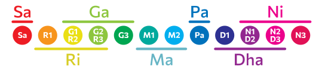
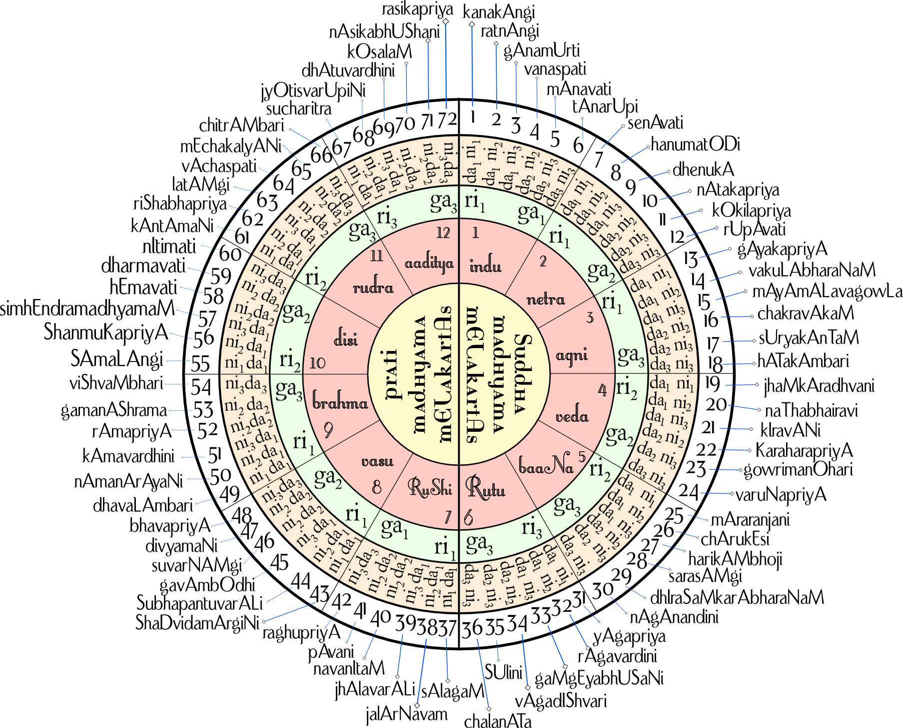

A raga or raag (IAST: rāga; also raaga or ragam; literally "coloring, tingeing, dyeing") is a melodic framework for improvisation akin to a melodic mode in Indian classical music. The rāga is a unique and central feature of the classical Indian music tradition, and as a result has no direct translation to concepts in classical European music. Each rāga is an array of melodic structures with musical motifs, considered in the Indian tradition to have the ability to "colour the mind" and affect the emotions of the audience.

Each rāga provides the musician with a musical framework within which to improvise. Improvisation by the musician involves creating sequences of notes allowed by the rāga in keeping with rules specific to the rāga. Rāgas range from small rāgas like Bahar and Shahana that are not much more than songs to big rāgas like Malkauns, Darbari and Yaman, which have great scope for improvisation and for which performances can last over an hour. Rāgas may change over time, with an example being Marwa, the primary development of which has been going down into the lower octave, in contrast with the traditional middle octave. Each rāga traditionally has an emotional significance and symbolic associations such as with season, time and mood. The rāga is considered a means in the Indian musical tradition to evoking specific feelings in an audience. Hundreds of rāga are recognized in the classical tradition, of which about 30 are common, and each rāga has its "own unique melodic personality".

Every raga has a swara (a note or named pitch) called shadja, or adhara sadja, whose pitch may be chosen arbitrarily by the performer. This is taken to mark the beginning and end of the saptak (loosely, octave). The raga also contains an adhista, which is either the swara Ma or the swara Pa. The adhista divides the octave into two parts or anga - the purvanga, which contains lower notes, and the uttaranga, which contains higher notes. Every raga has a vadi and a samvadi. The vadi is the most prominent swara, which means that an improvising musician emphasizes or pays more attention to the vadi than to other notes. The samvadi is consonant with the vadi (always from the anga that does not contain the vadi) and is the second most prominent swara in the raga.

 

According to Monier Monier-Williams, the term comes from a Sanskrit word for "the act of colouring or dyeing", or simply a "colour, hue, tint, dye". The term also connotes an emotional state referring to a "feeling, affection, desire, interest, joy or delight", particularly related to passion, love, or sympathy for a subject or something. In the context of ancient Indian music, the term refers to a harmonious note, melody, formula, building block of music available to a musician to construct a state of experience in the audience.

The word appears in the ancient Principal Upanishads of Hinduism, as well as the Bhagavad Gita.[ For example, verse 3.5 of the Maitri Upanishad and verse 2.2.9 of the Mundaka Upanishad contain the word rāga. The Mundaka Upanishad uses it in its discussion of soul (Atman-Brahman) and matter (Prakriti), with the sense that the soul does not "color, dye, stain, tint" the matter. The Maitri Upanishad uses the term in the sense of "passion, inner quality, psychological state". The term rāga is also found in ancient texts of Buddhism where it connotes "passion, sensuality, lust, desire" for pleasurable experiences as one of three impurities of a character. Alternatively, rāga is used in Buddhist texts in the sense of "color, dye, hue".

<youtube-embed video="J8QgzZQ3hyc" />

In 1933, states José Luiz Martinez – a professor of music, Stern refined this explanation to "the rāga is more fixed than mode, less fixed than the melody, beyond the mode and short of melody, and richer both than a given mode or a given melody; it is mode with added multiple specialities".

According to Walter Kaufmann, though a remarkable and prominent feature of Indian music, a definition of rāga cannot be offered in one or two sentences. rāga is a fusion of technical and ideational ideas found in music, and may be roughly described as a musical entity that includes note intonation, relative duration and order, in a manner similar to how words flexibly form phrases to create an atmosphere of expression. In some cases, certain rules are considered obligatory, in others optional. The rāga allows flexibility, where the artist may rely on simple expression, or may add ornamentations yet express the same essential message but evoke a different intensity of mood.

A rāga has a given set of notes, on a scale, ordered in melodies with musical motifs. A musician playing a rāga, states Bruno Nettl, may traditionally use just these notes, but is free to emphasize or improvise certain degrees of the scale. The Indian tradition suggests a certain sequencing of how the musician moves from note to note for each rāga, in order for the performance to create a rasa (mood, atmosphere, essence, inner feeling) that is unique to each rāga. A rāga can be written on a scale. Theoretically, thousands of rāga are possible given 5 or more notes, but in practical use, the classical tradition has refined and typically relies on several hundred. For most artists, their basic perfected repertoire has some forty to fifty rāgas. Rāga in Indian classic music is intimately related to tala or guidance about "division of time", with each unit called a matra (beat, and duration between beats).

## 72 Melakarta ragas

Here’s a list of an aesthetic and scientifically designed chart of the 72 parent ragas which have been assigned to 12 chakras/wheel each comprising six ragas.

Continuing the extremely complex system from which our Carnatic classical music was derived we here arrive at a very aesthetic and scientifically designed chart of the 72 parent ragas. These are called melakarta ragas which numbering 72 have been re-scheduled into 36 each taking the ‘shuddha madhyama’ and ‘prati (sharp) madhyama’, namely the note ‘Ma’ respectively. Again, these 72 ragas have been assigned to 12 chakras/wheel each comprising six ragas. Therefore, we have six chakras in the Ma1 (shuddha madhyama) scale and six in the Ma2 (prati madhyama).

The nomenclature given to the chakras carries great import. For instance, the first chakra being numero uno is called ‘Indu’ after the moon of which we have just one in our universe; chakra two is named after the eyes: netra; the third after agni (fire) which exists in three forms (treat agni); the fourth after the four Vedas, the fifth is the bana chakra after the pancha bana (five arrows of Manmatha/Cupid), the sixth Rithu after the seasons (shat rithu); the seventh is Rishi after the sapta (7)rishis; the eighth is called ‘Vasu chakra’ (our mythology speaks of 8 Vasus/superhumans); the ninth is ‘Brahma’ of which we are told there are 9 (nava brahma/creators); the tenth is ‘Disi’ or direction and in Indian system we count 10 directions; the eleventh is Rudra chakra named after 11 rudras/deities and finally the 12th chakra is the ‘Aditya’ or sun of which there are 12 in the galaxy apart from ours.

<youtube-embed video="mrFJ9MLR7do" />

This apart, the entire chart is made user-friendly by assigning the syllabic notes in an order that facilitates easy memorising for a student of music. For instance, all the ragas in the Indu chakra have a common note in rishabha and gandhara, viz,. ‘ra-ga’ (shuddha rishabha and shuddha gandhara-ri1 and ga1). The only notes that change their position in numerical order are the daivatha and nishadha (dha & ni). Similarly, in Netra chakra, it is ‘ra and gi’. The rishabha remains the same (ri1) while the gandhara changes to ‘sadharana gandharam (ga2). The third Agni chakra is identified with ‘ra-gu’ which means no change in the placement of rishabha but then the gandhara changes to antara gandhara (ga3). When it comes to the fourth Veda chakra, it is ‘ri-gi’ where the rishabha undergoes a change in position to chatursruti rishabha (ri2) with the gandhara remaining constant at sadharana gandhara (ga2). In the Bana chakra (ri-gu) the chatusruti rishabha is constant ‘ri2’ while the gandhara turns ‘ga3’. Finally, in the sixth Rithu chakra which completes the shuddha madhyama ragas, it is ‘ru-gu’ where the rishabha is placed in shatsruti (ri3) and the gandhara remains in ‘ga3’. The same is repeated in the next six chakras (37-72) which come under the prati madhayama melakarta ragas corresponding to the 36 shuddha madhyama ragas.

<youtube-embed video="G5xfoEVyJRg" />

Now let’s get the list of these 72 ragas: Kanakangi, Ratnangi, Ganamurti, Vanaspati, Manavati, Tanarupi (Indu chakra); Senavati, Hanumathodi (todi), Dhenuka, Natakapriya, Kokilapriya, Rupavathi (Netra chakra); Gayakapriya, Vakulapriya, Mayamalavagowla, Chakravakam, Suryakantam, Hatakambari (Agni Chakra); Jhankaradwani, Natabhairavi, Keeravani, Kharaharapriya, Gourimanohari, Varunapriya (Veda chakra); Mara ranjani, Charukesi, Sarasangi, Harikambhoji, Dheera Sankarabharanam (Sankarabharanam), Naganandini (Bana chakra); Yagapriya, Ragavardhini, Gaangeyabhushani, Vagadeeshwari, Shulini, Chalanata (Naata) (Ritu chakra); Salagam, Jalarnavam, Jhalavarali, Navaneetam, Pavani, Raghupriya (Rishi chakra); Shadvidhamargini, Shuba Panthuvarali, Gavambhodi, Suvarnangi, Divyamani, Bhavapriya (Vasu chakra); Dhavalambari, Naamanarayani, Kamavardhini, Ramapriya, Gamanashrama, Vishwambari (Brahma chakra); Shyamalangi, Shanmukhapriya, Simhendra Madhyamam, Hemavathi, Dharmavathi, Neethimathi (Disi chakra); Kantamani, Rishabapriya, Lataangi, Vaachaspati, Meccha Kalyani (Kalyani), Chitrambari (Rudra chakra); Sucharita, Jyothiswaroopini, Dhatuvardhini, Kosalam, Nasika bhushani, Rasikapriya (Aditya chakra).

## Katapayadi system

[ka·ṭa·pa·yā·di](https://en.wikipedia.org/wiki/Katapayadi_system) (Devanagari: कटपयादि) system (also known as Paralppēru, Malayalam: പരല്‍പ്പേര്) of numerical notation is an ancient Indian alphasyllabic numeral system to depict letters to numerals for easy remembrance of numbers as words or verses. Assigning more than one letter to one numeral and nullifying certain other letters as valueless, this system provides the flexibility in forming meaningful words out of numbers which can be easily remembered.

Following verse found in Śaṅkaravarman's Sadratnamāla explains the mechanism of the system.

> नञावचश्च शून्यानि संख्या: कटपयादय:।  
> मिश्रे तूपान्त्यहल् संख्या न च चिन्त्यो हलस्वर:॥

Transiliteration:

> nanyāvacaśca śūnyāni saṃkhyāḥ kaṭapayādayaḥ  
> miśre tūpāntyahal saṃkhyā na ca cintyo halasvaraḥ

Translation: na (न), nya (ञ) and a (अ)-s, i.e., vowels represent zero. The nine integers are represented by consonant group beginning with ka, ṭa, pa, ya. In a conjunct consonant, the last of the consonants alone will count. A consonant without a vowel is to be ignored.

Explanation: The assignment of letters to the numerals are as per the following arrangement (In Devanagari, Kannada, Telugu & Malayalam respectively)

| 1          | 2           | 3          | 4           | 5            | 6           | 7           | 8          | 9           | 0           |
| ---------- | ----------- | ---------- | ----------- | ------------ | ----------- | ----------- | ---------- | ----------- | ----------- |
| ka क ಕ క ക | kha ख ಖ ఖ ഖ | ga ग ಗ గ ഗ | gha घ ಘ ఘ ഘ | nga ङ ಙ జ్ఞ ങ | ca च ಚ చ ച  | cha छ ಛ ఛ ഛ | ja ज ಜ జ ജ | jha झ ಝ ఝ ഝ | nya ञ ಞ ఞ ഞ |
| ṭa ट ಟ ట ട | ṭha ठ ಠ ఠ ഠ | ḍa ड ಡ డ ഡ | ḍha ढ ಢ ఢ ഢ | ṇa ण ಣ ణ ണ   | ta त ತ త ത  | tha थ ಥ థ ഥ | da द ದ ద ദ | dha ध ಧ ధ ധ | na न ನ న ന  |
| pa प ಪ ప പ | pha फ ಫ ఫ ഫ | ba ब బ ബ   | bha भ ಭ భ ഭ | ma म ಮ మ മ   | –           | –           | –          | –           | –           |
| ya य ಯ య യ | ra र ರ ర ര  | la ल ల ల ല | va व ವ వ വ  | śha श ಶ శ ശ  | sha ष ಷ ష ഷ | sa स ಸ స സ  | ha ह ಹ హ ഹ | –           | –           |

- Consonants have numerals assigned as per the above table. For example, ba (ब) is always 3 whereas 5 can be represented by either nga (ङ) or ṇa (ण) or ma (म) or śha (श).
- All stand-alone vowels like a (अ) and ṛ (ऋ) are assigned to zero.
- In case of a conjunct, consonants attached to a non-vowel will be valueless. For example, kya (क्या) is formed by k (क्) + ya (य) + a (अ). The only consonant standing with a vowel is ya (य). So the corresponding numeral for kya (क्या) will be 1.
- There is no way of representing the decimal separator in the system.
- Indians used the Hindu–Arabic numeral system for numbering, traditionally written in increasing place values from left to right. This is as per the rule "अङ्कानां वामतो गतिः" which means numbers go from right to left.

The melakarta ragas of the Carnatic music is named so that the first two syllables of the name will give its number. This system is sometimes called the Ka-ta-pa-ya-di sankhya. The Swaras 'Sa' and 'Pa' are fixed, and here is how to get the other swaras from the melakarta number.

Melakartas 1 through 36 have Ma1 and those from 37 through 72 have Ma2.
The other notes are derived by noting the (integral part of the) quotient and remainder when one less than the melakarta number is divided by 6. If the melakarta number is greater than 36, subtract 36 from the melakarta number before performing this step.
'Ri' and 'Ga' positions: the raga will have:
Ri1 and Ga1 if the quotient is 0
Ri1 and Ga2 if the quotient is 1
Ri1 and Ga3 if the quotient is 2
Ri2 and Ga2 if the quotient is 3
Ri2 and Ga3 if the quotient is 4
Ri3 and Ga3 if the quotient is 5
'Da' and 'Ni' positions: the raga will have:
Da1 and Ni1 if remainder is 0
Da1 and Ni2 if remainder is 1
Da1 and Ni3 if remainder is 2
Da2 and Ni2 if remainder is 3
Da2 and Ni3 if remainder is 4
Da3 and Ni3 if remainder is 5

### Raga Dheerasankarabharanam

The katapayadi scheme associates dha ↔ "title" 9 and ra ↔ "title" 2, hence the raga's melakarta number is 29 (92 reversed). Now 29 ≤ "title" 36, hence Dheerasankarabharanam has Ma1. Divide 28 (1 less than 29) by 6, the quotient is 4 and the remainder 4. Therefore, this raga has Ri2, Ga3 (quotient is 4) and Da2, Ni3 (remainder is 4). Therefore, this raga's scale is Sa Ri2 Ga3 Ma1 Pa Da2 Ni3 SA.

### Raga MechaKalyani

From the coding scheme Ma ↔ "title" 5, Cha ↔ "title" 6. Hence the raga's melakarta number is 65 (56 reversed). 65 is greater than 36. So MechaKalyani has Ma2. Since the raga's number is greater than 36 subtract 36 from it. 65–36=29. 28 (1 less than 29) divided by 6: quotient=4, remainder=4. Ri2 Ga3 occurs. Da2 Ni3 occurs. So MechaKalyani has the notes Sa Ri2 Ga3 Ma2 Pa Da2 Ni3 SA.

### Exception for Simhendramadhyamam

As per the above calculation, we should get Sa ↔ "title" 7, Ha ↔ "title" 8 giving the number 87 instead of 57 for Simhendramadhyamam. This should be ideally Sa ↔ "title" 7, Ma ↔ "title" 5 giving the number 57. So it is believed that the name should be written as Sihmendramadhyamam (as in the case of Brahmana in Sanskrit).

## Chakras

The 72 melakarta ragas are split into 12 groups called chakras, each containing 6 ragas. The ragas within the chakra differ only in the dhaivatham and nishadham notes (D and N), as illustrated below. The name of each of the 12 chakras suggest their ordinal number as well.[2][4]

- **Indu** stands for the moon, of which we have only one - hence it is the first chakra.
- **Netra** means eyes, of which we have two - hence it is the second.
- **Agni** is the third chakra as it denotes the three agnis or the holy fires (laukikaagni - earthly fire, daavaagni - lightning, and divyaagni - the Sun).
- **Veda** denoting four Vedas or scriptures namely Rigveda, Samaveda, Yajurveda, Atharvaveda is the name of the fourth chakra.
- **Bana** comes fifth as it stands for the five banas of Manmatha.
- **Rutu** is the sixth chakra standing for the 6 seasons of Hindu calendar.
- **Rishi**, meaning sage, is the seventh chakra representing the seven sages.
- **Vasu** stands for the eight vasus of Hinduism.
- **Brahma** comes next of which there are 9.
- The 10 directions, including akash (sky) and patal (nether region), is represented by the tenth chakra, **Disi**.
- Eleventh chakra is **Rudra** of which represents the eleven names of Lord Shiva.
- Twelfth comes **Aditya** of which stands for the twelve names of Lord Surya or the Sun God.

## Asampurna Melakarta

https://en.wikipedia.org/wiki/Asampurna_Melakarta

The Asampurna Melakarta (transliterated as Asaṃpūrṇa Mēḷakarta) scheme is the system of 72 ragas (musical scales) originally proposed in the 17th century by Venkatamakhin in his Chaturdanda Prakasikha. This proposal used scales with notes that do not conform to the sampurna raga system. Skipped notes or repeated notes, etc., were used in some of the ragas. Some of the ragas of any Melakarta system will use Vivadi swaras (discordant notes). The original system is supposed to avoid such ill-effects and was followed by the Muthuswami Dikshitar school. The naming of the original system followed Katapayadi system. Muthuswami Dikshitar's compositions use the name of these ragas in the lyrics of the songs and is still referred to by those names even in radio / TV announcements of these songs.

Later Govindacharya came up with a more mathematical and regular system of 72 ragas, which is currently considered fundamental ragas (musical scales) in Carnatic music (South Indian classical music). These melakarta ragas were sampurna ragas. Some of the names of the ragas had to be modified to fit into the Katapayadi system.

In the Asampurna Melakarta system, there is no set rule for the ragas in contrast to the currently used system of Melakarta ragas. Some ragas though are the same in both systems (like 15 - Mayamalavagowla and 29 - Dheerasankarabharanam), and in some cases the scales are same, while names are different (like 8 - Janatodi and Hanumatodi, 56 - Chamaram and Shanmukhapriya).

http://music-raagaa.blogspot.com/p/72-melakartha-raagas_17.html

https://www.ragasurabhi.com/index.html

http://carnatica.net/origin.htm

http://www.melakarta.com/index.html

http://www.carnaticcorner.com/articles/22_srutis.htm
