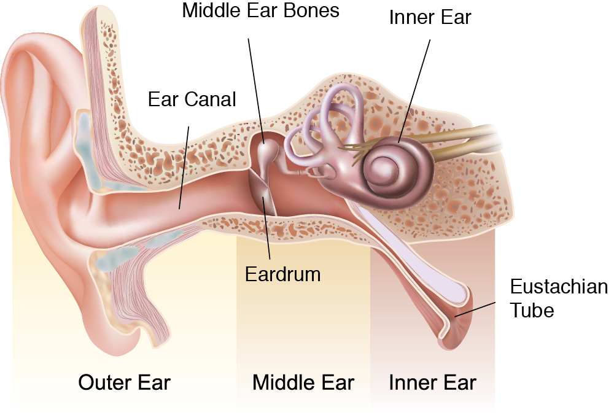
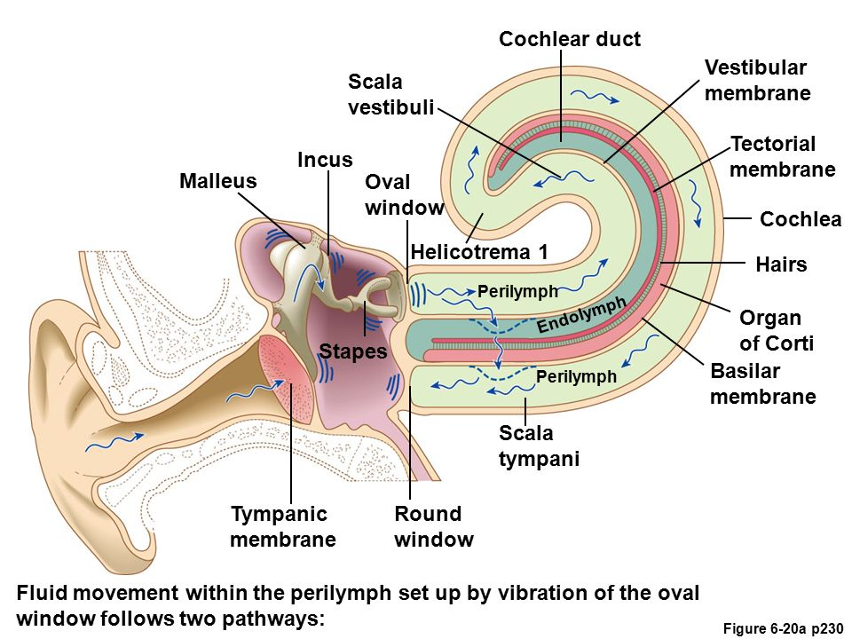
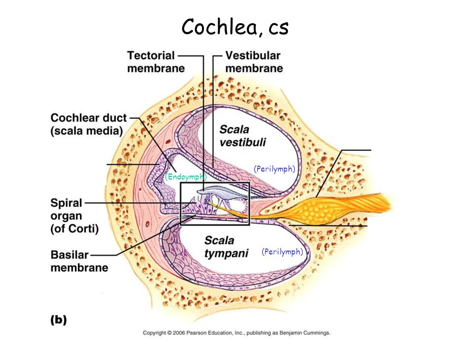

## Tonal perception

Sound is amplified and transformed into nerve signals by mechanically activated hair cells emitting glutamate neurotransmitter in a basilar membrane in the cochlea of the human inner ear. It happens in a spiral organ with 2.5 coils of tonotopically organized bone tissue resonating with different frequencies in its different locations.

<youtube-embed video="XsXIOBx6cwI" />

Hearing is a crucial aspect of human communication, as the ear transforms sound vibrations from the environment into nerve impulses that are interpreted as sounds by the brain. The cochlea, a part of the inner ear, is responsible for frequency analysis, with different sections resonating at different frequencies. The place theory of hearing suggests that each place in the cochlea corresponds to the perception of a given frequency.

The just noticeable difference in frequency is about 1 Hz for frequencies lower than 1000 Hz for most people. However, the resonance curves of the cochlea are broad and overlap, making it difficult for the ear to pick out frequencies that are close together. The place theory of hearing cannot fully explain how we perceive different frequencies, as it does not account for the ability to hear sudden changes in frequency.

The place theory of hearing is one of the two opposing theories that attempt to explain the perceptual processing of sound sensation, alongside the frequency theory explorable.com. The place theory suggests that each part of the cochlea resonates at a different frequency, with the stapes end resonating at high frequencies and the end furthest from the ossicles resonating at low frequencies. When a given frequency is presented to the cochlea, it causes motion in only one part, which sends a nerve impulse to the brain, enabling the perception of that frequency. However, the place theory has limitations, as the resonance curves are broad and overlap, making it difficult for the ear to distinguish frequencies that are close together.

The temporal theory of hearing is another overlapping theory that aims to explain the richness of auditory phenomena experienced by humans. Unlike the place theory, the temporal theory focuses on the timing of neural activity, suggesting that the brain processes temporal information to perceive sound. This theory posits that the brain uses the timing of neural activity to distinguish between different frequencies, even when the resonance curves of the cochlea overlap. Combining the place theory and the temporal theory can help explain the complexity of human auditory perception and provide a more comprehensive understanding of how we perceive sound.
