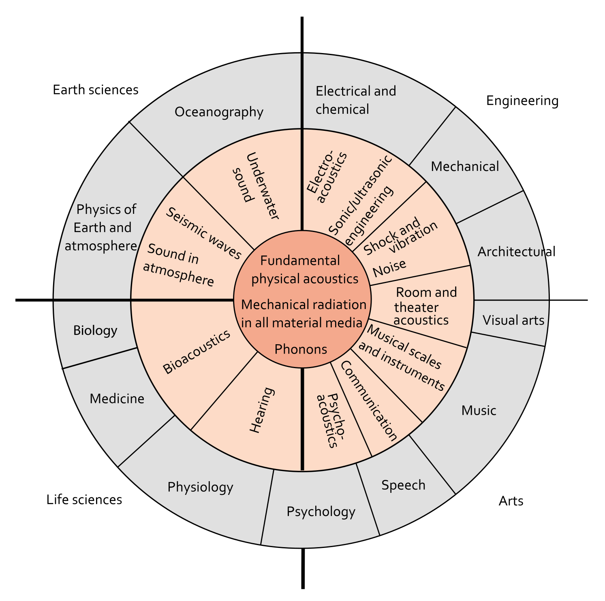
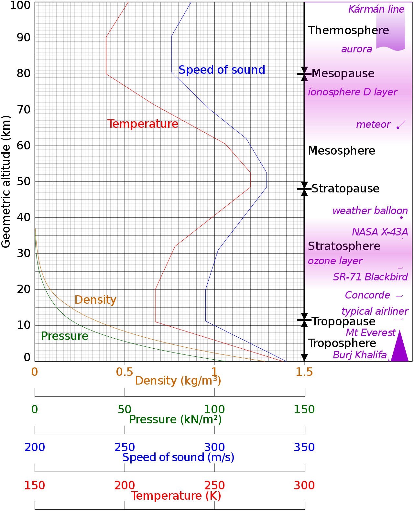
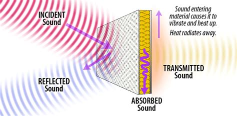
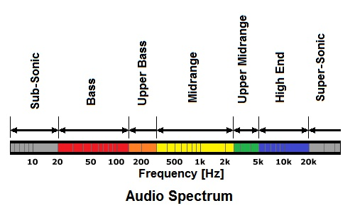

## What is sound?

Acoustic vibrations propagate as mechanical waves of pressure in a transmission medium such as gas, liquid or solid. The speed of sound in air at 20 ºC is about 343 m/s (1,235 km/h) and complexly depends on density and pressure/stiffness of the medium. Audio range falls between infrasonic (&lt;20 Hz) and ultrasonic (>20 kHz) frequencies.

<iframe width="100%" height="400" src="/demo/sound-wave.html">Wave demo</iframe>

[Wave demo](/demo/sound-wave.html){target="_self"}

https://auditoryneuroscience.com/ear/dancing_hair_cell

<iframe width="100%" height="400" src="/demo/simulation.html">Simulation demo</iframe>

[Simulation demo](/demo/simulation.html){target="_self"}

<youtube-embed video="XLfQpv2ZRPU" />

<youtube-embed video="px3oVGXr4mo" />

<youtube-embed video="b_3AngVJzp8" />

## Acoustic vibrations

<SoundVibrations class="my-16" id="sound-vibrations" />

## Lindsay's Wheel of Acoustics

<youtube-embed video="24yESm63tSY" />

