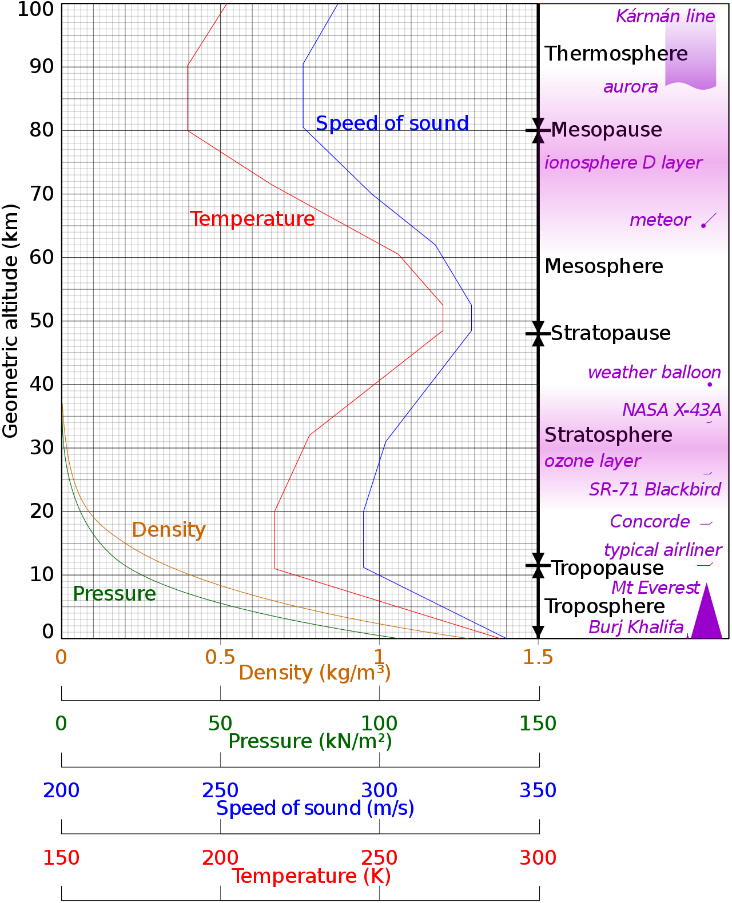

## What is sound?

Acoustic vibrations propagate as mechanical waves of pressure in a transmission medium such as gas, liquid or solid. The speed of sound in air at 20 ºC is about 343 m/s (1,235 km/h) and complexly depends on density and pressure/stiffness of the medium. Audio range falls between infrasonic (&lt;20 Hz) and ultrasonic (>20 kHz) frequencies.

<SoundVibrations class="my-16" id="sound-vibrations" />

## Lindsay's Wheel of Acoustics

