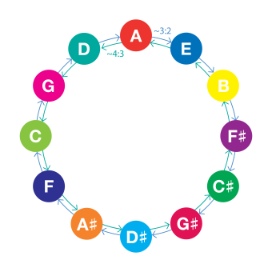

## Fifth P5

<abc-render abc="[A4e] Ae" />

<chroma-profile :chroma="'100000010000'" />

The second most harmonic interval is the fifth – a 3/2 of any given frequency. Pythagoras is claimed to be the first to use this law to construct pleasant musical notes combinations. This principle is foundational for the modern 12-TET equal temperament. Take the lowest starting frequency and go up in two ways:

- multiplying it by two – stepping an octave above,
- and also multiplying by 1.5 – stepping a fifth in a time.

After 7 octaves and 12 fifths you’ll end up on the same starting tone. And you’ll find that you’ve pressed all the other tones on the way. So any other step of fifth gives us a new note. Get the note frequencies, then divide them by two until they’re in the same octave with the starting frequency. And there you got it – 12 notes in any given octave.

This equation shows the approximate equality of the values of 12 perfect fifth intervals and 7 octaves. If we use the just interval of 3/2 we get the small difference, that represents the Pythagorean comma.

In musical tuning, the Pythagorean comma (or ditonic comma), named after the ancient mathematician and philosopher Pythagoras, is the small interval (or comma) existing in Pythagorean tuning between two enharmonically equivalent notes such as C and B♯ (Play), or D♭ and C♯. It is equal to the frequency ratio. (1.5)12⁄27 =. 531441⁄524288 ≈ 1.01364, or about 23.46 cents, roughly a quarter of a semitone (in between 75:74 and 74:73).

### 12-Tone Equal Temperament

Twelve-tone equal temperament is the musical system that divides the octave into 12 parts, all of which are equally tempered (equally spaced) on a logarithmic scale, with a ratio equal to the 12th root of 2 (12√2 ≈ 1.05946). That resulting smallest interval, 1⁄12 the width of an octave, is called a semitone or half step. 

## Perfect fourth P4

<abc-render abc="[A4d] Ad" />

<chroma-profile :chroma="'100001000000'" />

Perfect fourth is the inverse of the perfect fifth.

The perfect fourth may be derived from the harmonic series as the interval between the third and fourth harmonics. The term perfect identifies this interval as belonging to the group of perfect intervals, so called because they are neither major nor minor. 

A perfect fourth in just intonation corresponds to a pitch ratio of 4:3, or about 498 cents, while in equal temperament a perfect fourth is equal to five semitones, or 500 cents. 

The perfect fourth is a perfect interval like the unison, octave, and perfect fifth, and it is a sensory consonance. In common practice harmony, however, it is considered a stylistic dissonance in certain contexts, namely in two-voice textures and whenever it occurs "above the bass in chords with three or more notes". If the bass note also happens to be the chord's root, the interval's upper note almost always temporarily displaces the third of any chord, and, in the terminology used in popular music, is then called a suspended fourth. 

## Quartal and quintal harmony

In music, quartal harmony is the building of harmonic structures built from the intervals of the perfect fourth, the augmented fourth and the diminished fourth. For instance, a three-note quartal chord on C can be built by stacking perfect fourths, C–F–B♭.

Quintal harmony is harmonic structure preferring the perfect fifth, the augmented fifth and the diminished fifth. For instance, a three-note quintal chord on C can be built by stacking perfect fifths, C–G–D. 

Regarding chords built from perfect fourths alone, composer Vincent Persichetti writes that:

> Chords by perfect fourth are ambiguous in that, like all chords built by equidistant intervals (diminished seventh chords or augmented triads), any member can function as the root. The indifference of this rootless harmony to tonality places the burden of key verification upon the voice with the most active melodic line.