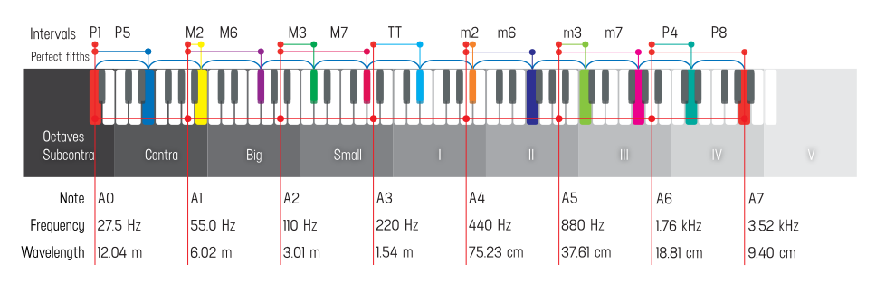
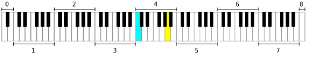

## Unison P1

<abc-render abc="[A4A4] AA" />

Unison is two or more musical parts that sound either the same pitch or pitches separated by intervals of one or more octaves, usually at the same time. 

Unison or perfect unison (also called a prime, or perfect prime) may refer to the (pseudo-)interval formed by a tone and its duplication (in German, Unisono, Einklang, or Prime), for example C–C, as differentiated from the second, C–D, etc. In the unison the two pitches have the ratio of 1:1 or 0 half steps and zero cents. Although two tones in unison are considered to be the same pitch, they are still perceivable as coming from separate sources, whether played on instruments of a different type or of the same type. This is because a pair of tones in unison come from different locations or can have different "colors" (timbres), i.e. come from different musical instruments or human voices. Voices with different colors have, as sound waves, different waveforms. These waveforms have the same fundamental frequency but differ in the amplitudes of their higher harmonics. The unison is considered the most consonant interval while the near unison is considered the most dissonant. The unison is also the easiest interval to tune. The unison is abbreviated as "P1". 

## Octave P8

<abc-render abc="[A4a] Aa" />

An octave (Latin: octavus: eighth) or perfect octave (sometimes called the diapason) is the interval between one musical pitch and another with double its frequency. The octave relationship is a natural phenomenon that has been referred to as the "basic miracle of music," the use of which is "common in most musical systems." The interval between the first and second harmonics of the harmonic series is an octave. 

Any two musical notes with fundamental frequencies in a ratio equal to 2n (n is any integer) are perceived as very similar and represent the simplest interval in music – an octave. Human pitch perception is periodic so that “color” or chroma of all the notes that are an octave apart seem circularly equivalent and brings them together into one pitch class.

To emphasize that it is one of the perfect intervals (including unison, perfect fourth, and perfect fifth), the octave is designated P8.

## Notation

Octaves are identified with various naming systems. Among the most common are the scientific, Helmholtz, organ pipe, and MIDI note systems. In scientific pitch notation, a specific octave is indicated by a numerical subscript number after note name. In this notation, middle C is C4, because of the note's position as the fourth C key on a standard 88-key piano keyboard, while the C an octave higher is C5. 

### Octave equivalence

After the unison, the octave is the simplest interval in music. The human ear tends to hear both notes as being essentially "the same", due to closely related harmonics. Notes separated by an octave "ring" together, adding a pleasing sound to music. The interval is so natural to humans that when men and women are asked to sing in unison, they typically sing in octave.

For this reason, notes an octave apart are given the same note name in the Western system of music notation—the name of a note an octave above A is also A. This is called octave equivalence, the assumption that pitches one or more octaves apart are musically equivalent in many ways, leading to the convention "that scales are uniquely defined by specifying the intervals within an octave". The conceptualization of pitch as having two dimensions, pitch height (absolute frequency) and pitch class (relative position within the octave), inherently include octave circularity. Thus all C♯s, or all 1s (if C = 0), in any octave are part of the same pitch class. 

