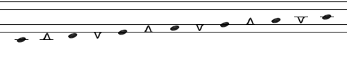

Bilinear is quite similar to [Reed’s Twinline](http://musicnotation.org/system/twinline-notation-by-thomas-reed/). Sotorrio maintains he had no prior knowledge of Twinline when designing Bilinear, since he relied primarily on Gardner Read’s Source Book of Proposed Music Notation Reforms which does not include Twinline. (It was published in 1987, just after Twinline was introduced in 1986.) Since Twinline is the earlier system (Bilinear was introduced in 1997), Sotorrio now offers Bilinear as a variant of Twinline.

The two systems share the same line pattern and the same alternating oval and triangle shaped noteheads, but there are differences in their details. Twinline’s triangles are right triangles with the 90 degree angle at their tip, while Bilinear’s triangles have a sharper angle at their tip. Also, the shape, color, and size of noteheads in Bilinear may be different depending on a note’s duration, as illustrated in the following image (courtesy of the Bilinear website):

