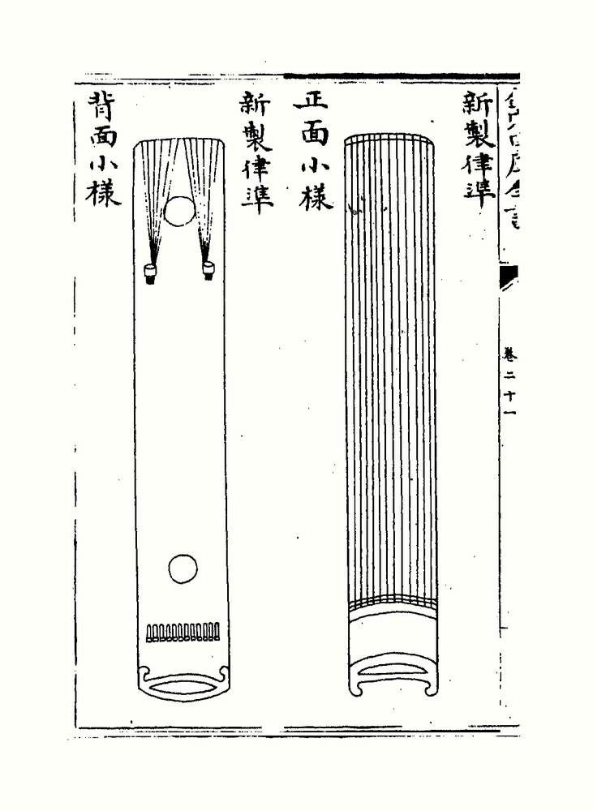
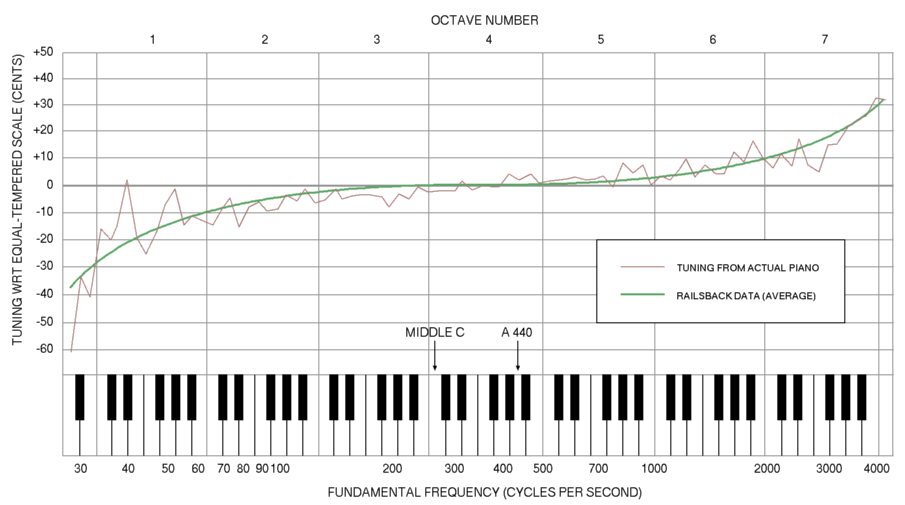

In classical music and Western music in general, the most common tuning system since the 18th century has been twelve-tone equal temperament (also known as 12 equal temperament, 12-TET or 12-ET; informally abbreviated to twelve equal), which divides the octave into 12 parts, all of which are equal on a logarithmic scale, with a ratio equal to the 12th root of 2 (12√2 ≈ 1.05946). That resulting smallest interval, 1⁄12 the width of an octave, is called a semitone or half step. In Western countries the term equal temperament, without qualification, generally means [12-TET](https://en.wikipedia.org/wiki/Equal_temperament). 

### Zhu Zaiyu

Zhu Zaiyu (朱載堉), a prince of the Ming court, spent thirty years on research based on the equal temperament idea originally postulated by his father. He described his new pitch theory in his Fusion of Music and Calendar 律暦融通 published in 1580. This was followed by the publication of a detailed account of the new theory of the equal temperament with a precise numerical specification for 12-TET in his 5,000-page work Complete Compendium of Music and Pitch (Yuelü quan shu 樂律全書) in 1584.

Zhu obtained his result mathematically by dividing the length of string and pipe successively by 12√2 ≈ 1.059463, and for pipe length by 24√2, such that after twelve divisions (an octave) the length was divided by a factor of 2:

Similarly, after 84 divisions (7 octaves) the length was divided by a factor of 128.

Zhu Zaiyu has been credited as the first person to solve the equal temperament problem mathematically.

### Mathematics of 12-TET

### Tuning to the beats

A precise equal temperament is possible using the 17th-century Sabbatini method of splitting the octave first into three tempered major thirds. This was also proposed by several writers during the Classical era. Tuning without beat rates but employing several checks, achieving virtually modern accuracy, was already done in the first decades of the 19th century. Using beat rates, first proposed in 1749, became common after their diffusion by Helmholtz and Ellis in the second half of the 19th century. The ultimate precision was available with 2-decimal tables published by White in 1917

