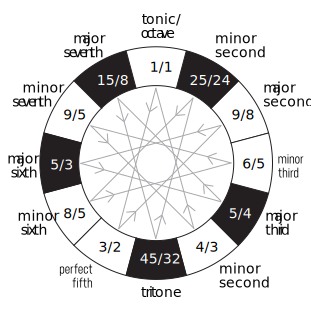

A twelve-tone scale can also be created by compounding harmonics up to the fifth: namely, by multiplying the frequency of a given reference note (the base note) by powers of 2, 3, or 5, or a combination of them. This method is called five-limit tuning. 

5-limit tuning encompasses ratios additionally using the number 5 and its powers, such as 5:4, a major third, and 15:8, a major seventh. 7-limit and higher systems use higher partials in the overtone series. 