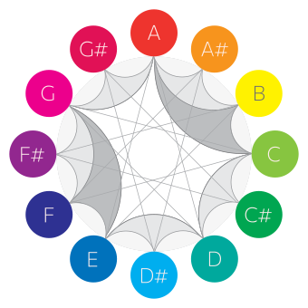

## Chromatone is a colorful music exploration project

It's an ongoing research and experiment to induce a synchronised synthetic synesthesia for personal music learning and exploration, and also for collective practice and performance. What if we once agree on a certain way to connect pitches and colors? Can empower our music perception with vision, the main modality for most of humans. And there we start to...