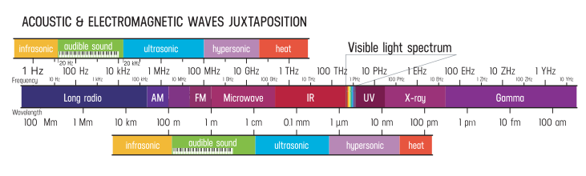

Sonic and electromagnetic waves have very different mediums as a carrier field. Sound is carried by air molecules, light travels through vacuum just because of ever present electromagnetic field.

But they're stil oscillations, so we an compare their frequencies and wavelenghts. But what to choose? Let's try both!

## Frequency

Let's start with frequencies. What is **1 Hz**? It's one oscillation per second. For EM it corresponds to radiation far in the **long radio spectrum**. We can't hear such slow air oscillations and 1 Hz is in **infrasonic** range.