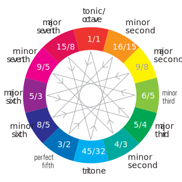
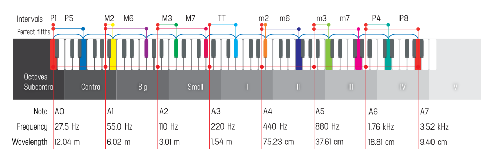

Any two musical notes with fundamental frequencies in a ratio equal to 2n (n is any integer) are perceived as very similar and represent the simplest interval in music – an octave. Human pitch perception is periodic so that “color” or chroma of all the notes that are an octave apart seem circularly equivalent and brings them together into one pitch class.

## Fifths

The second most harmonic interval is the fifth – a 3/2 of any given frequency. Pythagoras is claimed to be the first to use this law to construct pleasant musical notes combinations. This principle is foundational for the modern 12-TET equal temperament. Take the lowest starting frequency and go up in two ways:

- multiplying it by two – stepping an octave above,
- and also multiplying by 1.5 – stepping a fifth in a time.

After 7 octave and 12 fifths you’ll end up on the same starting tone. And you’ll find that you’ve pressed all the other tones on the way. So any other step of fifth gives us a new note. Get the note frequencies, then divide them by two until they’re in the same octave with the starting frequency. And there you got it – 12 notes in any given octave.

## 12-Tone Equal Temperament

(3/2)^12 ≈ 129.74634 ~ 128 = 2^7

