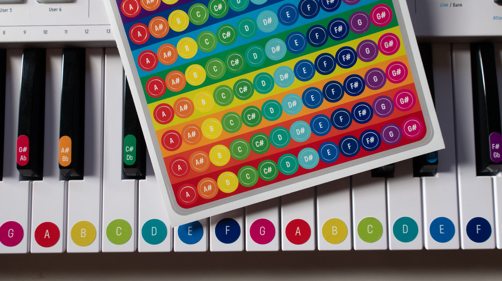
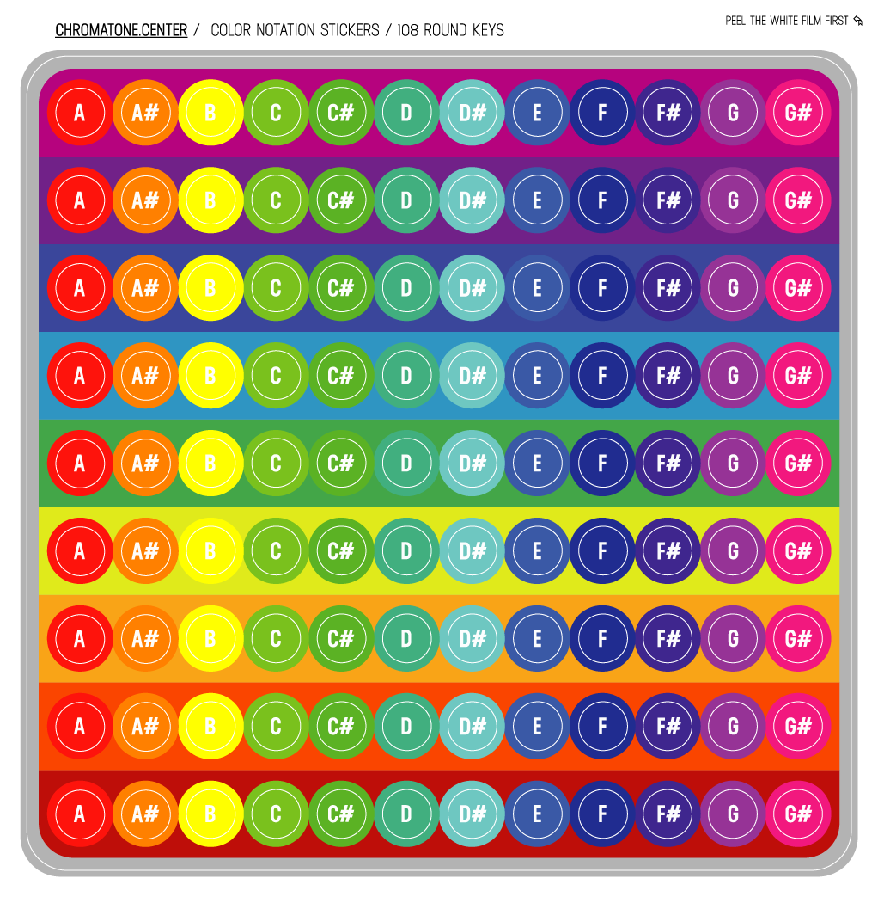

It covers 9 octaves and can be used to upgrade for chromatone the whole ensemble.

Every sticker is 1 cm in diameter and is made of durable vinyl film. Place them on any instrument you practice so memorizing the notes will be a lot easier and faster. Especially if you are a visual person.

