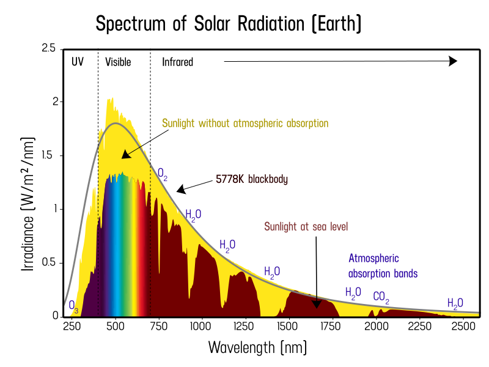
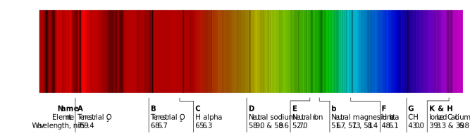

The Sun is the center of our Solar system.

The Sun is a G-type main-sequence star that comprises about 99.86% of the mass of the Solar System. The Sun has an absolute magnitude of +4.83, estimated to be brighter than about 85% of the stars in the Milky Way, most of which are red dwarfs.

The Sun is by far the brightest object in the Earth's sky, with an apparent magnitude of −26.74. This is about 13 billion times brighter than the next brightest star, Sirius, which has an apparent magnitude of −1.46.

Thermonuclear reactions in its core produce high energy gamma-rays that are absorbed and converted into lower energy radiation by ionized atoms in its photosphere and chromosphere layers.

## Earth atmosphere EM radiation absorption

