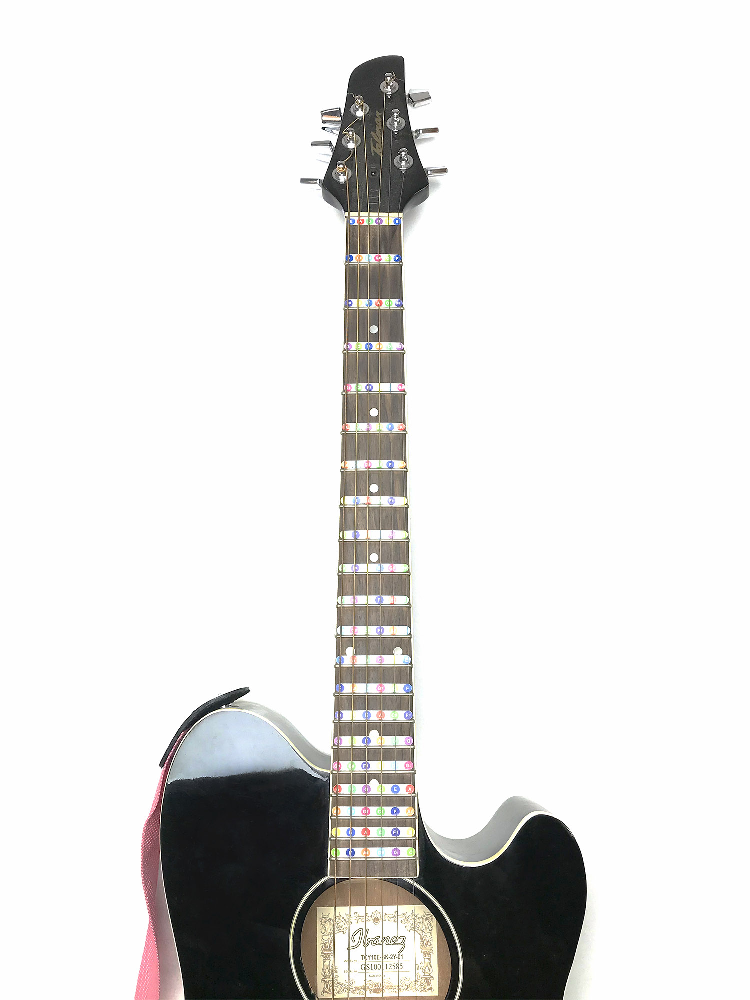
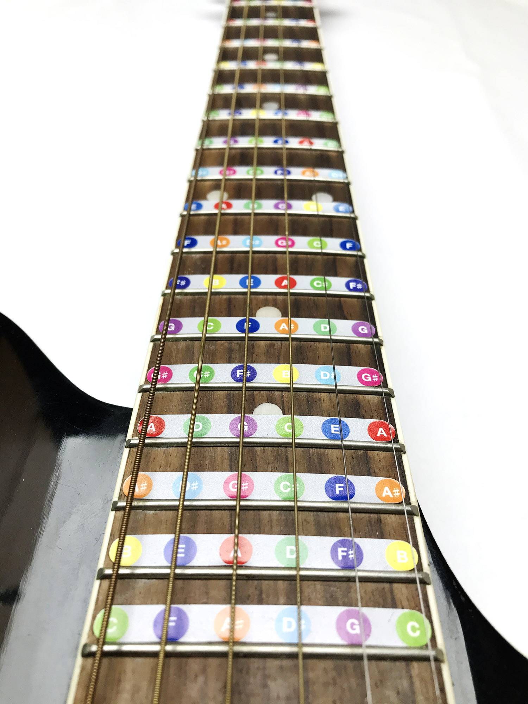

You can place them above or beyond the frets of your guitar. Plus a bigger circle note stickers kit for the side of the fret-board.

You can place the stickers event without removing the strings. Just slide them along the frets before pushing down on them. They’re safe there and won’t mess with your fingers and the strings. They just help you find and memorize the exact notes of the regular guitar tuning. And make your musical practice a little bit more colorful.

