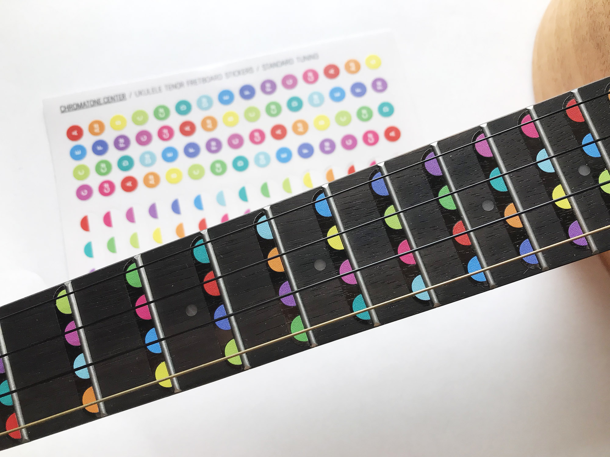
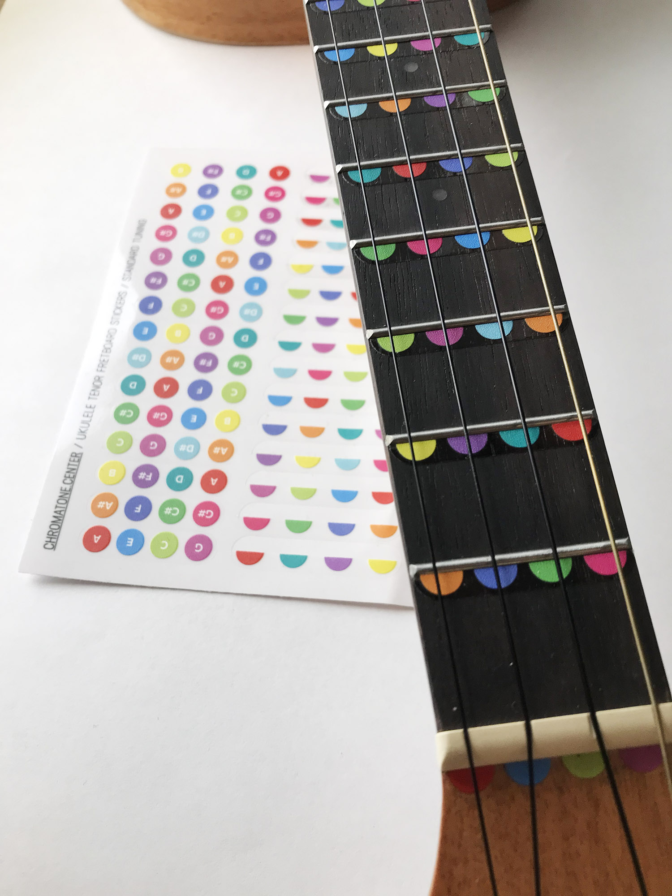
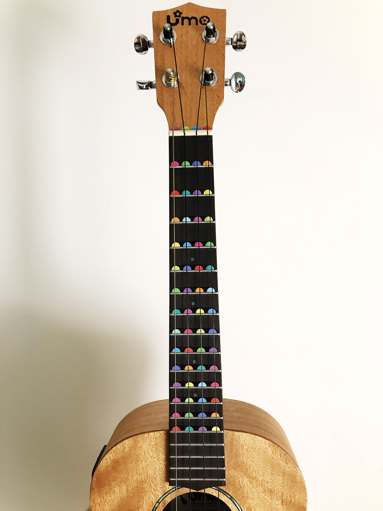
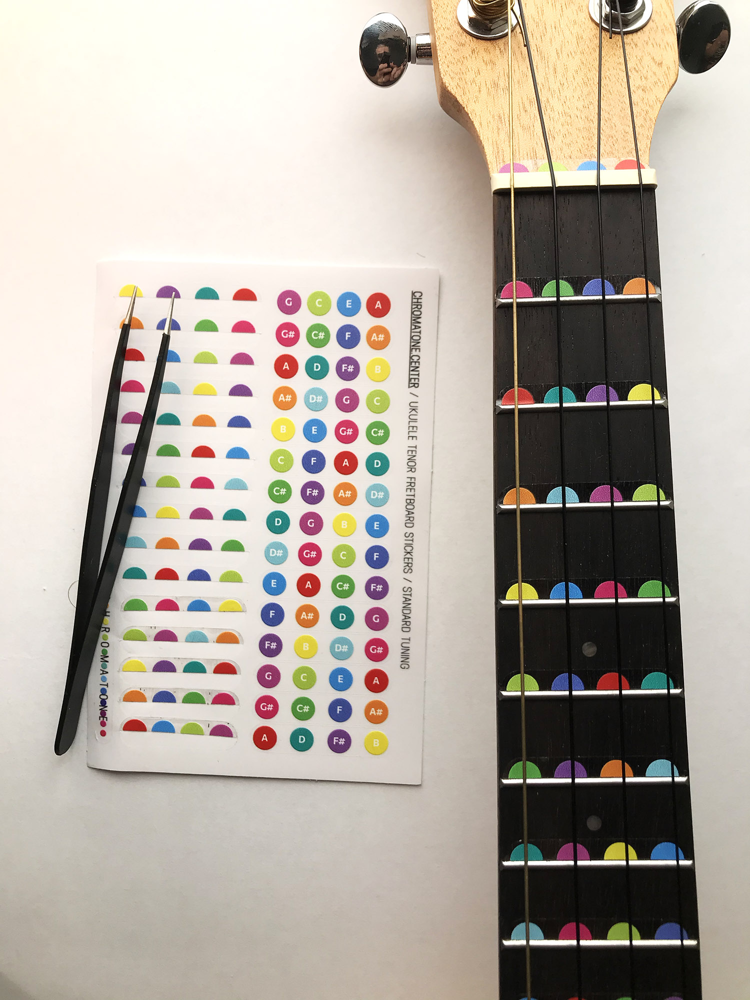

A brand new set of stickers for a ukulele fingerboard. It's designed for a tenor instrument, but will fit a ukulele of any size. It's a high quality UV-print on a transparent vinyl film. Very bright and durable colors blended into the wood of your fretboard. There are two types of stickers in the kit: full circles with white note letters on them and also a set of colorful circles cut in half. So you can decide on how to upgrade your instrument depending on you skill and preference. Or just use them on multiple instruments!

