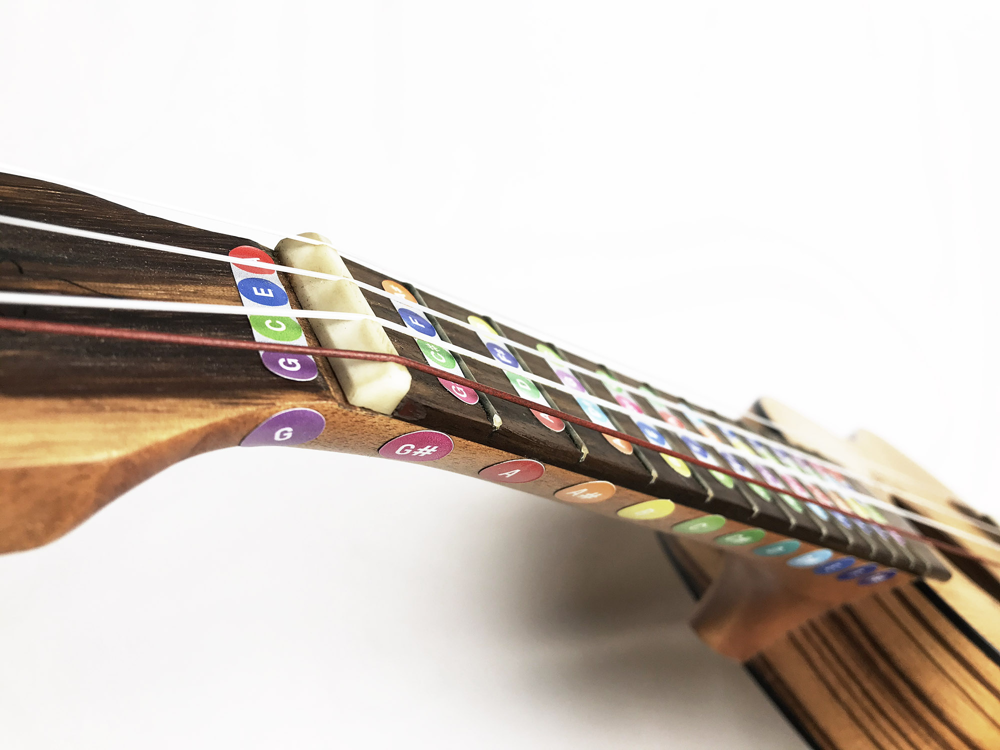

A very handy tool to feel the colors of note strings and vice versa. Ukulele is very portable, easy to learn and pleasant to hear. Just drop in some colors to make learning and practicing music a lot more fun. It’s like you really start seeing the notes you play.

