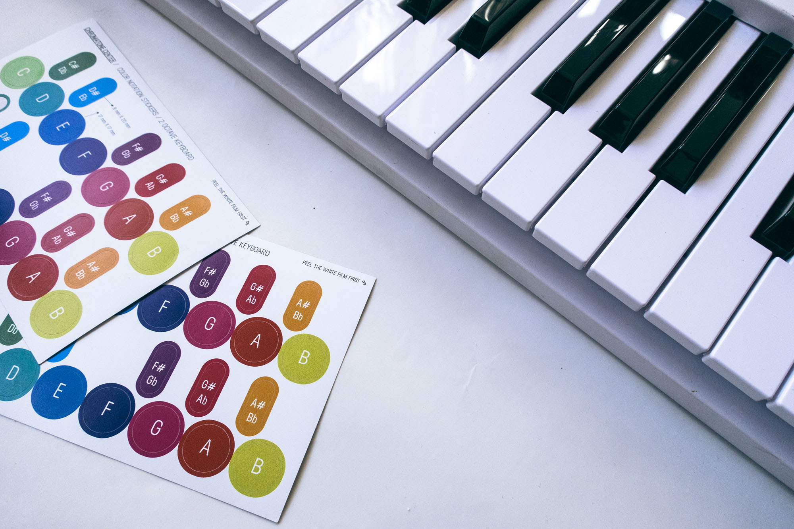
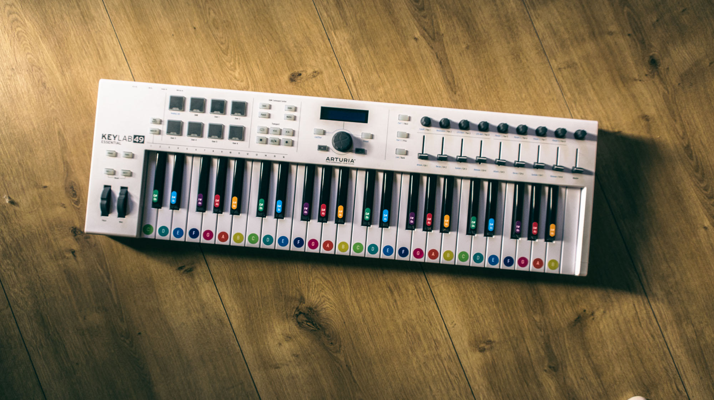

An intense immersion to the concept of colorful notes – 2 octaves of rather big and bright stickers for every key of classic piano size keys. It may be very useful in the beginning of your chromatone journey or for introducing the system to kids. Also you can just put a pair of your favorite notes on your keyboard as a guide for your learning and play.

More experienced players mostly don’t need text labels on the keys, but the small color stickers only.

