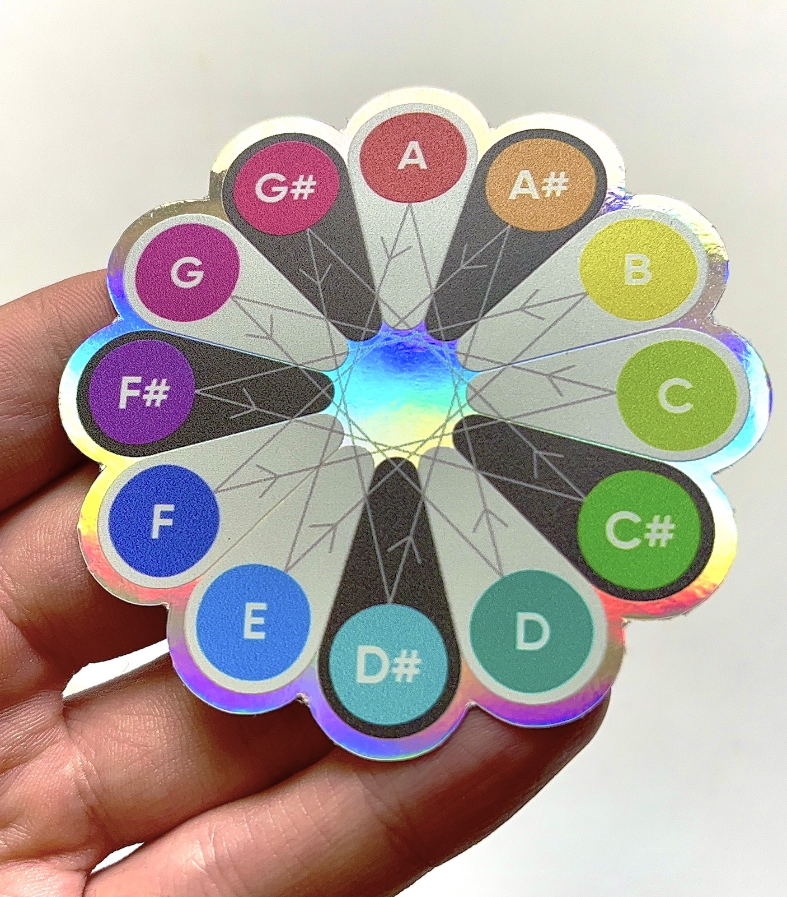
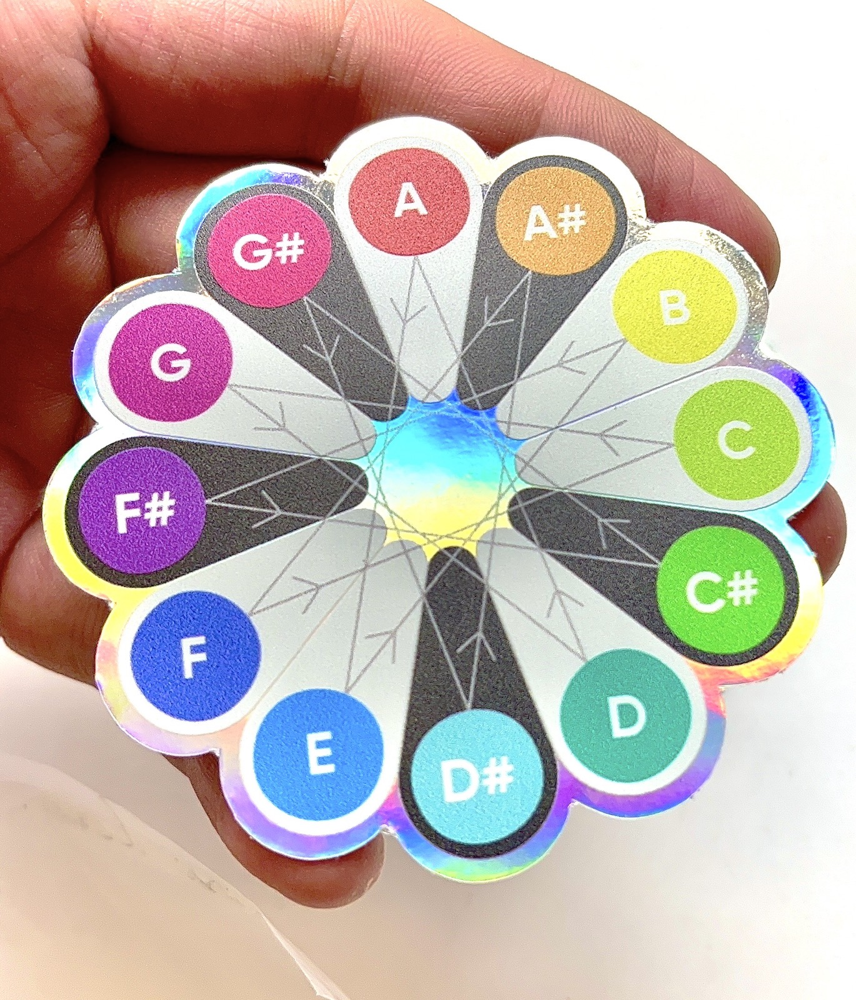
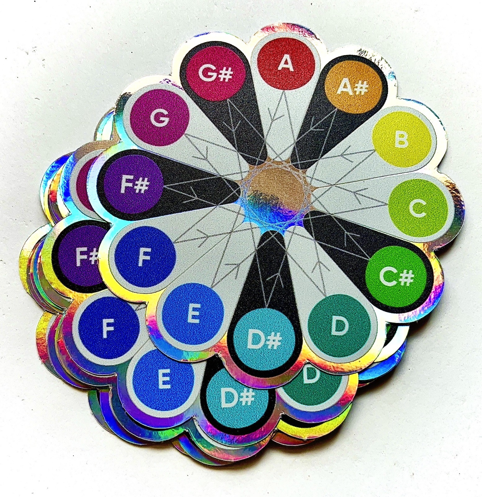

A rather small sticker to be put on your instrument case or any other flat surface. It’s highly durable print and vinyl holographic film make it the best portable format for visual music learning.

You can easily find fifths and fourths with the arrows. And you can memorize any chords and scales with your eyes and muscle memory, putting fingers on the exact notes. The stickers diameter of 7 cm is perfect for both visual and tactile contact with the colorful notes. 🌈👆👀

Even on the go. 🛹

