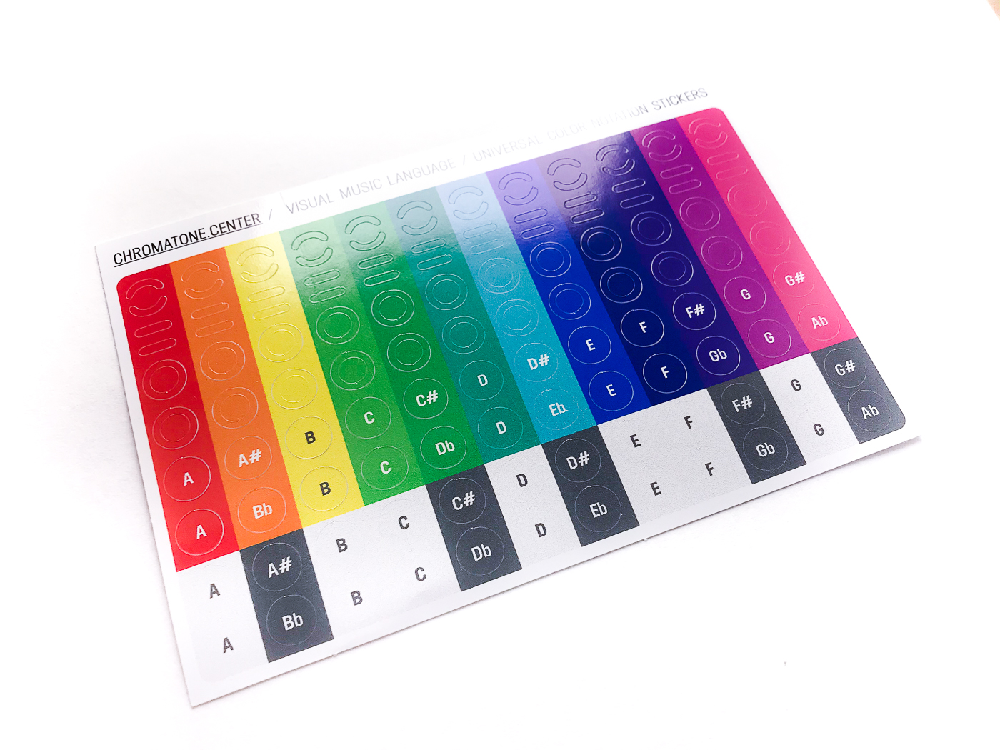
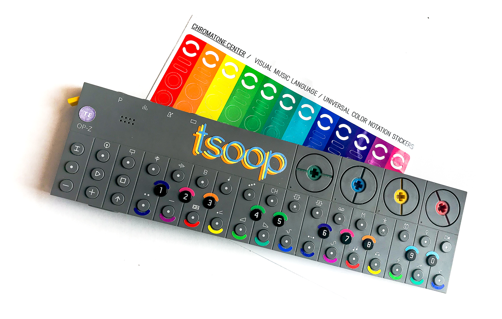
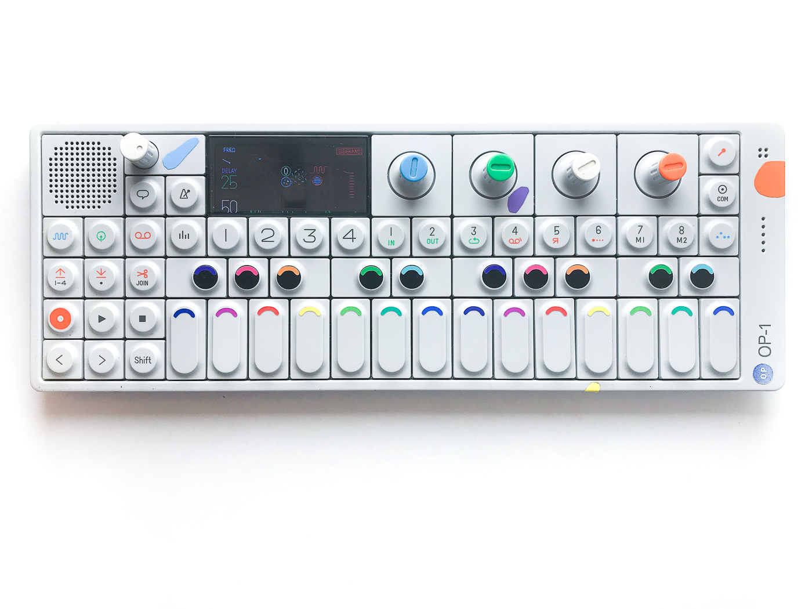
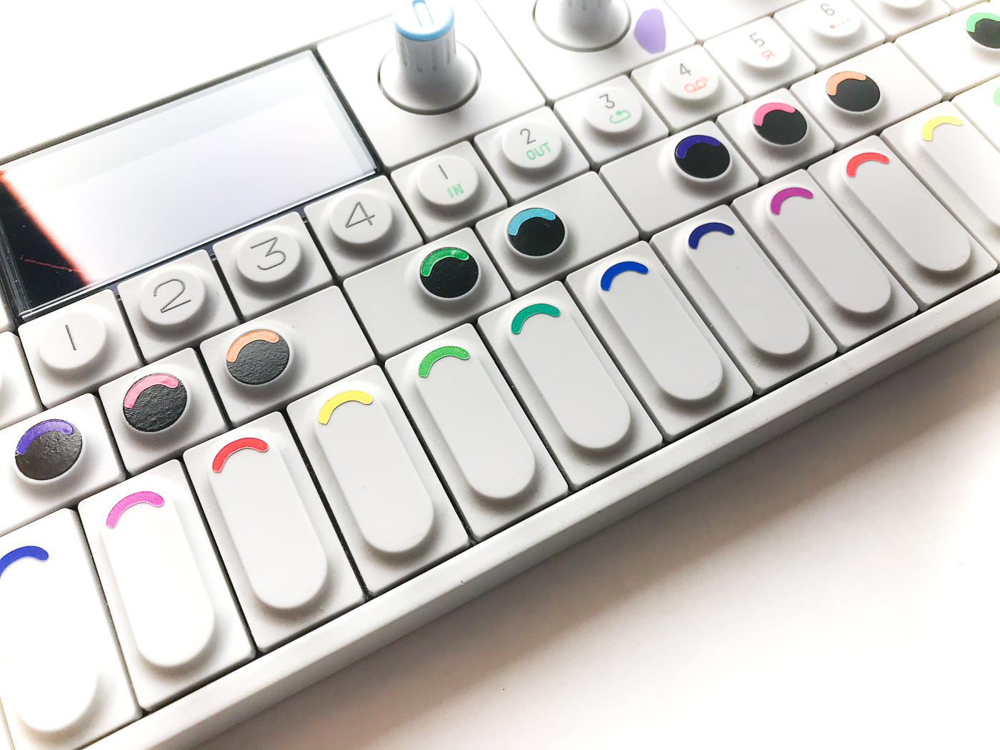

The most concentrated form of colorful instrument stickers. A small A6 sheet includes 144 various precut stickers for you to get creative with. There are two octabes of named note circles and much more pure colors. They come in the form of a circle, a ring, a semiring and a straight line.

These stickers are small enough to fit almost any instrument there. Synths of different forms and sizes, piano keyboards, guitars of all kinds, kalimbas, hung drums and tank drums, even harps and more.

One sheet is enough to cover up to 12 octaves, but imagine if you place not all the stickers, but just some of them. They may become very useful reference points even for advanced players, learning and performing on the edge of personal experience.

