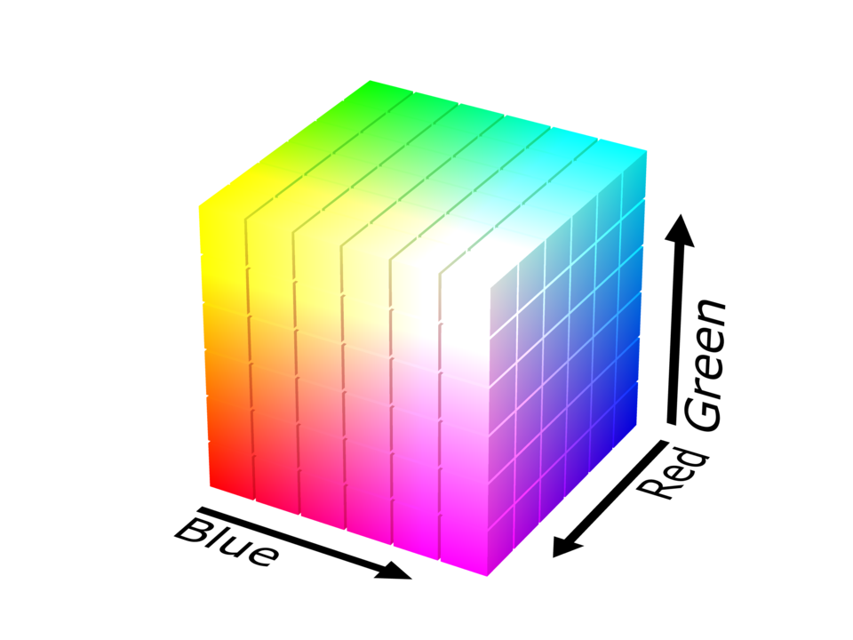

A color model is additive in the sense that the three light beams are added together, and their light spectra add, wavelength for wavelength, to make the final color's spectrum. Because of properties, these three colors create white, this is in stark contrast to physical colors, such as dyes which create black when mixed. 

## Interactive RGB color mixer

Drag any of the color components up or right to increase it's value.

<color-mix-rgb />

Zero intensity for each component gives the darkest color (no light, considered the black), and full intensity of each gives a white; the quality of this white depends on the nature of the primary light sources, but if they are properly balanced, the result is a neutral white matching the system's white point. When the intensities for all the components are the same, the result is a shade of gray, darker or lighter depending on the intensity. When the intensities are different, the result is a colorized hue, more or less saturated depending on the difference of the strongest and weakest of the intensities of the primary colors employed. 

### RGB

To form a color with RGB, three light beams (one red, one green, and one blue) must be superimposed (for example by emission from a black screen or by reflection from a white screen). Each of the three beams is called a component of that color, and each of them can have an arbitrary intensity, from fully off to fully on, in the mixture.

The RGB color model itself does not define what is meant by red, green, and blue colorimetrically, and so the results of mixing them are not specified as absolute, but relative to the primary colors. When the exact chromaticities of the red, green, and blue primaries are defined, the color model then becomes an absolute color space, such as sRGB or Adobe RGB.

Use of the three primary colors is not sufficient to reproduce all colors; only colors within the color triangle defined by the chromaticities of the primaries can be reproduced by additive mixing of non-negative amounts of those colors of light.
