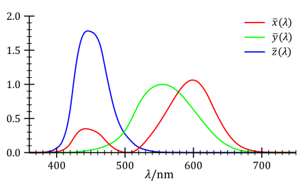
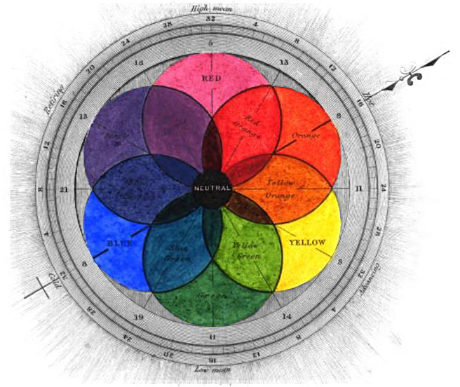
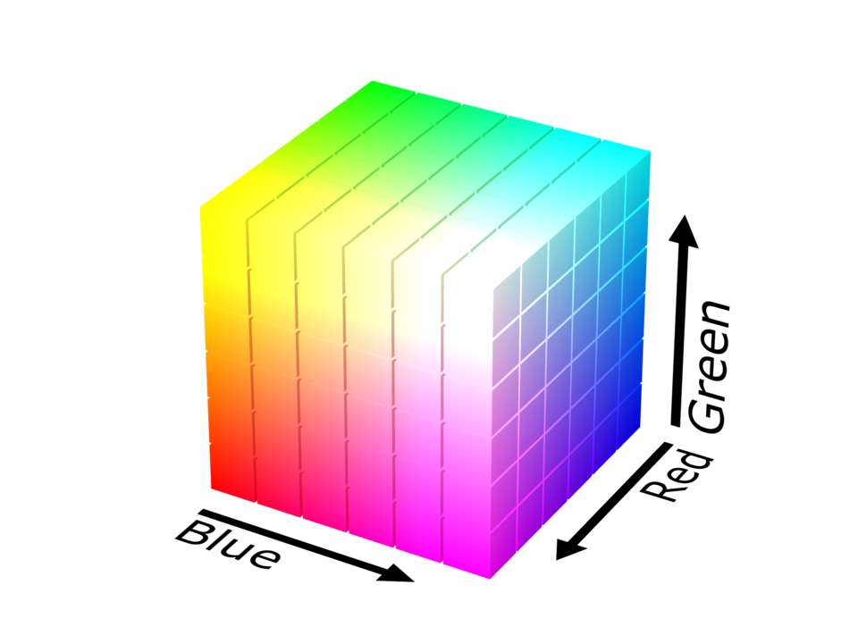
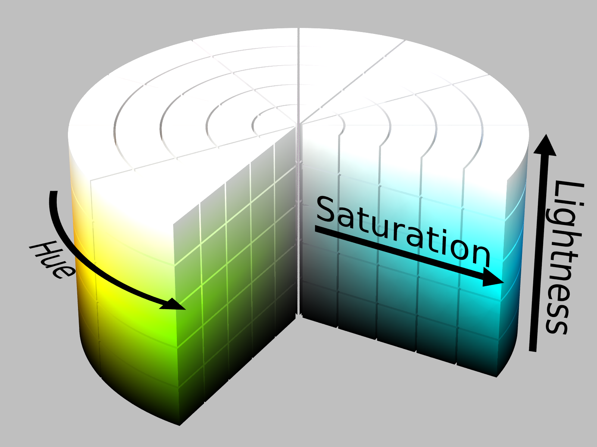

## Human color perception

The perception of color derives from the stimulation of cone cells in the human eye by visible light. Light, containing all spectral colors is perceived white. Color of an object depends on the range of wavelengths of light that are absorbed or reflected by its surface. The sense of a particular color is produced in nervous system by combining signal from three types of cones, sensitive to red, green and blue ranges of the spectrum.

## Subtractive color models

Subtractive means that color is produced by absorbing some parts of white light spectrum by the material. Subtractive models are used in painting and printing, where different pigment mixtures make up different colors.

A color model is subtractive in the sense that mixtures of dyes subtract specific wavelengths from the spectral power distribution of the illuminating light which is scattered back into the viewer's eye and is perceived as colored. Mixing of dyes is used to reproduce a gamut of colors, the resultant color from this layer is predicted by multiplying (not subtracting) the absorbance profiles of the dyes.

### RYB

>An RYB color chart from George Field's 1841 Chromatography; or, A treatise on colours and pigments: and of their powers in painting.

**RYB** (an abbreviation of red–yellow–blue) is a subtractive color model used in art and applied design in which red, yellow, and blue pigments are considered primary colors.

In this context, the term primary color refers to three exemplar colors (red, yellow, and blue) as opposed to specific pigments. As illustrated, in the RYB color model, red, yellow, and blue are intermixed to create secondary color segments of orange, green, and purple. This set of primary colors emerged at a time when access to a large range of pigments was limited by availability and cost, and it encouraged artists and designers to explore the many nuances of color through mixing and intermixing a limited range of pigment colors. In art and design education, red, yellow, and blue pigments were usually augmented with white and black pigments, enabling the creation of a larger gamut of color nuances including tints and shades. 

> **Jacob Christoph Le Blon** was the first to apply the RYB color model to printing, specifically mezzotint printing, and he used separate plates for each color: yellow, red and blue plus black to add shades and contrast. In 'Coloritto', Le Blon asserted that “the art of mixing colours…(in) painting can represent all visible objects with three colours: yellow, red and blue; for all colours can be composed of these three, which I call Primitive”. Le Blon added that red and yellow make orange; red and blue, make purple; and blue and yellow make green (Le Blon, 1725, p6).

### CMY and CMYK

The **CMY** color model is a subtractive color model in which cyan, magenta and yellow pigments or dyes are added together in various ways to reproduce a broad array of colors. 

When the intensities for all the components are the same, the result is a shade of gray, lighter, or darker depending on the intensity. When the intensities are different, the result is a colorized hue, more or less saturated depending on the difference of the strongest and weakest of the intensities of the primary colors employed. 

<color-mix-cmyk />

**CMYK** color model is a subtractive color model, based on the CMY color model, used in color printing, and is also used to describe the printing process itself, that is used in the layering technique by printers to create different colors on a white paper. CMYK refers to the four inks used in some color printing: cyan, magenta, yellow, and key. It uses K, black ink, since C, M, and Y inks are translucent and will only produce a gray color when laid on top of each other. 

With CMYK printing, halftoning (also called screening) allows for less than full saturation of the primary colors; tiny dots of each primary color are printed in a pattern small enough that humans perceive a solid color.

Light, saturated colors often cannot be created with CMYK, and light colors in general may make visible the halftone pattern. Using a CcMmYK process, with the addition of light cyan and magenta inks to CMYK, can solve these problems.

## Additive color models

A color model is additive in the sense that the three light beams are added together, and their light spectra add, wavelength for wavelength, to make the final color's spectrum. Because of properties, these three colors create white, this is in stark contrast to physical colors, such as dyes which create black when mixed. 

<color-mix-rgb />

Zero intensity for each component gives the darkest color (no light, considered the black), and full intensity of each gives a white; the quality of this white depends on the nature of the primary light sources, but if they are properly balanced, the result is a neutral white matching the system's white point. When the intensities for all the components are the same, the result is a shade of gray, darker or lighter depending on the intensity. When the intensities are different, the result is a colorized hue, more or less saturated depending on the difference of the strongest and weakest of the intensities of the primary colors employed. 

### RGB

To form a color with RGB, three light beams (one red, one green, and one blue) must be superimposed (for example by emission from a black screen or by reflection from a white screen). Each of the three beams is called a component of that color, and each of them can have an arbitrary intensity, from fully off to fully on, in the mixture.

The RGB color model itself does not define what is meant by red, green, and blue colorimetrically, and so the results of mixing them are not specified as absolute, but relative to the primary colors. When the exact chromaticities of the red, green, and blue primaries are defined, the color model then becomes an absolute color space, such as sRGB or Adobe RGB.

Use of the three primary colors is not sufficient to reproduce all colors; only colors within the color triangle defined by the chromaticities of the primaries can be reproduced by additive mixing of non-negative amounts of those colors of light.

### HSL and HSV

HSL (for hue, saturation, lightness) and HSV (for hue, saturation, value; also known as HSB, for hue, saturation, brightness) are alternative representations of the RGB color model, designed in the 1970s by computer graphics researchers to more closely align with the way human vision perceives color-making attributes. In these models, colors of each hue are arranged in a radial slice, around a central axis of neutral colors which ranges from black at the bottom to white at the top. 

The HSL representation models the way different paints mix together to create colour in the real world, with the lightness dimension resembling the varying amounts of black or white paint in the mixture (e.g. to create "light red", a red pigment can be mixed with white paint; this white paint corresponds to a high "lightness" value in the HSL representation). Fully saturated colors are placed around a circle at a lightness value of ½, with a lightness value of 0 or 1 corresponding to fully black or white, respectively.

Meanwhile, the HSV representation models how colors appear under light. The difference between HSL and HSV is that a color with maximum lightness in HSL is pure white, but a color with maximum value/brightness in HSV is analogous to shining a white light on a colored object (e.g. shining a bright white light on a red object causes the object to still appear red, just brighter and more intense, while shining a dim light on a red object causes the object to appear darker and less bright).

The issue with both HSV and HSL is that these approaches do not effectively separate colour into their three value components according to human perception of color. This can be seen when the saturation settings are altered — it is quite easy to notice the difference in perceptual lightness despite the "V" or "L" setting being fixed. 

### CIELUV and CIELAB

CIELUV, is a color space adopted by the International Commission on Illumination (CIE) in 1976, as a simple-to-compute transformation of the 1931 CIE XYZ color space, but which attempted perceptual uniformity.

The CIELAB color space also referred to as L*a*b* is a color space defined by the International Commission on Illumination (abbreviated CIE) in 1976. It expresses color as three values: L* for perceptual lightness, and a* and b* for the four unique colors of human vision: red, green, blue, and yellow. CIELAB was intended as a perceptually uniform space, where a given numerical change corresponds to similar perceived change in color. While the LAB space is not truly perceptually uniform, it nevertheless is useful in industry for detecting small differences in color.

Like the CIEXYZ space it derives from, CIELAB colorspace is a device-independent, "standard observer" model. The colors it defines are not relative to any particular device such as a computer monitor or a printer, but instead relate to the CIE standard observer which is an averaging of the results of color matching experiments under laboratory conditions. 

<color-table />

The CIELAB space is three-dimensional, and covers the entire range of human color perception, or gamut. It is based on the opponent color model of human vision, where red/green forms an opponent pair, and blue/yellow forms an opponent pair. The lightness value, L*, also referred to as "Lstar," defines black at 0 and white at 100. The a* axis is relative to the green–red opponent colors, with negative values toward green and positive values toward red. The b* axis represents the blue–yellow opponents, with negative numbers toward blue and positive toward yellow. 

While the intention behind CIELAB was to create a space that was more perceptually uniform than CIEXYZ using only a simple formula,[3] CIELAB is known to lack perceptually uniformity, particularly in the area of blue hues.

The lightness value, L* in CIELAB is calculated using the cube root of the relative luminance with an offset near black. This results in an effective power curve with an exponent of approximately 0.43 which represents the human eye's response to light under daylight (photopic) conditions. 

<color-names :list="$frontmatter.colors" :langs="$frontmatter.langs" />

