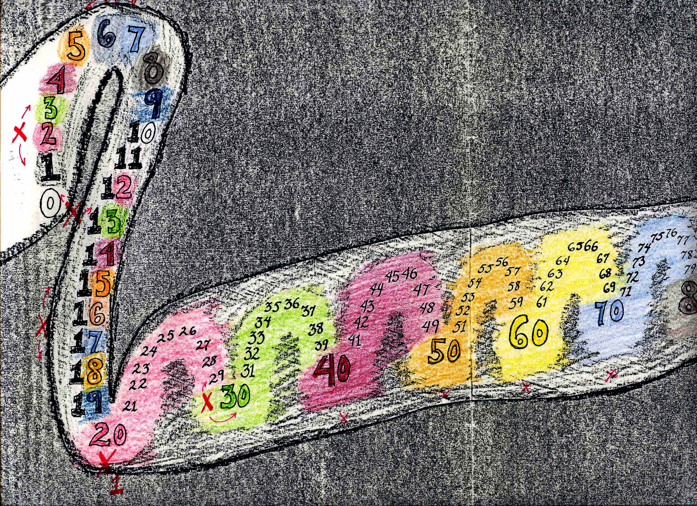
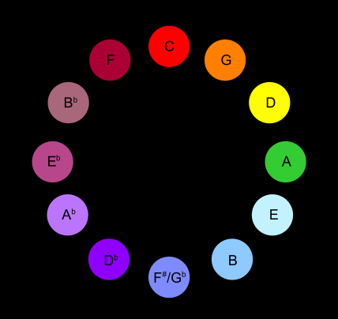

The term Synesthesia comes from the Ancient Greek σύν syn, 'together', and αἴσθησις aisthēsis, 'sensation'.

Synesthesia (American English) or synaesthesia (British English) is a perceptual phenomenon in which stimulation of one sensory or cognitive pathway leads to involuntary experiences in a second sensory or cognitive pathway.People who report a lifelong history of such experiences are known as synesthetes. Awareness of synesthetic perceptions varies from person to person. In one common form of synesthesia, known as grapheme–color synesthesia or color–graphemic synesthesia, letters or numbers are perceived as inherently colored. In spatial-sequence, or number form synesthesia, numbers, months of the year, or days of the week elicit precise locations in space (for example, 1980 may be "farther away" than 1990), or may appear as a three-dimensional map (clockwise or counterclockwise). Synesthetic associations can occur in any combination and any number of senses or cognitive pathways.

Little is known about how synesthesia develops. It has been suggested that synesthesia develops during childhood when children are intensively engaged with abstract concepts for the first time. This hypothesis – referred to as semantic vacuum hypothesis – explains why the most common forms of synesthesia are grapheme–color, spatial sequence, and number form. These are usually the first abstract concepts that educational systems require children to learn.

## Types

There are two overall forms of synesthesia:

- projective synesthesia: people who see colors, forms, or shapes when stimulated (the widely understood version of synesthesia).
- associative synesthesia: people who feel a very strong and involuntary connection between the stimulus and the sense that it triggers.

For example, in chromesthesia (sound to color), a projector may hear a trumpet, and see an orange triangle in space, while an associator might hear a trumpet, and think very strongly that it sounds "orange".

Synesthesia can occur between nearly any two senses or perceptual modes, and at least one synesthete, Solomon Shereshevsky, experienced synesthesia that linked all five senses.

While nearly every logically possible combination of experiences can occur, several types are more common than others.

## Grapheme–color synesthesia

A picture from the 2009 non-fiction book Wednesday Is Indigo Blue. Note the numbers 1-12 form an upside-down clock face.

In one of the most common forms of synesthesia, individual letters of the alphabet and numbers (collectively referred to as graphemes) are "shaded" or "tinged" with a color. While different individuals usually do not report the same colors for all letters and numbers, studies with large numbers of synesthetes find some commonalities across letters (e.g., A is likely to be red).

## Chromesthesia

Another common form of synesthesia is the association of sounds with colors. For some, everyday sounds such as doors opening, cars honking, or people talking can trigger seeing colors. For others, colors are triggered when musical notes or keys are being played. People with synesthesia related to music may also have perfect pitch because their ability to see/hear colors aids them in identifying notes or keys.

The colors triggered by certain sounds, and any other synesthetic visual experiences, are referred to as photisms.

Individuals rarely agree on what color a given sound is. B flat might be orange for one person and blue for another. Composers Franz Liszt and Nikolai Rimsky-Korsakov famously disagreed on the colors of musical keys.

## Composers with synesthesia

**Franz Liszt** is a composer who was known for asking performers to play with color. He was noted telling his orchestra to play the music in a "Bluer Fashion," since that is what the tone required. Synesthesia was not a common term in Liszt's time; people thought he was playing a trick on them when he referred to a color instead of a musical term.

**Leonard Bernstein** openly discussed his chromesthesia, which he described as a "timbre to color." Although he does not reference specific songs as being a certain color, he does explain the way it should sound to the artist performing. There are recordings of him stopping orchestras and singers when they are changing the "timbre." If someone changes the “timbre” or tone in a piece, it does not necessarily change the sound to the listener, but the composer with Chromesthesia will automatically know.

**Amy Beach** was another composer who had synesthesia. According to her perspective, each key signature was associated with a particular color. If an artist changed the key to suit their voice, then she would become upset because it would change the intended sound, portrayal, and emotion of the piece.

**Olivier Messiaen** was influenced by the color of musical keys for his compositions.

**Alexander Scriabin** was a Russian composer and pianist. He is famously regarded as a synesthete, but there is a lot of controversy surrounding whether he had chromesthesia or not. Scriabin was a major proponent of Theosophy, which had a system associating colors to feelings and emotions. This influenced the musician, who distinguished "spiritual" tonalities (like F-sharp major) from "earthly, material" ones (C major, F major). Furthermore, Alexander Scriabin developed a "keyboard with lights" or clavier à lumières, which directly matched musical notes with colors.

Scriabin's sound-to-color associations arranged into a circle of fifths, demonstrating its spectral quality.

<youtube-embed video="V3B7uQ5K0IU" />

Scriabin was friends with composer **Nikolai Rimsky-Korsakov**, who was a synesthete, and their sound-to-color associations were not the same. Specifically, Rimsky-Korsakov made a distinction between major and minor scales and his associations had a "more neutral, spontaneous character".

## Other types

### Spatial sequence synesthesia

Those with spatial sequence synesthesia (SSS) tend to see ordinal sequences as points in space. For example some people see months as a spiral or a column (this also happens with letters, numbers and any other sequence). People with SSS may have superior memories; in one study, they were able to recall past events and memories far better and in far greater detail than those without the condition. They can also see months or dates in the space around them, but most synesthetes "see" these sequences in their mind's eye. Some people see time like a clock above and around them.

### Number form

A number form is a mental map of numbers that automatically and involuntarily appear whenever someone who experiences number-forms synesthesia thinks of numbers. These numbers might appear in different locations and the mapping changes and varies between individuals. Number forms were first documented and named in 1881 by Francis Galton in "The Visions of Sane Persons". It is suggested that this might be caused by "cross-activation" of the neural pathway that connects the parietal lobes and angular gyrus. Both of these areas are involved in numerical cognition and spatial cognition respectively.

### Auditory–tactile synesthesia

In auditory–tactile synesthesia, certain sounds can induce sensations in parts of the body. For example, someone with auditory–tactile synesthesia may experience that hearing a specific word or sound feels like touch in one specific part of the body or may experience that certain sounds can create a sensation in the skin without being touched (not to be confused with the milder general reaction known as frisson, which affects approximately 50% of the population). It is one of the least common forms of synesthesia.

### List of people with synesthesia

https://en.wikipedia.org/wiki/List_of_people_with_synesthesia

## Frisson

Frisson (UK: /ˈfriːsɒn/ FREE-son, US: /friːˈsoʊn/ free-SOHN French: [fʁisɔ̃]; French for "shiver"), also known as aesthetic chills or musical chills is a psychophysiological response to rewarding auditory and/or visual stimuli that often induces a pleasurable or otherwise positively-valenced affective state and transient paresthesia (skin tingling or chills), sometimes along with piloerection (goose bumps) and mydriasis (pupil dilation).

### Frisson is caused by violations of musical expectancy

Rhythmic, dynamic, harmonic, and/or melodic violations of a person’s explicit or implicit expectations are associated with musical frisson as a prerequisite. Loud, very high or low frequency, or quickly varying sounds (unexpected harmonies, moments of modulations, melodic appoggiaturas) has been shown to arouse the autonomic nervous system (ANS). Activation of the ANS has a consistent strong correlation with frisson, as one study showed that an opioid antagonist could block frisson from music. Leonard Meyer, a prominent philosopher of music, wrote in his text, “Emotion and Meaning in Music” that music’s ability to evoke emotion in the listener stems from its ability to meet and break expectations.

## Ideasthesia

Ideasthesia (alternative spelling ideaesthesia) is a neuroscientific phenomenon in which activations of concepts (inducers) evoke perception-like sensory experiences (concurrents). The name comes from the Ancient Greek ἰδέα (idéa) and αἴσθησις (aísthēsis), meaning "sensing concepts" or "sensing ideas". The notion was introduced by neuroscientist Danko Nikolić as an alternative explanation for a set of phenomena traditionally covered by synesthesia.

While "synesthesia" meaning "union of senses" implies the association of two sensory elements with little connection to the cognitive level, empirical evidence indicated that most phenomena linked to synesthesia are in fact induced by semantic representations. That is, the linguistic meaning of the stimulus is what is important rather than its sensory properties. In other words, while synesthesia presumes that both the trigger (inducer) and the resulting experience (concurrent) are of sensory nature, ideasthesia presumes that only the resulting experience is of sensory nature while the trigger is semantic.

Over the past decade, it has been suggested that the Bouba/Kiki phenomenon is a case of ideasthesia. Most people will agree that the star-shaped object on the left is named Kiki and the round one on the right Bouba. It has been assumed that these associations come from direct connections between visual and auditory cortices. However, Gomez et al. have shown that Kiki/Bouba associations are much richer as either word and either image is associated semantically to a number of concepts such as white or black color, feminine vs. masculine, cold vs. hot, and others. These sound-shape associations seem to be related through a large overlap between semantic networks of Kiki and star-shape on the one hand, and Bouba and round-shape on the other hand. For example, both Kiki and star-shape are clever, small, thin and nervous. This indicates that behind Kiki-Bouba effect lies a rich semantic network. In other words, our sensory experience is largely determined by the meaning that we assign to stimuli.

## Implications for art theory

The concept of ideasthesia has been often discussed in relation to art, and also used to formulate a psychological theory of art. According to the theory, we consider something to be a piece of art when experiences induced by the piece are accurately balanced with semantics induced by the same piece. Thus, a piece of art makes us both strongly think and strongly experience. Moreover, the two must be perfectly balanced such that the most salient stimulus or event is both the one that evokes strongest experiences (fear, joy, ... ) and strongest cognition (recall, memory, ...) — in other words, idea is well balanced with aesthesia.

Ideasthesia theory of art may be used for psychological studies of aesthetics. It may also help explain classificatory disputes about art as its main tenet is that experience of art can only be individual, depending on person's unique knowledge, experiences and history. There could exist no general classification of art satisfactorily applicable to each and all individuals.
