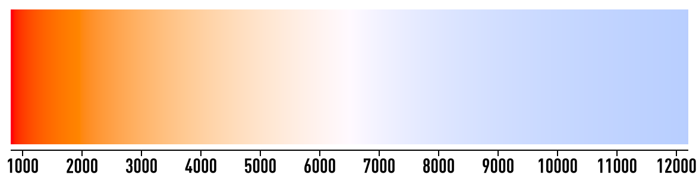
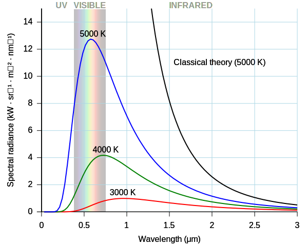

## Black body emission

Black-body radiation is the thermal electromagnetic radiation within or surrounding a body in thermodynamic equilibrium with its environment, emitted by a black body (an idealized opaque, non-reflective body). It has a specific spectrum of wavelengths, inversely related to intensity that depend only on the body's temperature, which is assumed for the sake of calculations and theory to be uniform and constant.

Black-body radiation has a characteristic, continuous frequency spectrum that depends only on the body's temperature, called the Planck spectrum or Planck's law. The spectrum is peaked at a characteristic frequency that shifts to higher frequencies with increasing temperature, and at room temperature most of the emission is in the infrared region of the electromagnetic spectrum. As the temperature increases past about 500 degrees Celsius, black bodies start to emit significant amounts of visible light. Viewed in the dark by the human eye, the first faint glow appears as a "ghostly" grey (the visible light is actually red, but low intensity light activates only the eye's grey-level sensors). With rising temperature, the glow becomes visible even when there is some background surrounding light: first as a dull red, then yellow, and eventually a "dazzling bluish-white" as the temperature rises. When the body appears white, it is emitting a substantial fraction of its energy as ultraviolet radiation. The Sun, with an effective temperature of approximately 5800 K, is an approximate black body with an emission spectrum peaked in the central, yellow-green part of the visible spectrum, but with significant power in the ultraviolet as well.

In the longer wavelengths this deviation is not so noticeable, as hv are very small. In the shorter wavelengths of the ultraviolet range, however, classical theory predicts the energy emitted tends to infinity, hence the ultraviolet catastrophe. The theory even predicted that all bodies would emit most of their energy in the ultraviolet range, clearly contradicted by the experimental data which showed a different peak wavelength at different temperatures (see also Wien's law).

As the temperature increases, the peak of the emitted black-body radiation curve moves to higher intensities and shorter wavelengths. The black-body radiation graph is also compared with the classical model of Rayleigh and Jeans.

Instead, in the quantum treatment of this problem, the numbers of the energy modes are quantized, attenuating the spectrum at high frequency in agreement with experimental observation and resolving the catastrophe. The modes that had more energy than the thermal energy of the substance itself were not considered, and because of quantization modes having infinitesimally little energy were excluded.

Thus for shorter wavelengths very few modes (having energy more than hν) were allowed, supporting the data that the energy emitted is reduced for wavelengths less than the wavelength of the observed peak of emission.

Notice that there are two factors responsible for the shape of the graph. Firstly, longer wavelengths have a larger number of modes associated with them. Secondly, shorter wavelengths have more energy associated per mode. The two factors combined give the characteristic maximum wavelength.

Calculating the black-body curve was a major challenge in theoretical physics during the late nineteenth century. The problem was solved in 1901 by Max Planck in the formalism now known as Planck's law of black-body radiation. By making changes to Wien's radiation law (not to be confused with Wien's displacement law) consistent with thermodynamics and electromagnetism, he found a mathematical expression fitting the experimental data satisfactorily. Planck had to assume that the energy of the oscillators in the cavity was quantized, i.e., it existed in integer multiples of some quantity. Einstein built on this idea and proposed the quantization of electromagnetic radiation itself in 1905 to explain the photoelectric effect. These theoretical advances eventually resulted in the superseding of classical electromagnetism by quantum electrodynamics. These quanta were called photons and the black-body cavity was thought of as containing a gas of photons. In addition, it led to the development of quantum probability distributions, called Fermi–Dirac statistics and Bose–Einstein statistics, each applicable to a different class of particles, fermions and bosons.

## Earth atmosphere EM radiation absorption

