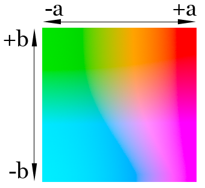

## Munsell color system

In colorimetry, the Munsell color system is a color space that specifies colors based on three properties of color: hue (basic color), chroma (color intensity), and value (lightness). It was created by Professor Albert H. Munsell in the first decade of the 20th century and adopted by the United States Department of Agriculture (USDA) as the official color system for soil research in the 1930s.

Several earlier color order systems had placed colors into a three-dimensional color solid of one form or another, but Munsell was the first to separate hue, value, and chroma into perceptually uniform and independent dimensions, and he was the first to illustrate the colors systematically in three-dimensional space. Munsell's system, particularly the later renotations, is based on rigorous measurements of human subjects' visual responses to color, putting it on a firm experimental scientific basis. Because of this basis in human visual perception, Munsell's system has outlasted its contemporary color models, and though it has been superseded for some uses by models such as CIELAB (L*a*b\*) and CIECAM02, it is still in wide use today.

> 
> Three-dimensional representation of the 1943 Munsell renotations (with portion cut away).

## HSL, HSV and HSB color models

HSL (for hue, saturation, lightness) and HSV (for hue, saturation, value; also known as HSB, for hue, saturation, brightness) are alternative representations of the RGB color model, designed in the 1970s by computer graphics researchers to more closely align with the way human vision perceives color-making attributes. In these models, colors of each hue are arranged in a radial slice, around a central axis of neutral colors which ranges from black at the bottom to white at the top.

The HSL representation models the way different paints mix together to create colour in the real world, with the lightness dimension resembling the varying amounts of black or white paint in the mixture (e.g. to create "light red", a red pigment can be mixed with white paint; this white paint corresponds to a high "lightness" value in the HSL representation). Fully saturated colors are placed around a circle at a lightness value of ½, with a lightness value of 0 or 1 corresponding to fully black or white, respectively.

Meanwhile, the HSV representation models how colors appear under light. The difference between HSL and HSV is that a color with maximum lightness in HSL is pure white, but a color with maximum value/brightness in HSV is analogous to shining a white light on a colored object (e.g. shining a bright white light on a red object causes the object to still appear red, just brighter and more intense, while shining a dim light on a red object causes the object to appear darker and less bright).

The issue with both HSV and HSL is that these approaches do not effectively separate colour into their three value components according to human perception of color. This can be seen when the saturation settings are altered — it is quite easy to notice the difference in perceptual lightness despite the "V" or "L" setting being fixed.

HWB is a cylindrical-coordinate representation of points in an RGB color model, similar to HSL and HSV. It was developed by HSV’s creator Alvy Ray Smith in 1996 to address some of the issues with HSV. HWB was designed to be more intuitive for humans to use and slightly faster to compute. The first coordinate, H (Hue), is the same as the Hue coordinate in HSL and HSV. W and B stand for Whiteness and Blackness respectively and range from 0–100% (or 0–1). The mental model is that the user can pick a main hue and then “mix” it with white and/or black to produce the desired color.

## HCL (Lch) color space

HCL (Hue-Chroma-Luminance) or Lch refers to any of the many cylindrical color space models that are designed to accord with human perception of color with the three parameters. Lch has been adopted by information visualization practitioners to present data without the bias implicit in using varying saturation. They are, in general, designed to have characteristics of both cylindrical translations of the RGB color space, such as HSL and HSV, and the L*a*b\* color space.

CIE-based Lch color spaces are transformations of the two chroma values (ab or uv) into the polar coordinates. The source color spaces are still very well-regarded for their uniformity, and the transformation does not cause degradation in this aspect. See the respective articles for how the underlying coordinates are derived.

## Interactive HSL, LCH and HWB color mixer

Choose any of the models by clicking on it's name. You can define a hue for the color by clicking on it's sector and then change two other parameters either by dragging the bars on the side or just swiping across the circle. Top-down motion is for the L (W) component and right-left is for the other one.

<color-mix-hsl />

## CIE 1931 XYZ

The CIE 1931 RGB color space and CIE 1931 XYZ color space were created by the International Commission on Illumination (CIE) in 1931. They resulted from a series of experiments done in the late 1920s by William David Wright using ten observers and John Guild using seven observers. The experimental results were combined into the specification of the CIE RGB color space, from which the CIE XYZ color space was derived.

Due to the distribution of cones in the eye, the tristimulus values depend on the observer's field of view. To eliminate this variable, the CIE defined a color-mapping function called the standard (colorimetric) observer, to represent an average human's chromatic response within a 2° arc inside the fovea. This angle was chosen owing to the belief that the color-sensitive cones resided within a 2° arc of the fovea. Thus the CIE 1931 Standard Observer function is also known as the CIE 1931 2° Standard Observer.

The CIE XYZ color space encompasses all color sensations that are visible to a person with average eyesight. That is why CIE XYZ (Tristimulus values) is a device-invariant representation of color. It serves as a standard reference against which many other color spaces are defined. A set of color-matching functions, like the spectral sensitivity curves of the LMS color space, but not restricted to non-negative sensitivities, associates physically produced light spectra with specific tristimulus values.

A color space maps a range of physically produced colors from mixed light, pigments, etc. to an objective description of color sensations registered in the human eye, typically in terms of tristimulus values, but not usually in the LMS color space defined by the spectral sensitivities of the cone cells. The tristimulus values associated with a color space can be conceptualized as amounts of three primary colors in a tri-chromatic, additive color model. In some color spaces, including the LMS and XYZ spaces, the primary colors used are not real colors in the sense that they cannot be generated in any light spectrum.

In the CIE 1931 model, Y is the luminance, Z is quasi-equal to blue (of CIE RGB), and X is a mix of the three CIE RGB curves chosen to be nonnegative (see § Definition of the CIE XYZ color space). Setting Y as luminance has the useful result that for any given Y value, the XZ plane will contain all possible chromaticities at that luminance.

The unit of the tristimulus values X, Y, and Z is often arbitrarily chosen so that Y = 1 or Y = 100 is the brightest white that a color display supports. In this case, the Y value is known as the relative luminance. The corresponding whitepoint values for X and Z can then be inferred using the standard illuminants.

n other words, the Z value is solely made up of the S cone response, the Y value a mix of L and M responses, and X value a mix of all three. This fact makes XYZ values analogous to, but different from, the LMS cone responses of the human eye.

## CIELUV and CIELAB

CIELUV, is a color space adopted by the International Commission on Illumination (CIE) in 1976, as a simple-to-compute transformation of the 1931 CIE XYZ color space, but which attempted perceptual uniformity.

Due to the distribution of cones in the eye, the tristimulus values depend on the observer's field of view. To eliminate this variable, the CIE defined a color-mapping function called the standard (colorimetric) observer, to represent an average human's chromatic response within a 2° arc inside the fovea.

The CIELAB color space also referred to as L*a*b* is a color space defined by the International Commission on Illumination (abbreviated CIE) in 1976. It expresses color as three values: L* for perceptual lightness, and a* and b* for the four unique colors of human vision: red, green, blue, and yellow. CIELAB was intended as a perceptually uniform space, where a given numerical change corresponds to similar perceived change in color. While the LAB space is not truly perceptually uniform, it nevertheless is useful in industry for detecting small differences in color.

Like the CIEXYZ space it derives from, CIELAB colorspace is a device-independent, "standard observer" model. The colors it defines are not relative to any particular device such as a computer monitor or a printer, but instead relate to the CIE standard observer which is an averaging of the results of color matching experiments under laboratory conditions.

The CIELAB space is three-dimensional, and covers the entire range of human color perception, or gamut. It is based on the opponent color model of human vision, where red/green forms an opponent pair, and blue/yellow forms an opponent pair. The lightness value, L*, also referred to as "Lstar," defines black at 0 and white at 100. The a* axis is relative to the green–red opponent colors, with negative values toward green and positive values toward red. The b\* axis represents the blue–yellow opponents, with negative numbers toward blue and positive toward yellow.

## Interactive LAB color mixer

Mix any possible color out of three color components by dragging the bars on the sides or simply by swiping the central color panel. You can also change the grid resolution and the range of A and B components with the sliders below the grid.

<color-mix-lab />

While the intention behind CIELAB was to create a space that was more perceptually uniform than CIEXYZ using only a simple formula, CIELAB is known to lack perceptually uniformity, particularly in the area of blue hues.

The lightness value, L\* in CIELAB is calculated using the cube root of the relative luminance with an offset near black. This results in an effective power curve with an exponent of approximately 0.43 which represents the human eye's response to light under daylight (photopic) conditions.

## HSL and LCH 12 colors cycle comparison

<color-table />
